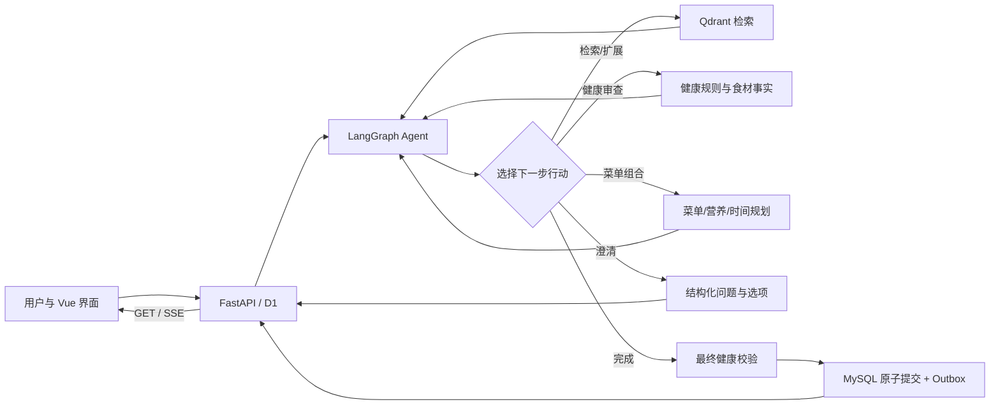

# 个性化健康膳食推荐 Agent

基于 LangGraph 的多人健康膳食推荐系统。Agent 根据用户目标和工具反馈决定检索、健康审查、菜单组合、再次检索、澄清或完成；健康硬约束、工具权限、最终校验和结果提交由服务端裁决。Web 端提供多轮对话、结构化澄清选项、请求状态和 SSE 事件展示。

当前新请求只运行 **LangGraph + 澄清协议 v2**。旧确定性编排入口已移除；历史旧协议会话可以查询，但不能继续发起推荐，API 会返回 `409 SESSION_PROTOCOL_UNSUPPORTED`。

## 工作方式



Agent 只能选择白名单中的类型化行动，行动参数和证据由服务端校验。菜谱检索不是健康结论；候选审查和最终菜单校验都必须使用权威健康规则。无法满足菜数、时间或其他硬要求时，系统返回准确的失败状态或结构化澄清，不静默放宽条件。循环有决策、工具、扩展和重规划预算。

每个新请求先在 MySQL 中领取幂等接受记录与执行代次，再运行 Agent。MySQL 保存会话、菜单版本、澄清问题和提交事实；Redis 保存运行态、会话锁和 SSE 缓存。事务 Outbox 在提交后投递事件。执行中断后，客户端使用**相同幂等键和原始请求载荷**重试以领取恢复代次；项目没有无人重试的持久任务队列。

## 主要能力

- 多人健康档案约束合并：过敏、疾病、忌口与本轮临时限制在推荐中保持有效。
- 菜谱检索、候选健康审查、菜单组合、最终健康复验与自然语言回答。
- 多轮菜单调整：追加约束、替换、重新推荐及历史菜单恢复均重新经过必要校验。
- 时间或其他约束冲突时生成 `question_id` 与 `option_id` 绑定的澄清选项；新需求不会因句中数字被误当成旧问题的选择。
- 幂等请求、执行代次隔离、会话锁、原子提交和可恢复的 SSE 事件。
- 公共接口仅使用匿名 `participant_ref`，不返回内部用户 ID、健康明细或模型内部推理。

## 项目结构

| 目录 | 职责 |
|---|---|
| `src/food_agent_v2/b1`–`b6` | 固定数据构建、健康约束、菜谱事实、时间/营养能力 |
| `src/food_agent_v2/c1`–`c2` | 检索重排与菜单规划 |
| `src/food_agent_v2/c3` | LangGraph Agent、行动策略、工具适配与共享运行时 |
| `src/food_agent_v2/c4`、`application` | 会话上下文、MySQL/Redis、原子提交与 Outbox |
| `src/food_agent_v2/d1`、`api_app.py` | 请求、会话、状态与 SSE API |
| `frontend` | Vue 3 + Pinia 对话界面 |
| `db`、`data` | Schema、向前迁移、数据来源与构建输入 |
| `tests`、`scripts`、`reports` | 自动化验证、在线验收脚本与结果记录 |

核心入口为 `src/food_agent_v2/c3/graph_orchestrator.py`；`runtime.py` 提供锁、执行代次、校验和提交等共享机制。领域工具与 Agent 的行动选择分离，便于独立验证安全边界。

## 本地运行

要求 Python 3.11–3.13、[uv](https://docs.astral.sh/uv/)、Node.js 20+、MySQL 8、Redis、Qdrant，以及可用的 OpenAI 兼容 LLM 与 SiliconFlow 检索模型 API。示例使用 PowerShell。

```powershell
Copy-Item .env.example .env
# 在 .env 中设置 LLM_API_KEY、SILICONFLOW_API_KEY 和 MySQL 密码
uv sync
Set-Location frontend
npm ci
Set-Location ..
```

`.env.example` 使用隔离的本地端口：MySQL `3309`、Redis `6382`、Qdrant `6339/6340`、API `8003`、前端 `5174`。服务与数据库需先启动。首次部署应在配置的 MySQL 数据库执行 `db/schema_mysql.sql`；已有库执行 `db/migrations/apply_migration.py` 中的 `apply_migrations()`。推荐数据还需要一份通过质量门禁的 Build Manifest 及其构建产物：

```powershell
uv run food-agent-v2 data-verify --manifest <构建目录>\build_manifest.json
uv run food-agent-v2 data-initialize `
  --manifest <构建目录>\build_manifest.json `
  --confirm-empty-v2
```

`data-initialize` 仅用于空的 v2 固定数据存储；不要在已有数据的库上重复初始化。数据构建和质量门禁见[数据工程设计](docs/modules/01-data-engineering.md)。

```powershell
# 终端 1：API
uv run food-agent-v2 api-start

# 终端 2：前端
Set-Location frontend
npm run dev
```

前端为 <http://127.0.0.1:5174>，API 文档为 <http://127.0.0.1:8003/docs>。前端开发服务器将 `/api` 代理到本地 API。

## API 与澄清协议

| 方法 | 路径 | 用途 |
|---|---|---|
| `POST` | `/v1/sessions` | 创建 `langgraph/v2` 会话 |
| `GET` | `/v1/sessions/{session_id}` | 查询会话与当前菜单 |
| `POST` | `/v1/recommendation-requests` | 发起幂等推荐；可省略 `session_id` |
| `GET` | `/v1/recommendation-requests/{request_id}` | 查询终态、结果或活跃澄清问题 |
| `GET` | `/v1/recommendation-requests/{request_id}/events` | 订阅 SSE，支持 `Last-Event-ID` |
| `POST` | `/v1/recommendation-requests/{request_id}/cancel` | 取消未完成请求 |
| `GET` | `/health`、`/ready` | 存活与依赖就绪检查 |

发起推荐时提供唯一 `idempotency_key`、用户消息和匿名参与者；同键同载荷重试复用原请求：

```json
{
  "idempotency_key": "dinner-2026-09-29-001",
  "message": "给 p1 推荐三道不含花生的晚餐，40 分钟内完成",
  "participants": [{"participant_ref": "p1"}]
}
```

若状态为 `needs_clarification`，从 GET 响应中的 `active_clarification` 读取 `question_id` 与选项 ID，并在**新请求**中提交选择：

```json
{
  "idempotency_key": "dinner-2026-09-29-002",
  "session_id": "<首轮返回的 session_id>",
  "message": "选择选项 1",
  "participants": [{"participant_ref": "p1"}],
  "clarification_response": {
    "question_id": "<当前活跃的 question_id>",
    "option_id": 1
  }
}
```

不要自行构造选项修改内容；服务端以 MySQL 中的问题和私有快照为准。旧问题在新请求成功提交后才消费或作废。若启动阶段返回 `REQUEST_RECOVERY_PENDING`，保留原请求体和幂等键重试。

## 测试与验收

```powershell
uv run pytest tests -m "not live" -q
uv run ruff check src tests scripts/verify_v2_live_structured.py
Set-Location frontend
npm test -- --run
npm run build
```

需要真实模型与本地 MySQL/Redis/Qdrant 时，在已配置的环境运行 `scripts/verify_v2_live_structured.py`。该脚本验证 Q1 追问、结构化选择、终态提交与 GET/SSE；会调用付费模型。上次实际在线闭环及 MySQL/Outbox 证据见[LangGraph v2 验收报告](reports/2026-09-28-clarification-v2-acceptance.md#9-2026-09-29-langgraph-v2-唯一入口最终验收)。

## 设计与边界

- [受约束 Agent 编排决策](docs/decisions/0008-langgraph-hybrid-agent-orchestration.md)
- [LangGraph v2 入口与澄清协议交付方案](docs/superpowers/plans/2026-09-29-langgraph-v2-entry-convergence.md)
- [全局不变量](docs/contracts/global-invariants.md)
- [固定数据与 Artifact 契约](docs/contracts/data-artifact-contracts.md)

本项目用于健康约束推荐和软件工程实践，不提供医学诊断或治疗建议。API 密钥、运行时数据库、缓存及已发布的数据构建产物不进入 Git。
