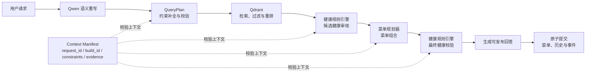

# 方太个性化健康膳食推荐 Agent

面向多人、多健康约束和多轮菜单调整场景的菜品推荐系统。项目使用大模型理解自然语言，用结构化检索召回候选菜品，再由确定性健康规则、菜单规划器和版本化会话状态完成审核、规划与提交。

`Python / FastAPI / MySQL / Qdrant / Redis / Qwen API / Vue 3`

## 项目简介

普通菜品推荐只需要回答“用户可能喜欢什么”，健康推荐还需要回答三个问题：原始菜谱能否形成可信的食材事实、用户约束能否在整条链路中保持一致、菜单调整后能否继续满足健康要求。

本项目围绕这三个问题搭建完整 Agent 主链：

```text
自然语言请求
  → Qwen 语义重写
  → QueryPlan 约束解析
  → Qdrant 检索与重排
  → 候选健康审核
  → 菜单规划
  → 最终健康校验
  → 回答生成与原子提交
```

大模型负责语言边界上的语义理解与表达；健康裁决、菜单规划、状态转换和最终提交由可验证的系统逻辑完成。节点之间不传递自由文本结论，而是传递带请求身份、数据版本和证据引用的结构化 Artifact。

## 主要功能

- 支持“3 人晚餐、清淡、40 分钟内”“不要花生，换一道菜”等自然语言请求。
- 合并健康档案中的永久约束与当前会话中的临时约束，覆盖疾病、过敏、异常指标和明确忌口。
- 基于菜名、标准食材和结构化标签进行向量召回、条件过滤与重排。
- 在候选召回后和最终菜单提交前执行两次健康校验，避免规划或替换阶段重新引入风险。
- 支持追加约束、精确替换、整单重生成和恢复上一版菜单等多轮操作。
- 通过请求幂等、会话锁、事务 Outbox 和版本化数据构建保留可恢复、可追踪的提交事实。
- 提供 FastAPI 接口、SSE 请求事件和 Vue 3 对话界面。

## 系统工作流



默认运行模式为 `WORKFLOW_MODE=fast_path`。该模式不是纯规则解析：系统先识别新推荐、追加约束、替换、拒绝或恢复等操作意图，再由 `QueryNormalizer` 调用 Qwen 的 `query_understanding` 完成语义重写，并将模型结果与显式约束解析、结果校验和失败兜底合并。后续检索、健康审核、菜单规划、状态转换与提交由确定性节点执行。

## 核心实现

### 1. 从原始菜谱到可信食材事实

离线数据构建不会把原始食材字符串直接交给在线检索或健康判断。系统先将同义名、别名和不同形态映射到标准食材实体，再建立菜谱—食材关系，并区分必选食材、可选食材、替代选择组、默认选项和加工辅料。

在此基础上，一次构建同时生成检索、健康、营养和时间等下游视图。所有 Artifact 共享同一 `build_id` 与 `source_manifest_hash`，Build Manifest 记录 Schema 版本、记录数和文件散列；MySQL 与 Qdrant 只能从同一份已通过质量门禁的 Manifest 初始化。在线请求只读取已发布的结构化事实，不重新解释原始菜谱文本。

### 2. 从用户请求到安全菜单

Qwen 先将口语请求改写为便于解析的语义表达，确定性逻辑再补全并校验人数、餐次、菜品数量、时间预算、排除食材和健康信号，形成封闭的 `QueryPlan`。检索层依据 QueryPlan 做向量召回、结构化过滤和重排，但只负责提供候选，不直接给出健康结论。

候选菜品首先经过健康规则引擎审核；菜单规划器只在安全候选中结合数量、时间和营养目标生成组合；规划结果在提交前再次接受同一规则引擎的最终校验。每个节点通过结构化 Artifact 绑定当前请求、有效约束、检索证据和数据版本，防止模型输出或旧上下文覆盖规则结果。

### 3. 从当前菜单到可恢复的新版本

会话上下文同时维护永久健康约束、临时对话约束、当前菜单、历史版本和待澄清问题。“换一道菜”“不要某种食材”“整单重来”“恢复上一版”不会绕过主链，而是在更新上下文后重新执行必要的检索、审核和终检。

Redis 保存请求状态、SSE 事件、幂等记录和会话并发锁；MySQL 保存已提交菜单、菜单历史、会话事实和审计记录。最终结果通过带 fencing token 的原子提交与事务 Outbox 发布，使菜单状态和成功事件拥有同一个提交事实，并可在进程重启后恢复。

## 数据与验证

当前固定数据基线包括：

| 项目 | 规模 |
|---|---:|
| 原始菜谱 | 2,000 条 |
| 可推荐菜品 | 1,932 条 |
| 匿名健康档案 | 50 份 |
| 标准食材实体 | 1,770 个 |
| 菜谱—食材关系 | 17,493 条 |
| 健康约束—食材矩阵 | 65,588 条 |
| 当前构建 Artifact | 20 项 |
| Qdrant 菜谱向量点 | 1,932 个 |

数据构建设置 G01–G18 质量门禁，覆盖源数据唯一性、食材身份闭包、跨视图菜谱集合一致性、健康关系完整性、营养与时间可用性、运行时边界以及 Manifest 散列校验。

当前分支最近一次本地验证结果：

- 后端非实时模型测试：`1528 passed, 3 skipped`。
- 前端组件测试：`31 passed`。
- Vue 生产构建：通过。
- H07 真实集成环境：MySQL、Qdrant、Redis readiness 通过；已验证首次推荐、追加约束、精确替换、整单重生成和恢复上一版五步会话。

详细证据见[最终数据质量审计](reports/2026-08-28-final-data-quality-audit.md)和[H07 Agent 链路集成验证](reports/2026-09-01-h07-agent-chain-integration-verification.md)。

## 技术架构

| 层次 | 主要职责 | 实现 |
|---|---|---|
| 前端 | 对话交互、请求状态、SSE 事件与菜单展示 | Vue 3、Pinia、Vite |
| API | 会话与推荐请求、幂等校验、SSE、健康检查 | FastAPI、Pydantic |
| Agent 编排 | 操作意图路由、模型语义理解、QueryPlan、节点 Artifact 与失败分支 | `fast_path`：Qwen 语义重写 + Python 确定性执行 |
| 语义与检索 | 语义重写、向量化、结构化过滤、重排 | Qwen API、BGE-M3、BGE-Reranker、Qdrant |
| 领域逻辑 | 健康规则、时间调度、营养计算、菜单规划 | Python、OR-Tools |
| 状态与持久化 | 固定事实、菜单版本、会话状态、锁与事件 | MySQL、Redis、事务 Outbox |
| 工程化 | 单元、契约与集成测试 | pytest、Vitest、Ruff |

## 项目结构

```text
program_v2/
├── src/food_agent_v2/   # 后端模块化单体
│                        # 数据构建、健康规则、检索、规划、工作流、记忆与 API
├── frontend/            # Vue 3 对话界面
├── data/                # 原始数据、人工审核决定与营养参考数据
├── db/                  # MySQL Schema
├── tests/               # 单元、契约、集成和端到端测试
├── docs/                # 系统设计、共享契约、场景与架构决策
├── reports/             # 数据质量和真实链路验收记录
├── scripts/             # 验收、性能测试与数据审计脚本
├── config/              # 模型提示词与运行配置
└── .env.example         # 本地环境变量模板
```

后端源码按模块隔离数据工程、健康约束、菜谱视图、时间与营养、检索重排、菜单规划、Agent 编排、上下文记忆和接口适配。README 使用业务职责描述这些边界；源码中的模块编号用于与详细设计、契约和测试保持对应。

## 本地运行

### 1. 环境要求

- Python `3.11`–`3.13`
- [uv](https://docs.astral.sh/uv/)
- Node.js `20+`
- MySQL `8.0`、Qdrant、Redis
- 可用的 Qwen 兼容 API Key 与 SiliconFlow API Key

### 2. 安装依赖与配置

以下示例使用 PowerShell：

```powershell
Copy-Item .env.example .env
# 编辑 .env，至少填写 LLM_API_KEY、SILICONFLOW_API_KEY 和数据库密码

uv sync

Set-Location frontend
npm ci
Set-Location ..
```

`.env.example` 默认使用隔离端口：MySQL `3309`、Qdrant `6339/6340`、Redis `6382`、API `8003`、前端 `5174`。

### 3. 初始化固定数据

完整运行需要一份已经通过质量门禁的 Build Manifest 及其同目录构建产物：

```powershell
uv run food-agent-v2 data-verify --manifest <构建目录>\build_manifest.json
uv run food-agent-v2 data-initialize `
  --manifest <构建目录>\build_manifest.json `
  --confirm-empty-v2
```

执行前需确保 `.env` 指向的 MySQL、Qdrant 和 Redis 服务已经就绪。`data-initialize` 仅用于空的 V2 存储。仓库不会提交运行时数据库、生成缓存和已发布构建目录；如需完整重建，请先按照[数据工程设计](docs/modules/01-data-engineering.md)生成并审核构建产物。

### 4. 启动后端与前端

```powershell
# 终端 1
uv run food-agent-v2 api-start

# 终端 2
Set-Location frontend
npm run dev
```

- 前端：<http://127.0.0.1:5174>
- API 文档：<http://127.0.0.1:8003/docs>
- 存活检查：<http://127.0.0.1:8003/health>
- 就绪检查：<http://127.0.0.1:8003/ready>

### 5. 运行测试

```powershell
uv run pytest -m "not live" -q

Set-Location frontend
npm test -- --run
npm run build
```

真实模型与外部服务测试被标记为 `live`，默认测试命令不会调用付费 API。

## 主要接口

| 方法 | 路径 | 说明 |
|---|---|---|
| `POST` | `/v1/sessions` | 创建匿名参与者会话 |
| `GET` | `/v1/sessions/{session_id}` | 获取当前会话与菜单状态 |
| `POST` | `/v1/recommendation-requests` | 创建幂等推荐或菜单调整请求 |
| `GET` | `/v1/recommendation-requests/{request_id}` | 查询请求状态和最终结果 |
| `GET` | `/v1/recommendation-requests/{request_id}/events` | 订阅 SSE 请求事件 |
| `POST` | `/v1/recommendation-requests/{request_id}/cancel` | 取消未完成请求 |
| `GET` | `/health` / `/ready` | 进程存活与完整依赖就绪检查 |

## 文档入口

- [系统总体设计](docs/00-system-overview.md)
- [全局不变量](docs/contracts/global-invariants.md)
- [模块边界与数据所有权](docs/contracts/module-boundaries.md)
- [固定数据与 Artifact 契约](docs/contracts/data-artifact-contracts.md)
- [推荐请求生命周期](docs/scenarios/recommendation-lifecycle.md)
- [架构决策记录](docs/decisions/README.md)

## 项目边界

- 本项目是健康约束下的推荐与软件工程实践，不提供医学诊断或治疗建议。
- 公共 API 只接受匿名 `participant_ref`，不返回内部用户 ID、疾病明细或模型内部推理。
- 默认主链不会让模型直接修改健康结论、已验证菜单或提交状态。
- 生成缓存、运行时卷、API 密钥和已发布数据构建不进入 Git。
