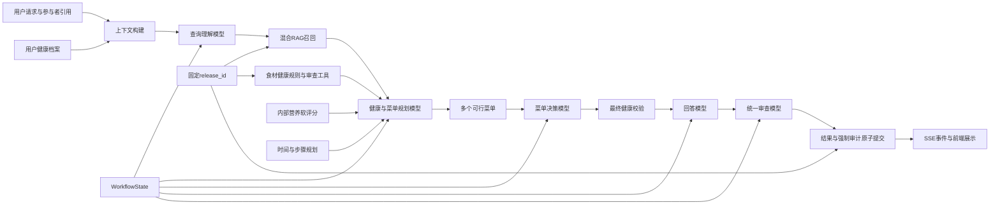

# 健康菜品推荐系统V2总体设计

- 状态：`IN_REVIEW`
- 日期：2026-08-04
- 适用项目：`program_v2`
- 文档定位：V2目标架构与全局约束的权威入口
- 替代范围：定义V2目标系统，不覆盖旧`program`的运行说明

## 1. 文档目的

本文从全局角度定义健康菜品推荐系统V2的边界、端到端链路、模块关系、模型职责、状态流转、失败原则和交付顺序。后续模块详细设计必须服从本文及共享契约，不能在模块内部重新解释健康安全、模型权限或工作流边界。

本文不展开每张表的字段、每个工具的完整JSON Schema和每种算法的实现细节。这些内容分别进入`docs/modules/`和`docs/contracts/`，避免总文档与模块文档维护两套事实。

## 2. 系统目标与非目标

### 2.1 系统目标

- 使用项目已有的用户健康档案、菜品、食材、步骤、时间和营养数据生成个性化菜单。
- 先按用户意图召回真实菜品，再基于标准食材和用户健康约束进行健康审查。
- 任何标准食材命中任一参与者的健康硬约束时，排除整道菜。
- 多人共享菜单中的每道菜都必须对所有参与者通过健康审查。
- 使用营养、偏好、检索相关性、时间和多样性等软因素比较安全候选。
- 通过职责不同的模型完成理解、健康与菜单规划、菜单决策、回答和统一审查。
- 通过确定性工作流控制工具权限、State更新、校验、修订次数和最终提交。
- 保留可验证的结构化Artifact、证据引用和用户可见分析摘要。
- 在失败时给出明确终态，不绕过健康校验，不用固定回答掩盖问题。

### 2.2 非目标

- 不进行医疗诊断、治疗建议、处方或临床风险预测。
- 不把系统能力扩展到项目现有数据之外的真实世界人群代表性、公平性或流行病学结论。
- 不计算或展示人数份量、`per_serving`、个人摄入量和采购量。
- 不建立烹饪营养损耗模型；内部营养只采用原始食材的理论估算。
- 不在正常回答或前端中展示内部营养估算值和置信度。
- 不让RAG、单个模型或回答文本替代食材健康规则和最终健康校验。
- 不建立通用开放式Agent平台，也不增加负责分配权限的管理模型。
- 当前阶段不建设LangSmith、自建Trace详情页或完整指标平台；这些能力在核心工作流稳定后重新评估。

## 3. 核心设计原则

### 3.1 健康安全优先于推荐质量

健康硬约束先决定菜品是否可进入安全候选集；偏好、营养、时间和多样性只在安全候选之间排序。软评分不能抵消健康冲突。

### 3.2 模型判断与系统控制分离

模型负责理解、比较、选择、组织和审查；工作流负责角色权限、必需工具校验、结构校验、证据校验、State更新、循环上限和最终提交。模型不能自行取得系统权限或宣布自己的结果已经最终通过。

### 3.3 模块化但不孤立

系统采用模块化单体。模块拥有独立职责、数据所有权和公开接口，同时通过共享契约、类型化Artifact和全局不变量组成一条完整链路。模块不能复制跨模块规则，也不能绕过上游权威事实。

### 3.4 失败可见且有界

关键工具漏调、权限越界、证据失效、上下文完整性失败或发布版本不一致时立即停止。系统不自动切换模型、不执行SDK技术重试、不生成固定模板回答继续流程。允许的业务修订具有明确上限。

### 3.5 单一权威契约

WorkflowState、Artifact、工具参数、错误码、证据格式和发布版本最终以可执行Schema为唯一权威定义。Markdown解释语义与边界，不手工维护相互冲突的第二份字段结构。

## 4. 总体架构



主链路必须保持以下顺序：

```text
请求进入
→ 构建受控上下文
→ 理解当前需求和约束变化
→ 按需求召回真实菜品
→ 基于标准食材审查健康并生成多个可行菜单
→ 从已有plan_id中选择菜单并再次健康校验
→ 基于已验证事实生成回答
→ 统一审查回答、证据和执行轨迹
→ 原子提交结果和强制健康审计
→ 输出最终SSE事件和前端结果
```

## 5. 系统分层与依赖方向

| 分层 | 主要职责 | 不承担的职责 |
|---|---|---|
| 领域与共享契约 | 定义健康、菜品、菜单、State、Artifact和错误语义 | 不连接具体基础设施 |
| 数据工程 | 清洗、标准化、构建食材关系、时间画像、营养画像和发布产物 | 不处理在线对话和菜单决策 |
| 确定性业务模块 | 健康审查、检索、营养软评分、时间计划、菜单可行性 | 不生成最终自然语言回答 |
| 模型与工具 | 完成角色内的理解、判断、比较、组织和审查 | 不直接修改State或数据库 |
| 工作流编排 | 投影上下文、分配工具、校验产物、控制流转和循环上限 | 不复制领域算法 |
| 上下文与记忆 | 管理永久事实、会话事实、请求State和角色投影 | 不改变权威健康事实 |
| 基础设施 | 实现MySQL、Qdrant、Redis和模型供应商适配 | 不决定业务流转和健康结论 |
| API与前端 | 创建请求、消费事件、呈现已验证事实 | 不合成业务结论 |
| 测试与验收 | 验证全局不变量、模块契约和端到端场景 | 不替代生产校验 |

固定依赖方向为：

```text
API/前端适配
→ Application/Workflow
→ Agent节点与领域服务接口
→ Tool接口
→ 领域服务
→ Repository接口
← Infrastructure实现
```

详细模块所有权见[模块边界与数据所有权](contracts/module-boundaries.md)。任何模块详设都不得引入反向依赖。跨模块不可破坏的规则见[全局不变量](contracts/global-invariants.md)。

## 6. 权威事实与数据边界

### 6.1 MySQL

MySQL保存永久健康事实、派生健康约束、菜品和标准食材事实、审核通过的健康规则、会话提交记录、菜单版本、请求幂等结果以及最终强制审计。最终结果和必须存在的健康审查证据处于同一提交边界。

### 6.2 Qdrant

Qdrant保存菜品检索文档的向量表示和检索元数据。它只服务于菜品召回，不保存用户健康档案，不承担聊天记忆，也不宣称菜品健康安全。

### 6.3 Redis

Redis保存在线WorkflowState、会话锁、SSE事件、短期缓存和运行时协调信息。Redis不是永久健康事实和最终结果的唯一来源；其数据丢失不能改变已经提交的MySQL事实。

### 6.4 模型上下文

模型上下文是根据当前角色从权威事实和Artifact中生成的只读投影。模型输出只是待验证的结构化产物，不能覆盖权威健康档案、规则版本和菜单事实。

## 7. 五个模型的职责

| 模型角色 | 主要输入 | 主要输出 | 允许的工具类别 | 禁止行为 |
|---|---|---|---|---|
| 查询理解模型 | 当前消息、有效会话约束、当前菜单引用 | `QueryPlanArtifact` | 当前会话、参与者引用、当前菜单事实 | 访问原始健康档案、决定健康安全、生成菜单 |
| 健康与菜单规划模型 | QueryPlan、RAG候选、标准化参与者约束 | `HealthEvaluationArtifact`、`FeasibleMenuArtifact` | 健康约束、食材健康审查、菜单生成、受控证据补充、一次召回扩展 | 绕过食材健康审查、提交最终结果、生成最终回答 |
| 菜单决策模型 | 已存在的多个可行菜单及评分分解 | `MenuDecisionArtifact`、触发`FinalValidationArtifact` | 菜单事实比较、时间步骤事实、所选菜单最终校验 | 重组未验证菜品、自行创造plan_id、修改健康规则 |
| 回答模型 | 已选择且最终健康校验通过的菜单、公开说明、步骤与时间事实 | `AnswerArtifact` | 最终菜单事实、用户可见健康摘要、步骤和时间 | 新增菜品、改写食材、输出内部营养值、暴露他人健康信息 |
| 统一审查模型 | 执行轨迹、工具回执、最终校验、AnswerArtifact | `ReviewArtifact` | 只读执行证据、必需工具清单、回答依据 | 直接修改菜单、代替缺失工具调用、提交结果 |

系统不设置管理模型。当前节点由WorkflowState决定，角色工具由工作流配置注入，下一条边由结构化Artifact及校验结果决定。

## 8. 模型工具与权限

每个角色的工具分为三类：

- 必需工具：该角色必须调用，缺少有效回执时返回`REQUIRED_TOOL_NOT_CALLED`并停止。
- 可选工具：模型根据证据缺口决定是否调用，但不能超过调用预算和业务上限。
- 禁止工具：不向该角色暴露，越权调用返回`TOOL_PERMISSION_DENIED`。

工具调用的会话范围、参与者范围、`request_id`和`release_id`由工作流注入，不由模型自由填写。工具回执至少关联调用角色、参数哈希、结果哈希、规则版本和发布版本。

模型可以决定允许范围内的调用顺序和可选工具使用，但不能给自己增加工具、跨会话读取数据、跳过必需健康审查或直接写入业务表。

## 9. WorkflowState与Artifact

WorkflowState是工作流流转的控制事实，保存当前请求状态、固定版本、角色产物引用、调用回执、修订计数、终态和用户可见阶段摘要。只有工作流可以在完成Schema、权限、证据和完整性校验后更新State。

模型之间通过以下七类Artifact通信：

```text
QueryPlanArtifact
HealthEvaluationArtifact
FeasibleMenuArtifact
MenuDecisionArtifact
FinalValidationArtifact
AnswerArtifact
ReviewArtifact
```

公共事实通过`SharedWorkflowContext`投影，节点交接使用类型化`HandoffMessage`，包含来源角色、目标角色、Artifact引用、行动要求、约束和证据引用。系统不传递或保存模型隐藏思维过程。

## 10. 健康审查总原则

健康约束分为：

- 原始健康事实：用户档案中的疾病、过敏和检测指标；
- 派生健康约束：由版本化确定性规则根据原始事实生成；
- 会话临时信号：用户在当前对话中明确增加、删除或调整的约束。

缺失检测指标保持`null`，不能由模型推测或填补。明确疾病事实不会因为当前某个指标较低而被自动删除。同一约束可以保留多个证据来源，但只形成一个有效约束。

健康硬约束包括：过敏、疾病对应的审核硬关系、异常指标派生硬关系、明确健康禁忌和用户明确“不能吃”的食材。普通口味偏好、营养目标和一般健康倾向属于软条件，除非用户明确将其设为禁忌。

硬排除必须基于标准`ingredient_id`、审核通过的别名映射和受控健康关系。字符串包含、自动词根匹配和未经审核的推断不能成为硬关系。只要一道菜的任一标准食材命中任一参与者的硬约束，整道菜从全部候选菜单中排除。

## 11. 多人菜单原则

多人推荐生成一份全员共享菜单。每道最终菜品必须对所有参与者安全，不允许通过“部分参与者可以吃”进入共享菜单，也不生成参与者专属菜品。

健康约束使用全员AND交集作为硬条件；正向口味偏好使用共享得分、个人得分和最低满意度参与软优化。系统只在项目参与者数据范围内处理偏好覆盖，不扩展到真实世界公平性结论。

最终回答可以说明某道菜与当前参与者约束冲突，但不能暴露具体参与者的疾病、指标或身份信息。

## 12. RAG检索边界

RAG采用字符n-gram词法检索、BGE-M3向量检索、加权RRF融合和BGE重排序组成完整混合检索。RAG的唯一职责是召回符合当前口味、菜系、时间、食材和正向偏好表达的真实菜品。

疾病、过敏和异常指标等健康词不进入主语义查询，也不用于RAG判定安全。RAG输出包含候选`recipe_id`、检索路径、排名、分数、文档哈希和`release_id`，但不包含“安全”结论。

多人场景可以对共享需求和个人正向偏好使用多路召回后合并候选，再由健康模块执行全员交集审查。完整词法、向量、融合和重排序链路缺失时停止，不回退为纯词法结果。初次候选不足时只允许一次扩展召回，并且必须产生新的候选批次。

## 13. 营养处理边界

营养信息来自原始食材的理论营养数据和受控估算，只用于安全候选之间的内部软排序。数据必须保留来源、匹配方法和置信度，以支持内部评分和审查。

低置信度营养不能成为健康红线，也不能抵消食材健康冲突。当前系统不计算烹饪损耗、不计算个人摄入、不计算人数份量、不生成采购量，并从正常回答和前端中移除具体营养数值、`per_serving`和参与者营养汇总。

## 14. 制作时间与步骤边界

系统保留原始步骤，并把步骤派生为主动操作、设备占用、被动等待和未知任务。任务之间保存依赖关系、设备互斥和步骤食材引用。

整套菜单的时间通过任务图计算：一名烹饪者的主动操作互斥，相同设备互斥，不同设备和被动等待可以在依赖允许时并行，以总完工时间为目标。严格时间限制只接受高置信度结果并使用时间上界比较；中低置信度时间只参与软排序。

步骤食材通过标准ID、审核别名和最长精确匹配关联。只有经过验证的关键步骤食材缺失才阻止执行，不能用宽泛字符串包含制造阻断。

## 15. 菜单生成与决策

健康与菜单规划阶段只使用已经通过硬筛选的菜品生成多个候选菜单。硬约束包括安全菜品集合、参与者交集、菜单结构、锁定或拒绝菜品、严格时间、明确食材限制和去重；软目标包括RAG相关性、正向偏好、内部营养评分、软时间、多样性和历史反馈。

菜单优化器生成3至5个有实际差异的`plan_id`。菜单决策模型只能从这些已有方案中选择，不能把不同方案的菜品重新拼装成未经验证的新方案。菜单修改、替换和恢复均重新执行相关健康校验。

存在零个健康安全菜品时进入`no_safe_menu`；存在健康安全菜品但无法满足菜单结构、严格时间或其他硬条件时进入`no_feasible_menu`。

## 16. 记忆、上下文与压缩

MySQL保存永久事实、已提交会话记忆、菜单版本和请求结果；Redis保存当前WorkflowState、锁和短期事件；角色模型只接收与职责相符的`ModelContext`投影。

约束优先级为：

```text
永久健康事实
→ 当前明确健康要求
→ 当前明确修改
→ 已提交会话事实
→ 历史事件
→ 模型推断
```

不可压缩内容包括当前消息、有效健康约束、当前菜单、待澄清事项和固定版本。压缩顺序为去重、用Artifact引用替换重复详情、选择相关历史事件、把旧原文转为结构化事件、最后移除非权威摘要。

如果仍超出预算，返回`CONTEXT_BUDGET_EXCEEDED`；如果核心块缺失、哈希错误或Manifest验证失败，返回`CONTEXT_INTEGRITY_FAILED`。系统不能为了继续调用模型而静默删除健康约束。

## 17. 失败、重试和有界修订

模型SDK、工具、数据库、Qdrant、Redis和提交操作默认不执行技术自动重试。系统不自动切换模型，不使用词法检索降级，不生成模板回答继续失败流程。

允许的业务闭环只有：

- 初次召回不足时扩展召回最多一次；
- 最终健康校验失败后重新规划最多一次；
- 统一审查要求修改时，定向修订最多一次、复审最多一次；
- 同一工具与同一参数在同一节点预算内只能形成一次有效调用。

所有循环计数保存在WorkflowState，由工作流判断是否允许下一次流转。模型不能自行清零或扩大上限。用户显式重试创建新的`request_id`并关联`retry_of`，不会在旧请求内隐式重跑。

## 18. 状态与终态

请求运行状态包括`accepted`、`running`和`revising`。终态包括：

| 终态 | 含义 |
|---|---|
| `completed` | 最终健康校验、统一审查和原子提交全部通过 |
| `needs_clarification` | 缺少无法安全推断的必要用户信息 |
| `no_safe_menu` | 没有通过全员健康硬筛选的菜品 |
| `no_feasible_menu` | 有安全菜品，但无法满足其余菜单硬约束 |
| `failed` | 工具、权限、证据、Schema、版本或有界修订失败 |
| `cancelled` | 用户显式取消并在节点边界生效 |
| `interrupted` | 系统终止或恢复条件不满足，未形成最终结果 |

必需工具漏调、越权调用、证据引用失效、发布版本不一致和上下文完整性失败都进入可诊断失败，不转为`no_safe_menu`或`no_feasible_menu`。

## 19. 发布与版本一致性

一次数据构建形成唯一`release_id`，关联MySQL数据、Qdrant索引、健康规则、RAG文档、缓存命名空间以及各组件Schema版本和哈希。

构建与发布阶段执行完整验证；运行期只做轻量`release_id`一致性校验，不在每次请求重新计算全部哈希。请求开始后固定版本，任何节点不能自动切换到新发布。

发布采用暂停新请求、等待在途请求结束、验证暂存产物、切换当前发布、运行最小验证、恢复请求的受控过程。旧数据、索引和兼容代码只在确认没有消费者和在途请求后清理；当前发布清单、迁移记录和启动校验继续保留。

## 20. API、SSE与并发

推荐采用请求与事件分离的单执行入口：

```text
POST /v1/recommendation-requests
GET  /v1/recommendation-requests/{request_id}
GET  /v1/recommendation-requests/{request_id}/events
POST /v1/recommendation-requests/{request_id}/cancel
```

同一幂等键和相同载荷返回已有请求；同一键不同载荷返回`IDEMPOTENCY_KEY_REUSED`。会话锁和唯一Worker Claim防止同一请求重复执行。

SSE事件携带事件ID并支持`Last-Event-ID`续传。连接断开不取消、不重跑请求。阶段分析只有在对应阶段产物通过校验后才能发布；最终回答只有在最终健康校验和统一审查均通过后发布。前端不能在缺少事件时自行补写业务文本。

## 21. 回答与用户可见分析

每个模型产物可以包含：

```text
user_visible_analysis.title
user_visible_analysis.summary
user_visible_analysis.evidence_refs
```

它表达已经验证的处理依据，例如先理解了哪些需求、筛掉了哪些冲突类别、比较了哪些菜单差异以及为何选择当前菜单。它不是隐藏思维过程、系统日志或固定模板。

最终回答结论优先，然后说明可验证的选择依据、取舍、菜品、关键食材、时间和制作步骤。回答模型不能增加`MenuDecisionArtifact`之外的菜品，不能修改已经校验的食材和步骤，不能输出内部营养数值、医疗效果或参与者隐私。

提示词只是表达约束的一部分；Schema、证据引用、工作流校验、统一审查和前端渲染共同保证输出边界。

## 22. 权限、隐私与不可信输入

用户输入和RAG文档都属于不可信自然语言数据，不能改变系统指令、工具权限和健康规则。MySQL健康档案、审核规则和确定性工具结果是相应职责范围内的权威事实。

模型只看到匿名`participant_ref`和角色需要的标准化约束。工作流自动注入请求、会话、参与者和发布范围，模型不能通过工具参数访问其他会话。回答及SSE可见摘要不能暴露参与者真实身份、疾病详情或检测指标。

出现`UNTRUSTED_INSTRUCTION_DETECTED`、`CROSS_SESSION_ACCESS_DENIED`、`INVALID_EVIDENCE_REFERENCE`、`STATE_MUTATION_DENIED`或`SENSITIVE_DATA_EXPOSURE`时停止，不允许另一个模型猜测或补写结果。

## 23. 审计、可观测性与评测边界

最终推荐和强制健康审查证据必须可追溯，并与最终结果处于同一业务提交边界。关键异常不能被日志吞掉。

LangSmith、自建运行详情页、完整Trace表和完整指标平台属于明确延期能力，不阻塞核心工作流。是否引入这些能力将在数据规则、模型职责、基础验收和隐私边界稳定后重新评估。

无论是否引入可观测平台，确定性健康规则测试、State流转测试、工具权限测试和关键端到端案例都属于核心建设，不得延期到监控平台阶段。

## 24. 建设顺序

```text
系统总设计
→ 共享契约
→ 数据工程模块
→ 确定性业务工具
→ WorkflowState与Artifact
→ 五模型工作流
→ 上下文与记忆
→ API与SSE
→ 前端
→ 全链路验收
→ 旧项目清理
```

每个旧模块迁移前必须审查并标记为`REUSE`、`REFACTOR`、`REWRITE`、`REMOVE`或`PENDING`。不整体复制旧源码，不在新系统未通过验收前清理旧项目。

## 25. 文档导航

当前总览的配套文档包括[全局不变量](contracts/global-invariants.md)和[模块边界与数据所有权](contracts/module-boundaries.md)，其余计划路径为：

```text
docs/scenarios/recommendation-lifecycle.md
docs/decisions/README.md
docs/documentation-roadmap.md
```

模块详细设计的完整顺序和状态见[文档建设路线图](documentation-roadmap.md)。所有模块详设必须引用上述共享文档，并在修改全局边界时回到本文重新审查。
