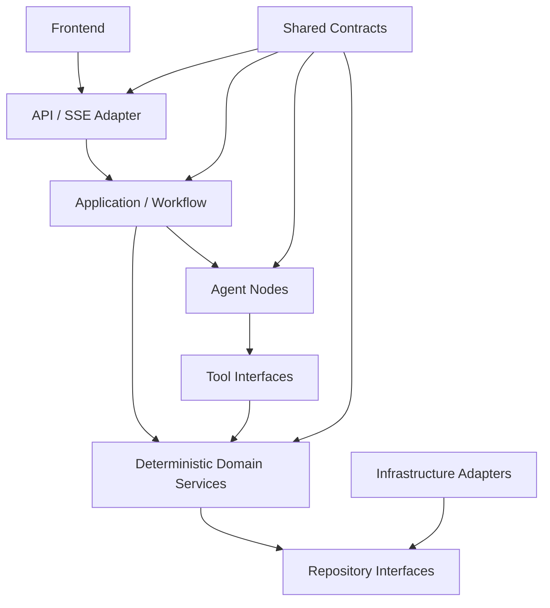

# V2模块边界与数据所有权

- 状态：`APPROVED`
- 日期：2026-08-04
- 架构形式：模块化单体

## 1. 文档目的

本文规定V2各模块负责什么、拥有什么数据、可以读取什么、通过什么公开接口协作，以及明确禁止哪些依赖。模块可以共享同一个进程和MySQL实例，但不能通过直接导入内部实现或跨模块写表破坏边界。

模块化的目标是让每个单元可以独立理解、独立测试和替换，同时继续服从[系统总体设计](../00-system-overview.md)和[全局不变量](global-invariants.md)。

## 2. 通用边界规则

- 每个业务事实只有一个写入所有者。
- 模块只能写自己拥有的数据，不能取得其他模块Repository的写权限。
- 其他模块通过公开Application Service、Domain Service、Tool Contract或Repository查询接口使用事实。
- 模块不得直接导入其他模块的`internal`、数据库实现或私有函数。
- 模型节点不得直接连接MySQL、Qdrant或Redis。
- 基础设施适配器实现接口，不决定健康、菜单、流转和回答语义。
- API和前端只适配输入输出，不重建领域判断。
- 跨模块事务由Application层协调，领域模块不互相写表。
- Artifact和WorkflowState属于共享契约，不能在单个模块内私自扩展同名字段。

## 3. 模块所有权总表

| 模块 | 拥有的数据或产物 | 允许读取 | 公开接口类型 | 明确禁止 |
|---|---|---|---|---|
| 数据工程 | 清洗产物、标准化映射、构建Manifest、发布候选产物 | 原始输入、参考营养数据、构建配置 | 构建命令、发布产物Schema、质量报告 | 处理在线请求、决定菜单、写会话State |
| 用户健康档案 | 原始健康事实、派生约束、临时健康信号的标准化结果 | 用户档案输入、版本化指标规则 | `HealthProfileService`、健康约束查询接口 | 根据缺失指标推测事实、决定菜品是否安全 |
| 菜品目录 | 菜品、标准食材、别名、菜品食材、原始步骤和结构化步骤引用 | 数据工程发布产物 | `RecipeCatalogService`、只读Recipe Repository | 保存用户健康信息、根据用户档案删除菜品 |
| 健康规则 | 审核食材健康关系、健康评估证据、健康评估领域结果 | 标准食材、用户有效约束、规则版本 | `HealthEvaluationService`、健康审查工具 | 使用RAG分数或营养估算制造硬命中 |
| RAG检索 | 检索文档、索引映射、检索配置、召回结果和检索证据 | 菜品目录发布视图、QueryPlan中的非健康需求 | `RecipeRetrievalService`、召回和扩展召回工具 | 读取原始健康档案、写健康PASS、执行菜单优化 |
| 营养评分 | 营养匹配结果、内部软评分分解 | 原始食材理论营养、标准食材、健康安全候选 | `NutritionScoringService` | 触发健康硬筛选、向正常回答输出营养数值 |
| 时间与步骤 | 步骤任务、依赖、设备占用、时间Profile和菜单调度结果 | 菜品目录步骤和设备事实 | `TimePlanningService` | 计算采购量、修改菜品食材、用低置信度时间执行严格排除 |
| 菜单规划 | 可行菜单、软评分分解、差异约束和`plan_id` | 安全候选、偏好、营养软分、时间结果、菜单硬约束 | `MenuPlanningService`、生成可行菜单工具 | 重新判定健康关系、把不安全菜品加入菜单 |
| 上下文与记忆 | 已提交会话事实、ConversationEvent、ContextManifest和角色上下文投影 | 永久健康事实引用、当前菜单引用、WorkflowState | `ContextService`、`SessionMemoryService` | 覆盖永久健康事实、静默丢弃核心约束、保存隐藏思维过程 |
| Agent角色 | 各角色的结构化Artifact和用户可见分析摘要 | 角色ModelContext、允许工具回执 | 角色Node接口、Artifact Schema | 直接写数据库、修改State、跨角色取得工具权限 |
| 工作流 | Request运行状态、WorkflowState、节点流转、工具回执引用、循环计数 | Artifact、角色策略、发布信息 | `RecommendationWorkflow`、State Reducer、Transition Policy | 复制健康算法、代替模型补调必需工具、绕过最终校验 |
| Application提交 | 请求幂等结果、最终结果、强制健康审计提交协调 | 最终Artifact链、工具回执、固定版本 | `RecommendationApplicationService`、`ResultCommitService` | 在证据缺失时提交成功、修改领域评估结果 |
| API/SSE | API请求适配、事件传输游标和公开响应投影 | Application状态和经过验证的可见事件 | HTTP/SSE Contract | 直接调用数据库、拼装健康结论、SSE断开后重跑请求 |
| 前端 | 本地展示状态和用户交互输入 | API Schema、SSE公开事件、最终结果 | Vue组件与客户端类型 | 推导健康安全、生成业务说明、展示内部营养和他人健康详情 |
| 基础设施 | MySQL、Qdrant、Redis、模型供应商和时钟等接口实现 | 对应端口输入 | Repository/Client Adapter | 依赖API Schema、决定业务终态、执行未授权自动重试 |

“拥有”表示唯一写入责任，不表示模块可以绕过共享契约。“允许读取”必须通过公开接口或授权投影完成，不等于可以跨模块查询内部表。

## 4. 固定依赖方向



箭头表示上层使用下层公开能力。Infrastructure通过依赖倒置实现Repository接口，领域层不能反向导入具体MySQL、Qdrant或Redis客户端。

### 4.1 允许的协作

```text
Workflow → HealthEvaluationService
Health Planner Tool → MenuPlanningService
RAG Service → RecipeCatalog只读发布视图
MenuPlanningService → NutritionScoringService公开评分接口
MenuPlanningService → TimePlanningService公开调度接口
Application → ResultCommitService
API → RecommendationApplicationService
```

### 4.2 禁止的依赖

```text
Data Pipeline → Agent Node
RAG → Health Planner Model
Repository → API Schema
Menu Optimizer → RAG内部词法函数
Answer Model → MySQL/Qdrant/Redis客户端
Frontend → Health Rule Engine
Infrastructure Adapter → Workflow Transition
Health Engine → Answer Prompt
```

旧项目中出现的“Repository导入API Schema”“优化器导入RAG内部词法函数”等依赖，在迁移分类中必须标记为`REFACTOR`或`REWRITE`，不能原样进入V2。

## 5. 公开接口与私有实现

每个模块至少区分以下边界：

```text
module_name/
├── api.py          # 对其他模块公开的服务入口
├── contracts.py    # 模块输入输出，引用共享契约
├── service.py      # 领域流程实现
├── repository.py   # 模块需要的存储接口
└── internal/       # 外部模块禁止直接导入
```

实际目录可以根据模块复杂度调整，但公开入口和私有实现的语义必须保留。外部模块只能依赖`api.py`、公开`contracts.py`或共享`src/food_agent/contracts/`。

模型工具是领域服务的受控适配器，不是第二套业务实现。工具负责权限范围、参数Schema、调用预算和回执包装，领域判断继续由相应Service完成。

## 6. 跨模块数据流

```text
QueryPlanArtifact
→ RAG产生候选recipe_id和检索证据
→ 菜品目录加载标准菜品与食材事实
→ 健康规则服务产生不可改写的评估结果和证据回执
→ 健康与菜单规划节点形成HealthEvaluationArtifact
→ 菜单规划服务产生可行方案结果和回执
→ 健康与菜单规划节点形成FeasibleMenuArtifact
→ 菜单决策产生MenuDecisionArtifact
→ 最终健康校验门形成FinalValidationArtifact
→ 回答模型产生AnswerArtifact
→ 统一审查产生ReviewArtifact
→ Application原子提交结果与强制审计
```

模块之间优先传递稳定ID、Artifact引用和证据引用，而不是复制完整可变对象。需要详细事实时，通过授权工具按引用读取，避免多个节点各自维护一份可能过期的数据。

## 7. 跨模块写入与事务

### 7.1 单模块写入

模块通过自己的Repository接口写入本模块拥有的数据。其他模块不能取得该Repository的写入实现。

### 7.2 跨模块提交

最终请求提交由Application层协调：

```text
验证最终Artifact链和release_id
→ 验证健康证据完整
→ 写最终推荐结果
→ 写强制健康审计
→ 写请求completed终态
→ 同一MySQL事务提交
```

任一步失败均回滚，返回`AUDIT_COMMIT_FAILED`或更具体的提交错误，不留下成功终态。

### 7.3 非事务运行状态

Redis中的WorkflowState、锁和SSE事件用于运行协调，不替代MySQL最终事实。运行状态更新失败不得被解释为健康校验通过，也不得触发模型或工具自动重跑。

## 8. 模型和工具权限边界

- 工作流根据当前节点选择角色策略并注入工具集合。
- 必需、可选和禁止工具由静态角色策略定义，不由模型管理。
- `request_id`、`session_id`、参与者范围和`release_id`由工作流注入。
- 工具返回结构化结果、证据引用和回执，不返回未授权的完整健康档案。
- 模型输出先通过Artifact Schema，再检查证据、权限和必需工具回执，最后才允许State Reducer应用。
- 统一审查模型可以指出问题，但不能写State、重组菜单或补调其他角色遗漏的工具。

## 9. 数据所有权变更规则

如果后续设计需要改变某个事实的所有者，必须同时更新：

1. 本文所有权总表；
2. 对应模块详细设计；
3. Repository和工具契约；
4. [全局不变量](global-invariants.md)的负责模块与校验点；
5. 跨模块场景和测试；
6. 旧实现迁移分类。

不允许通过新增“临时共享表”“common service”或无边界`utils`目录规避所有权决策。

## 10. 架构验收

后续实现至少增加以下自动化检查：

- 禁止Agent和模型包导入基础设施客户端；
- 禁止Repository导入API Schema；
- 禁止领域模块互相导入`internal`目录；
- 禁止前端响应包含内部营养评分和原始健康档案字段；
- 检查Artifact只能由其负责节点产生；
- 检查每个数据表只有一个写入模块；
- 检查跨模块最终提交只通过Application提交服务完成。
