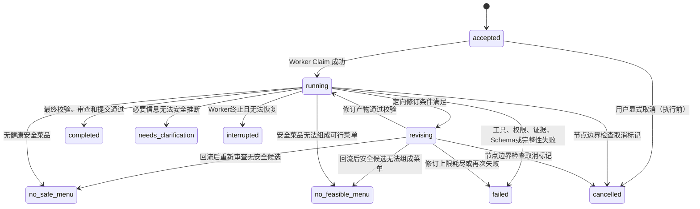

# V2 Agent工作流与编排模块设计

- 状态：`APPROVED`
- 日期：2026-08-09
- 适用项目：`program_v2`
- 上游依据：[系统总体设计](../00-system-overview.md)、[全局不变量](../contracts/global-invariants.md)、[模块边界](../contracts/module-boundaries.md)、[推荐请求生命周期](../scenarios/recommendation-lifecycle.md)、全部阶段B和阶段C已批准模块

## 0. 2026-08-09 批准的实现基线

- C3 的 WorkflowState、五类 Artifact、工具参数和 ToolReceipt 必须有唯一可执行 Schema；临时字典、字段猜测和消费者私有同名结构不能进入状态。
- 每个回执绑定 `request_id/node_id/tool_call_id/input_hash/output_hash/build_id`；State reducer 只接受当前节点、当前角色权限和当前输入对应的有效回执。
- 必需工具漏调立即 `REQUIRED_TOOL_NOT_CALLED`，不得自动重跑节点或由工作流补调；ADR-0003 的一次自动重试授权已经废止。
- 所有未知 verdict、事件、状态和错误码 fail-closed；生产路径没有模板回答、mock 结果、纯词法降级或跨模块安全 fallback。
- 最终菜单复核、统一审查和 Artifact 链完整性通过后，C3 只把提交命令交给 Application；成功事件服从 ADR-0006，不能在事务前发布。
- 使用 DeepSeek 实施本模块与运行时使用的业务模型是两回事；整改模型必须额外服从[执行契约](../contracts/deepseek-execution-contract.md)。

## 1. 模块目的

C3 是推荐请求的执行引擎。它把系统总览和全局不变量转化为确定性运行规则：控制五个模型的调用顺序和权限、校验每个节点提交的 Artifact、管理循环计数和修订上限、在失败时产出可诊断的错误终态、在成功时驱动原子提交。

C3 不实现任何业务算法——健康审查由 B4 完成、菜单规划由 C2 完成、RAG 由 C1 完成。C3 只负责"谁在什么时候能做什么、做完后怎么验证、验证通过后往哪走、什么时候该停"。

## 2. 已确认前提

- 所有适用全局不变量（INV-001 ~ INV-024）的执行由 C3 与对应确定性模块在规定校验点共同强制实施。
- 模型只生成符合角色 Schema 的 Artifact；模型永远不能直接修改 WorkflowState、不能扩大权限范围、不能给自己的输出标记为最终通过。
- 工作流不预调用工具，不在模型漏调后代替模型补调用。
- 系统不执行 SDK 技术自动重试、不自动切换模型供应商、不生成固定模板回答继续失败流程。
- 循环上限：召回扩展最多 1 次、最终健康校验失败后重新规划最多 1 次、统一审查定向修订最多 1 次、复审最多 1 次。所有计数值保存在 WorkflowState，模型不能修改。
- C3 不实现 LangGraph 的具体适配层（该层属于基础设施适配器），但定义工作流必须遵守的状态结构、转换条件和校验规则。
- 当前节点由 WorkflowState + 角色策略决定；下一条边由结构化 Artifact 及校验结果决定。
- QueryPlanArtifact 中的排除项须区分 `health_exclusions`（由 B2 处理）和 `preference_exclusions`（由 C1 处理）；具体的 Schema 字段由 QueryPlanArtifact 的正式 Schema 定义，C3 在 query_understanding 节点的后置校验中确保两者不混入对方的处理路径。

## 3. 职责

C3 负责：

1. 定义 WorkflowState 的完整结构和 Reducer 语义；
2. 定义七个角色策略（查询理解、健康与菜单规划、菜单决策、回答、统一审查、上下文构建、原子提交），每个策略包含允许工具集合、必需工具清单、输出 Artifact 类型；
3. 定义工具注册表——每个工具的参数 Schema、权限范围注入规则、回执格式、调用预算和幂等键；
4. 实现节点前置校验：上下文完整性、角色权限、请求和会话范围；
5. 实现节点后置校验：Artifact Schema 校验、必需工具回执完整性、证据引用有效性、跨 Artifact 一致性；
6. 实现 State Reducer——只有通过全部校验后才能更新 WorkflowState；
7. 实现状态机转换函数——每条边的前置条件、循环计数的读写；
8. 实现终态判定：`completed`、`no_safe_menu`、`no_feasible_menu`、`needs_clarification`、`failed`、`cancelled`、`interrupted`；
9. 管理请求生命周期：`accepted` → `running` → 终态，以及 Worker Claim 和会话锁；
10. 在节点边界检查取消标记；
11. 控制 SSE 事件的发布时机——阶段分析事件只在对应 Artifact 校验通过后发布，最终回答只在 `FinalValidationArtifact=PASS` 且 `ReviewArtifact=PASS` 后发布。

## 4. 非职责

C3 不负责：

- 实现任何健康审查、食材匹配、RAG 检索、营养评分、时间调度或菜单优化算法；
- 生成或修改菜品、食材、健康约束或营养数据；
- 直接连接 MySQL、Qdrant 或 Redis（通过基础设施适配器接口）；
- 实现 LangGraph 或具体编排框架的适配代码（属于基础设施层，C3 定义契约）；
- 运行 SSE 传输层或 HTTP 路由（属于 D1 API 模块）；
- 管理会话存储或上下文压缩（属于 C4 上下文与记忆模块）；
- 生成用户可见的自然语言分析摘要（属于模型职责，C3 只校验和传递）；
- 在模型漏调用具后代替模型补调用、伪造回执或生成默认值。

## 5. 上游输入

| 输入 | 来源 | 内容 |
|---|---|---|
| 请求创建 | D1 API 适配层 | `request_id`、`idempotency_key`、`session_id`、参与者映射、原始用户消息 |
| 上下文投影 | C4 上下文模块 | `SharedWorkflowContext`、`ContextManifest`、角色级 `ModelContext` |
| B2 约束 | B2 HealthProfileService | `ParticipantHealthConstraintSet`（通过工具回执引用） |
| B4 健康评估 | B4 HealthEvaluationService | `HealthEvaluationReceipt`（通过工具回执引用） |
| C1 检索结果 | C1 RecipeRetrievalService | `RetrievalResult`（通过工具回执引用） |
| C2 菜单方案 | C2 MenuPlanningService | `FeasibleMenuArtifact`（通过工具回执引用） |
| B5 时间调度 | B5 TimeProfileService | `MenuScheduleResult`（通过工具回执引用） |
| B6 营养评分 | B6 NutritionScoringService | `NutritionScoreDecomposition`（通过 C2 内部消费） |

## 6. 下游输出

### 6.1 请求状态

```
RequestState
├── request_id
├── idempotency_key
├── retry_of | null
├── session_id
├── participant_refs[]
├── participant_user_id_mapping (仅 C3 和工作流持有，不传给模型)
├── status: accepted | running | completed | failed | ...
├── created_at
├── worker_id | null
└── final_artifact_refs[] (仅终态时有值)
```

### 6.2 WorkflowState

```
WorkflowState
├── request_id
├── status: accepted | running | revising | <terminal>
├── current_node: context_building | query_understanding | health_menu_planning
│                 | menu_decision | answer_generation | unified_review | atomic_commit
├── previous_node | null
├── shared_context_ref (ContextManifest 引用)
├── artifacts
│   ├── query_plan_artifact | null
│   ├── health_evaluation_artifact | null
│   ├── feasible_menu_artifact | null
│   ├── menu_decision_artifact | null
│   ├── final_validation_artifact | null
│   ├── answer_artifact | null
│   └── review_artifact | null
├── tool_receipts[]
│   ├── receipt_id
│   ├── tool_name
│   ├── called_by_node
│   ├── parameter_hash
│   ├── result_hash
│   ├── evidence_refs[]
│   └── timestamp
├── counters
│   ├── retrieval_expansion_count: 0 | 1
│   ├── health_replan_count: 0 | 1
│   ├── review_revision_count: 0 | 1
│   └── review_reevaluation_count: 0 | 1
├── stage_events[] (已发布的 SSE 事件游标)
├── cancel_requested: boolean
├── error | null
│   ├── error_code
│   ├── failed_node
│   ├── evidence_refs[]
│   └── timestamp
└── updated_at
```

### 6.3 角色策略

```
RolePolicy
├── role: query_understanding | health_menu_planning | menu_decision
│        | answer_generation | unified_review
├── allowed_tools[] (工具名称列表)
│   └── 每个工具: { name, type: required | optional, max_calls_per_node, idempotent }
├── forbidden_tools[] (工具名称列表，越权调用返回 TOOL_PERMISSION_DENIED)
├── output_artifact_type
├── required_tool_receipts[] (角色成功完成必须存在的回执工具名)
├── input_artifact_types[] (进入该节点需要的前置 Artifact)
├── context_projection_role (传给 C4 的角色标识)
└── max_retries_per_call: 0 (默认不自动重试)
```

### 6.4 消费者视图

- **D1 API/SSE**：请求状态、阶段事件、最终结果；
- **C4 上下文记忆**：已提交的 `request_id`、`session_id` 和最终 Artifact 引用；
- **Application 提交服务**：完整的 Artifact 链和工具回执，供原子提交；
- **审计**：强制健康审计所需的全部证据引用。

## 7. 状态机定义

### 7.1 状态转换图



### 7.2 终态互斥

终态一旦写入即不可变更。`completed` 不可变更为 `cancelled`（如果提交事务已开始，由提交服务完成或回滚后确定）。同一 `request_id` 不能从终态重新执行。

修订（`revising`）状态下也可能直接进入终态：回流后重新审查无安全候选 → `no_safe_menu`；回流后安全候选无法组成菜单 → `no_feasible_menu`。

### 7.3 主链路节点顺序

```
请求进入
→ context_building (C4 构建 SharedWorkflowContext)
→ query_understanding (查询理解模型)
→ health_menu_planning (健康与菜单规划模型)
→ menu_decision (菜单决策模型)
→ answer_generation (回答模型)
→ unified_review (统一审查模型)
→ atomic_commit (Application 提交)
→ completed
```

未列入主链路的节点（如 `context_building`、`atomic_commit`）不由模型节点处理，是工作流的确定性步骤。

## 8. 节点定义

### 8.1 context_building（上下文构建）

- 类型：确定性步骤，无模型
- 输入：原始用户消息、`session_id`、参与者映射
- 动作：
  1. 通过 C4 构建 `SharedWorkflowContext`
  2. 校验 `ContextManifest` 完整性（当前消息、有效健康约束、当前菜单、待澄清事项）
  3. 校验通过 → 写入 `WorkflowState.shared_context_ref`
  4. 校验失败 → `CONTEXT_INTEGRITY_FAILED` → `failed`
- 输出边：`query_understanding`

### 8.2 query_understanding（查询理解）

- 模型角色：查询理解模型
- 输入 Artifact：无（首节点）
- 输入上下文：`ModelContext(role=query_understanding)` —— 当前消息、有效会话约束、当前菜单引用、参与者引用
- 允许工具：

| 工具 | 类型 | 说明 |
|---|---|---|
| `retrieve_recipes` | **必需** | C1 初次检索，参数中含 query_plan 结构化字段 |
| `get_current_menu` | 可选 | 读取当前会话的已有菜单方案（用于替换/恢复场景），通过 C4 的 `SharedWorkflowContext.current_menu` 获取 |

> 该工具由 C3/C4 实现（投影自 C4 的 `SharedWorkflowContext`），不由 B3/B5/B6 实现。

- 禁止工具：`get_health_constraints`、`evaluate_recipe_health`、`generate_feasible_menus`、`validate_selected_menu_health`、任何 B4/C2 工具
- 输出 Artifact：`QueryPlanArtifact`
- 后置校验：
  1. Artifact 符合 `QueryPlanArtifact` Schema
  2. 存在 `retrieve_recipes` 的有效工具回执（必需工具）
  3. 回执中的 `request_id`、`session_id` 与 WorkflowState 一致
  4. `RetrievalResult` 不包含健康安全结论
- 校验失败：`REQUIRED_TOOL_NOT_CALLED` 或 `SCHEMA_VALIDATION_FAILED` → `failed`
- 输出边：
  - 成功 → `health_menu_planning`
  - 若 B2 临时信号验证返回 `HEALTH_SIGNAL_AMBIGUOUS` → `needs_clarification`

### 8.3 health_menu_planning（健康与菜单规划）

- 模型角色：健康与菜单规划模型
- 输入 Artifact：`QueryPlanArtifact`、`RetrievalResult`（来自 query_understanding 的必需工具回执）
- 输入上下文：`ModelContext(role=health_menu_planning)` —— QueryPlan、RAG 候选摘要、匿名参与者约束摘要（不包含原始指标）
- 允许工具：

| 工具 | 类型 | 说明 |
|---|---|---|
| `get_health_constraints` | **必需** | B2 当前参与者有效约束集 |
| `evaluate_recipe_health` | **必需** | B4 候选批次健康审查 |
| `generate_feasible_menus` | **必需** | C2 生成 3-5 个可行方案 |
| `expand_retrieval` | 可选 | C1 扩展召回（仅 `retrieval_expansion_count=0` 时允许） |
| `adjust_menu_plan` | 可选 | C2 菜单调整（替换/恢复） |

- 禁止工具：`validate_selected_menu_health`（属于 menu_decision）、任何直接写 State 或 DB 的操作
- 输出 Artifact：`HealthEvaluationArtifact`（引用 B4 工具回执）+ `FeasibleMenuArtifact`（引用 C2 工具回执）
- 后置校验：
  1. 两个 Artifact 均符合各自 Schema
  2. 存在 `get_health_constraints`、`evaluate_recipe_health`、`generate_feasible_menus` 的有效回执
  3. `HealthEvaluationArtifact` 中的 `safe_recipe_ids` 与 B4 回执一致（模型不能删改安全集合）
  4. `FeasibleMenuArtifact` 中的所有菜品 ID 均属于 `safe_recipe_ids`
  5. 多人场景：每道菜均通过全员健康审查
  6. 若 `safe_recipe_ids` 为空 → 不进入此节点的成功出口，应转为 `no_safe_menu`
  7. 若 `feasible_plan_ids` 为空 → `no_feasible_menu`
- 校验失败：对应错误码 → `failed` 或终态
- 输出边：
  - 成功 → `menu_decision`
  - `safe_recipe_ids` 为空 → `no_safe_menu`
  - `feasible_plan_ids` 为空 → `no_feasible_menu`

### 8.4 menu_decision（菜单决策）

- 模型角色：菜单决策模型
- 输入 Artifact：`HealthEvaluationArtifact`、`FeasibleMenuArtifact`
- 输入上下文：`ModelContext(role=menu_decision)` —— 可行方案摘要、各方案差异说明、评分分解、健康回执引用
- 允许工具：

| 工具 | 类型 | 说明 |
|---|---|---|
| `validate_selected_menu_health` | **必需** | B4 最终健康校验 |

> 时间调度与营养评分结果不通过直接工具获取——它们随 C2 的 `FeasibleMenuArtifact` 一并到达（B5 的 `MenuScheduleResult` 与 B6 的 `NutritionScoreDecomposition` 由 C2 内部消费），menu_decision 不提供 B5/B6 直接工具。

- 禁止工具：`get_health_constraints`、`evaluate_recipe_health`、`generate_feasible_menus`、`adjust_menu_plan`
- 输出 Artifact：`MenuDecisionArtifact`（含所选 `plan_id` 和 `FinalValidationArtifact` 引用）
- 后置校验：
  1. `MenuDecisionArtifact` 符合 Schema
  2. 存在 `validate_selected_menu_health` 的有效回执
  3. `FinalValidationArtifact.status = PASS`
  4. 所选 `plan_id` 存在于 `FeasibleMenuArtifact` 中（模型不能编造新 plan_id）
  5. `menu_hash` 与 `FeasibleMenuArtifact` 中对应方案的哈希一致
  6. 所选菜单的所有菜品均通过最终健康校验
- 特殊处理：
  - `FinalValidationArtifact.status = EXCLUDE` 且 `health_replan_count = 0` → 回流至 `health_menu_planning`，`health_replan_count = 1`
  - `FinalValidationArtifact.status = EXCLUDE` 且 `health_replan_count = 1` → `FINAL_HEALTH_VALIDATION_FAILED` → `failed`
  - 菜单哈希不一致、参与者范围不一致 → `ARTIFACT_INTEGRITY_FAILED` → `failed`（不进入 replan）
- 输出边：
  - 成功 → `answer_generation`
  - 最终校验 EXCLUDE + replan 可用 → `health_menu_planning`（`status = revising`）
  - 最终校验 EXCLUDE + replan 耗尽 → `failed`

### 8.5 answer_generation（回答生成）

- 模型角色：回答模型
- 输入 Artifact：`MenuDecisionArtifact`（含 `FinalValidationArtifact`）
- 输入上下文：`ModelContext(role=answer_generation)` —— 最终菜单公开事实、时间说明、公开健康摘要（不含疾病名、指标值、参与者身份）
- 允许工具：无直接工具。B3 公开菜品视图与 B5 公开时间摘要等公开事实不通过直接工具获取——它们由 menu_decision 产出的 `HandoffMessage` 携带进入 answer_generation。

- 禁止工具：全部 B2/B4/B6 工具、任何可读取健康档案或营养数值的工具、`validate_selected_menu_health`、`generate_feasible_menus`
- 输出 Artifact：`AnswerArtifact`
- 后置校验：
  1. `AnswerArtifact` 符合 Schema
  2. 引用的菜品 ID 集合 ⊆ `MenuDecisionArtifact` 所选菜单的菜品集合（不增加菜品）
  3. 不包含内部营养数值、`per_serving`、疾病名称、参与者真实身份
  4. 不包含模型声明"通过健康审查"的自主结论（该结论必须引用 `FinalValidationArtifact`）
- 校验失败：`ANSWER_GROUNDING_FAILED` 或 `SENSITIVE_DATA_EXPOSURE` → `failed`
- 输出边：`unified_review`

### 8.6 unified_review（统一审查）

- 模型角色：统一审查模型
- 输入 Artifact：全部前序 Artifact + 全部工具回执引用
- 输入上下文：`ModelContext(role=unified_review)` —— 执行轨迹摘要（哪个节点调了哪些工具、回执状态）、Artifact 链、回答正文
- 允许工具：只读审查工具（无写入能力）

| 工具 | 类型 | 说明 |
|---|---|---|
| `get_execution_trace` | **必需** | 读取当前请求的完整工具回执清单（含调用角色、参数哈希、结果哈希和时间戳），由 C3 从 WorkflowState.tool_receipts[] 投影 |
| `get_artifact_chain` | 可选 | 读取当前请求的完整 Artifact 链引用和校验状态，由 C3 从 WorkflowState.artifacts 投影 |

> 这两个审查工具均为 C3 内部工具（C3-internal），不由任何 B/C 模块实现。

- 禁止工具：全部 B2/B4/B6/C1/C2 工具、任何可写 State 或 DB 的操作、`generate_feasible_menus`、`validate_selected_menu_health`
- 输出 Artifact：`ReviewArtifact`
- 后置校验：
  1. `ReviewArtifact` 符合 Schema
  2. `ReviewArtifact.status ∈ {PASS, REVISION_REQUIRED}`
  3. `REVISION_REQUIRED` 必须包含 `target_node` 和 `issue_codes[]`
- 输出边：
  - `PASS` → `atomic_commit` → `completed`
  - `REVISION_REQUIRED` 且 `review_revision_count = 0`：
    - `target_node = answer_generation` → 回流至 `answer_generation`，`review_revision_count = 1`
    - `target_node = menu_decision` → 回流至 `menu_decision`，需重新执行最终健康校验
    - `target_node` 为上游节点（`health_menu_planning` 等）且证据缺失 → 不进入修订，`failed`
  - `REVISION_REQUIRED` 且 `review_revision_count = 1` → `review_reevaluation_count = 1`，再审查一次
  - 复审仍 `REVISION_REQUIRED` → `WORKFLOW_RETRY_LIMIT_EXCEEDED` → `failed`

### 8.7 atomic_commit（原子提交）

- 类型：确定性步骤，无模型
- 输入：完整 Artifact 链 + 工具回执 + `ReviewArtifact(PASS)`
- 动作：
  1. 验证 Artifact 链完整性（7 类 Artifact 全部存在）
  2. 验证强制健康审计所需证据全部存在
  3. 在同一 MySQL 事务中写入：最终菜单、参与者约束引用、食材关系证据、覆盖引用、FinalValidationArtifact、ReviewArtifact、`completed` 终态
  4. 任一步失败 → 回滚，`AUDIT_COMMIT_FAILED`
  5. 发布 `result_committed` SSE 事件
- 输出边：`completed`（终态）

## 9. 跨节点通信与记忆交互

### 9.1 HandoffMessage

每个模型节点完成后，工作流构建 `HandoffMessage` 传给下一节点（通过 C4 投影为 `ModelContext`）。模型不直接接收上一节点的完整 Artifact 内容。

```
HandoffMessage
├── from_node
├── to_node
├── artifact_refs[]       (本节点产出的 Artifact 引用，非完整内容)
├── action_required       (下一节点需要完成的任务描述)
├── constraints_summary   (当前有效约束的摘要，按角色裁剪)
└── evidence_summary      (关键工具回执的引用和结论摘要)
```

不进入 HandoffMessage 的内容：模型隐藏思维过程、上一节点的完整提示词、被排除菜品的详细健康命中路径（仅 `evidence_refs` 引用保留供审计）、内部营养数值、原始指标值。

### 9.2 角色投影规则

C3 在节点入口调用 C4 的 `project_model_context(role, handoff_message, shared_context_ref)` 获得 `ModelContext`。投影裁剪规则：

| 角色 | 可见内容 | 不可见 |
|---|---|---|
| 查询理解 | 当前消息、会话约束摘要、当前菜单引用、参与者匿名引用 | B2 约束详情、B4 健康结果、原始档案 |
| 健康与菜单规划 | QueryPlan、RAG 候选摘要、匿名约束摘要、工具回执引用 | 原始指标值、参与者真实身份 |
| 菜单决策 | 可行方案摘要、差异说明、评分分解、健康回执引用 | B4 内部关系表、B6 营养数值 |
| 回答 | 最终菜单公开事实、时间说明、公开健康摘要 | 疾病名、指标值、参与者身份、营养数值 |
| 统一审查 | 执行轨迹摘要（节点×工具调用的回执状态）、Artifact 链引用、回答正文 | 直接写 State 或补调工具 |

### 9.3 C3→C4 记忆交互契约

| 时机 | 调用 | 参数 | 返回值 |
|---|---|---|---|
| `context_building` 节点 | `C4.build_shared_context()` | `session_id`, `participant_refs`, 当前消息 | `SharedWorkflowContext` + `ContextManifest` |
| C3 `context_building` 节点 | `C4.validate_context_integrity()` | `shared_context_ref` | `ContextIntegrityResult` |
| 每个模型节点入口 | `C4.project_model_context()` | `role`, `handoff_message`, `shared_context_ref` | `ModelContext`（角色裁剪后的只读视图） |
| `completed` 终态 | `C4.commit_session_state()` | `request_id`, 最终 `MenuDecisionArtifact` 引用, 健康摘要引用 | `void` |
| `cancelled` / `failed` 终态 | `C4.record_session_event()` | `request_id`, 终态, 已产生的 `stage_events[]` | `void` |
| `needs_clarification` 终态 | `C4.record_session_event()` | `request_id`, 待澄清事项, 已产生的 `stage_events[]` | `void` |
| B2 临时约束写入（B2→C4，经 C3 工作流） | `C4.store_temporary_constraint()` | `constraint` | `constraint_id` |
| B2 临时约束撤销（B2→C4，经 C3 工作流） | `C4.revoke_temporary_constraint()` | `constraint_id` | `void` |
| B2 有效约束查询（B2→C4，经 C3 工作流） | `C4.get_effective_constraints()` | `participant_refs` | `EffectiveConstraintSet` |

C3 不关心 C4 内部如何压缩、存储或索引——它只持有 `shared_context_ref` 句柄，每次投影时传给 C4。

## 11. 工具注册与回执管理

### 11.1 工具注册表

每个工具在注册时定义：

```
ToolRegistration
├── tool_name
├── parameter_schema (JSON Schema)
├── injected_parameters (由工作流注入，模型不可覆盖)
│   ├── request_id
│   ├── session_id
│   └── participant_refs[]
├── result_schema (回执的 JSON Schema)
├── call_budget
│   ├── max_calls_per_node: 1 (默认)
│   └── idempotent: true | false
├── permission_scope: read_health | read_recipe | read_retrieval | write_menu | ...
└── node_whitelist[] (允许使用该工具的节点)
```

### 11.2 参数注入

工作流在每次工具调用前注入以下参数（模型不可通过工具参数覆盖）：

- `request_id`：当前请求 ID
- `session_id`：当前会话 ID
- `participant_refs[]`：当前请求的合法参与者引用列表
- `call_sequence`：同一节点内的调用序号

模型可以在白名单内自主决定调用顺序和时机，但参数中与注入字段同名的值被覆盖为注入值。

### 11.3 回执校验

```
工具调用返回后：
1. 回执 Schema 校验
2. 回执中的 request_id 与 WorkflowState.request_id 一致
3. 同一节点 + 同一工具 + 同一参数哈希 → 只保留第一次调用（预算 1）
4. 第二次相同调用 → WORKFLOW_RETRY_LIMIT_EXCEEDED（节点内）
5. 回执记录到 WorkflowState.tool_receipts[]
```

### 11.4 越权检测

```
模型调用不在角色白名单中的工具：
→ 框架层拦截（不传给工具实现）
→ 返回 TOOL_PERMISSION_DENIED
→ 该调用不产生有效回执
→ 如果该工具在 required_tool_receipts 中 → 节点完成后校验失败 → failed

模型尝试通过参数覆盖注入值：
→ 覆盖值被静默替换为注入值
→ 如果参数中包含超出当前 participant_refs 范围的引用 → TOOL_PERMISSION_DENIED
```

## 12. Artifact 校验管道

### 12.1 校验顺序

每个模型节点提交输出后，按以下顺序校验：

```
1. Artifact Schema 校验（JSON Schema 验证）
2. 必需工具回执完整性检查
3. 回执身份校验（request_id、session_id、participant_refs）
4. 证据引用有效性（引用的回执 ID 和 Artifact ID 真实存在）
5. 跨 Artifact 一致性校验：
   a. 查询理解：RetrievalResult 不含健康安全结论
   b. 健康菜单规划：safe_recipe_ids 与 B4 回执一致，FeasibleMenu 菜品 ⊆ safe_recipe_ids
   c. 菜单决策：所选 plan_id 存在于 FeasibleMenuArtifact，menu_hash 一致
   d. 回答：菜品 ⊆ MenuDecisionArtifact 所选菜品，不含敏感数据
   e. 统一审查：不直接修改菜单或补调工具
6. 全局不变量断言（INV-001 ~ INV-024）
```

### 12.2 校验失败处理

| 失败类型 | 处理 |
|---|---|
| Schema 校验失败 | `SCHEMA_VALIDATION_FAILED` → `failed` |
| 必需工具漏调 | `REQUIRED_TOOL_NOT_CALLED` → `failed` |
| 回执身份不一致 | `ARTIFACT_INTEGRITY_FAILED` → `failed` |
| 证据引用失效 | `INVALID_EVIDENCE_REFERENCE` → `failed` |
| 跨 Artifact 不一致 | `ARTIFACT_INTEGRITY_FAILED` → `failed` |
| 全局不变量断言失败 | 对应 INV 的错误码 → `failed` |

所有校验失败均不自动重试、不切换到替代模型、不生成兜底回答。

### 12.3 不允许的 Artifact 模式

以下模式在 Schema 和校验逻辑中强制拦截：

- 模型在 Artifact 中自行声明"健康审查通过"（必须引用 B4 回执）
- 模型在 Artifact 中复制一份工具回执数据并修改字段
- 模型在 Artifact 中包含 `review_status`、`health_safe` 等只有确定性模块能输出的字段
- 模型在用户可见分析中输出内部营养值、疾病名称、指标值

## 13. 循环与修订控制

### 13.1 计数器

所有计数器位于 `WorkflowState.counters`，由工作流在条件函数中读写，模型不能访问或修改：

```
counters:
  retrieval_expansion_count: int (0-1)
  health_replan_count: int (0-1)
  review_revision_count: int (0-1)
  review_reevaluation_count: int (0-1)
```

### 13.2 循环边条件

```
边: health_menu_planning → expand_retrieval → health_menu_planning (自循环)
条件: counters.retrieval_expansion_count = 0
     AND 模型主动调用 expand_retrieval 工具
     AND expand_retrieval 回执非空
动作: counters.retrieval_expansion_count = 1
     → 重新进入 health_menu_planning 节点的健康审查步骤
失败: counters.retrieval_expansion_count = 1 时模型再次调用 → WORKFLOW_RETRY_LIMIT_EXCEEDED

边: menu_decision → health_menu_planning (回流)
条件: FinalValidationArtifact.status = EXCLUDE
     AND counters.health_replan_count = 0
动作: counters.health_replan_count = 1
     → status = revising
     → 旧失败 plan_id 保留审计
     → health_menu_planning 模型必须重新获取 B2 约束回执和 B4 健康审查回执
     → 只能使用新 safe_recipe_ids 生成新 plan_id
失败: counters.health_replan_count = 1 时再次 EXCLUDE → failed

边: unified_review → answer_generation (回流)
条件: ReviewArtifact.status = REVISION_REQUIRED
     AND ReviewArtifact.target_node = answer_generation
     AND counters.review_revision_count = 0
     AND 不是上游工具漏调或证据缺失
动作: counters.review_revision_count = 1
     → status = revising
     → answer_generation 模型基于审查意见重新生成 AnswerArtifact

边: unified_review → menu_decision (回流)
条件: ReviewArtifact.status = REVISION_REQUIRED
     AND ReviewArtifact.target_node = menu_decision
     AND counters.review_revision_count = 0
     AND 不是上游工具漏调或证据缺失
动作: counters.review_revision_count = 1
     → menu_decision 必须重新调用 validate_selected_menu_health

边: unified_review → unified_review (复审)
条件: 修订后的新 ReviewArtifact
     AND counters.review_reevaluation_count = 0
动作: counters.review_reevaluation_count = 1
失败: 复审仍 REVISION_REQUIRED → WORKFLOW_RETRY_LIMIT_EXCEEDED → failed
```

### 13.3 不进入修订的错误

以下情况直接 `failed`，不消耗任何修订或回流计数：

- 菜单哈希与 FeasibleMenuArtifact 不一致
- 参与者范围在 Artifact 链之间不一致
- 证据引用指向不存在的回执或 Artifact
- 必需工具漏调
- 权限越界
- 工具、数据库或模型供应商基础设施错误
- 全局不变量断言失败

## 14. Worker Claim 与会话锁

### 14.1 Worker Claim

```
请求创建 (status=accepted) 后：
→ Worker 尝试在 Redis 中 SET NX worker_claim:{request_id} = worker_id (TTL=300s)
→ 成功 → status = running，开始执行
→ 失败（已被其他 Worker 认领）→ 不执行，等待已有结果或超时
→ 执行期间定期续期 TTL
```

### 14.2 会话锁

```
同一 session_id 的并发请求：
→ 获取 session_lock:{session_id} (TTL=30s)
→ 成功 → 继续
→ 失败 → 等待或返回 CONCURRENT_SESSION_MODIFICATION
→ 请求完成后释放锁
```

会话锁防止并发修改覆盖当前菜单版本。SSE 事件消费者不需要会话锁。

## 15. 取消机制

```
POST /v1/recommendation-requests/{request_id}/cancel
→ 设置 cancel_requested = true (Redis 标记)
→ 当前正在执行的模型或工具调用完成后
→ 工作流在下一个节点边界检查标记
→ 若 cancel_requested = true:
    - 不启动下一节点
    - 保存已产生的执行证据（不回滚已完成的工作）
    - 写入 cancelled 终态
→ 如果 atomic_commit 已开始 → 由提交事务完成或回滚后确定终态（不能改为 cancelled）
```

取消不是即时生效——它等待当前模型或工具调用完成，在节点边界生效。这避免了中断正在进行的数据库事务或模型推理。

## 16. 中断与恢复

```
Worker 终止或 Redis 运行状态不可恢复：
→ status = interrupted
→ 不自动重跑
→ 恢复时从 MySQL 已提交的节点边界和 Artifact 引用继续
→ 无法证明上下文完整 → 保持 interrupted，等待用户显式新建请求
```

## 17. 异常、错误码与处理

### 17.1 节点前置错误

| 错误码 | 触发条件 | 处理 |
|---|---|---|
| `CONTEXT_INTEGRITY_FAILED` | ContextManifest 缺少核心块或哈希不一致 | `failed` |
| `CONTEXT_BUDGET_EXCEEDED` | 核心块完整但总 Token 超预算 | `failed` |
| `PREREQUISITE_ARTIFACT_MISSING` | 进入节点时缺少必需的输入 Artifact | `failed` |
| `UNTRUSTED_INSTRUCTION_DETECTED` | 用户输入或 RAG 文档中检测到指令注入 | `failed` |

### 17.2 工具错误

| 错误码 | 触发条件 | 处理 |
|---|---|---|
| `REQUIRED_TOOL_NOT_CALLED` | 模型提交 Artifact 时必需工具回执不完整 | `failed` |
| `TOOL_PERMISSION_DENIED` | 角色调用白名单外工具或扩大范围 | `failed` |
| `TOOL_EXECUTION_FAILED` | 工具内部执行错误（数据库、模型等） | `failed` |
| `TOOL_RECEIPT_VALIDATION_FAILED` | 工具回执不符合 Schema 或身份不一致 | `failed` |

### 17.3 Artifact 错误

| 错误码 | 触发条件 | 处理 |
|---|---|---|
| `SCHEMA_VALIDATION_FAILED` | Artifact 不符合 Schema | `failed` |
| `ARTIFACT_INTEGRITY_FAILED` | 跨 Artifact 引用不一致 | `failed` |
| `INVALID_EVIDENCE_REFERENCE` | 证据引用指向不存在的回执或 Artifact | `failed` |
| `ANSWER_GROUNDING_FAILED` | AnswerArtifact 引用非所选菜单的菜品 | `failed` |
| `SENSITIVE_DATA_EXPOSURE` | 回答或 SSE 事件包含隐私数据 | `failed` |
| `STATE_MUTATION_DENIED` | 模型提交包含非法 State 写入的 Artifact | `failed` |

### 17.4 循环与状态错误

| 错误码 | 触发条件 | 处理 |
|---|---|---|
| `WORKFLOW_RETRY_LIMIT_EXCEEDED` | 循环计数超过上限 | `failed` |
| `FINAL_HEALTH_VALIDATION_FAILED` | 最终校验 EXCLUDE + replan 耗尽或因系统错误 | `failed` |
| `AUDIT_COMMIT_FAILED` | 原子提交任一步失败 | 回滚，`failed` |
| `IDEMPOTENCY_KEY_REUSED` | 相同幂等键不同载荷 | `failed` |
| `CONCURRENT_SESSION_MODIFICATION` | 同一会话并发修改 | `failed` |
| `PERMANENT_CONSTRAINT_OVERRIDE_DENIED` | 尝试删除/放宽永久健康硬约束 | `failed` |

### 17.5 与 B4/B2 共享的错误码

以下错误码由 B2 或 B4 产生，C3 收到后不再回流，直接进入对应终态：

- `HEALTH_PROFILE_NOT_FOUND` → `failed`
- `HEALTH_CONSTRAINT_COVERAGE_INCOMPLETE` → `failed`
- `HEALTH_INGREDIENT_SET_INCOMPLETE` → `failed`
- `PERMANENT_CONSTRAINT_OVERRIDE_DENIED` → `failed`
- `CROSS_SESSION_ACCESS_DENIED` → `failed`

C3 不能把这些错误当作 `no_safe_menu` 处理——`no_safe_menu` 只有在 B4 完成全部前置校验且 `safe_recipe_ids=[]` 时才能形成。

## 18. 依赖方向

允许依赖：

```
C3 Workflow → C4 ContextService (构建上下文投影)
C3 Workflow → B2 HealthProfileService (通过工具适配器)
C3 Workflow → B4 HealthEvaluationService (通过工具适配器)
C3 Workflow → C2 MenuPlanningService (通过工具适配器)
C3 Workflow → B5 TimeProfileService (通过工具适配器)
C3 Workflow → B6 NutritionScoringService (通过 C2 间接)
C3 Workflow → C1 RecipeRetrievalService (通过工具适配器)
C3 Workflow → B3 RecipeCatalogService (通过工具适配器，公开视图)
C3 Workflow → Application 提交服务 (atomic_commit 节点)
C3 Workflow → Redis (Worker Claim、会话锁、WorkflowState 缓存、SSE 游标)
C3 Workflow → 模型供应商适配器 (通过基础设施层)
D1 API → C3 Workflow (创建请求、查询状态、取消)
```

禁止依赖：

```
C3 → 直接 MySQL 连接（通过 Application 提交服务和 Repository 接口）
C3 → 实现任何业务算法
C3 → 直接生成自然语言
C3 → 前端类型或 API 响应 Schema
模型 → C3 内部 State 或计数器
```

## 19. 构建与初始化要求

- 角色策略、工具注册表、Artifact Schema 和状态机定义为 C3 构建配置；
- 这些配置在系统启动时加载并校验完整性（所有角色的必需工具都存在、Artifact Schema 可解析、状态机无死锁路径）；
- 配置变更时重新运行 C3 单元测试和场景测试；
- C3 不维护自己的持久化数据表；WorkflowState 在 Redis 中缓存，最终结果在 MySQL 中提交；
- Redis WorkflowState TTL 与请求超时窗口一致；过期后只能从 MySQL 已提交边界恢复。

## 20. 测试和验收标准

### 20.1 正常链路

- 单人推荐请求从 `accepted` → `completed`，所有 Artifact 链完整；
- 多人推荐请求的全员交集链路正确执行；
- 所有阶段 SSE 事件在对应 Artifact 校验后发布；
- `answer_ready` 事件仅在 `FinalValidationArtifact=PASS`、`ReviewArtifact=PASS` 且 Application 已原子提交结果、强制审计和 outbox 后发布。

### 20.2 工具权限

- 查询理解模型调用 B4 工具返回 `TOOL_PERMISSION_DENIED`；
- 回答模型调用 B4 工具返回 `TOOL_PERMISSION_DENIED`；
- 统一审查模型调用 C2 工具返回 `TOOL_PERMISSION_DENIED`；
- 任何模型尝试扩大 `participant_refs` 范围返回 `TOOL_PERMISSION_DENIED`；
- 越权调用后工作流不继续，进入 `failed`。

### 20.3 必需工具漏调

- 查询理解模型不调用 `retrieve_recipes` → `REQUIRED_TOOL_NOT_CALLED` → `failed`；
- 健康菜单规划模型不调用 `get_health_constraints` → `REQUIRED_TOOL_NOT_CALLED` → `failed`；
- 菜单决策模型不调用 `validate_selected_menu_health` → `REQUIRED_TOOL_NOT_CALLED` → `failed`；
- 工作流不代替模型补调任何工具。

### 20.4 循环上限

- 扩展召回调用第二次 → `WORKFLOW_RETRY_LIMIT_EXCEEDED`；
- 最终健康校验失败回流第二次 → `WORKFLOW_RETRY_LIMIT_EXCEEDED`；
- 统一审查修订第二次 → `WORKFLOW_RETRY_LIMIT_EXCEEDED`；
- 复审第二次 → `WORKFLOW_RETRY_LIMIT_EXCEEDED`；
- 所有计数器由工作流控制，模型不能修改。

### 20.5 终态正确性

- `safe_recipe_ids=[]` + 完整 B4 证据 → `no_safe_menu`；
- `safe_recipe_ids` 非空 + 无法组成菜单 → `no_feasible_menu`；
- 必需工具漏调 → `failed`（不是 `no_safe_menu`）；
- 覆盖缺失 → `failed`（不是 `no_safe_menu`）；
- 用户取消在节点边界生效 → `cancelled`。

### 20.6 原子提交

- 强制审计失败 → 回滚所有写入 → 不保留 `completed`；
- 提交成功后 `completed` 不可变更为其他终态；
- 相同幂等键 + 相同载荷 → 返回已有结果；
- 相同幂等键 + 不同载荷 → `IDEMPOTENCY_KEY_REUSED`。

### 20.7 SSE 与取消

- SSE 连接断开不取消工作流、不重跑、不重建请求；
- `Last-Event-ID` 续传正确恢复事件；
- 取消标记在节点边界检查，不中断进行中的数据库事务。

## 21. 旧实现与目标实现差异

| 维度 | 旧实现 | V2 目标 |
|---|---|---|
| 工作流框架 | LangGraph 自定义图 | 与 LangGraph 解耦的状态机定义（C3 定义契约，基础设施层适配） |
| 工具调用 | 混合：部分工作流预调用、部分模型调用 | 模型在角色白名单内自主调用，工作流只校验 |
| 健康工具 | 可能直接调用 Repository | 通过 B4 工具适配器，模型不接触 Repository |
| 权限控制 | 隐式，依赖代码结构 | 显式角色策略 + 工具白名单 + 参数注入 |
| 循环控制 | 可能不严格 | 显式计数器 + 固定上限 + 模型不可修改 |
| 失败处理 | 可能有降级路径 | 无降级、无自动重试、无自动模型切换 |
| 状态持久化 | Redis + MySQL | 同，但 WorkflowState 结构更完整，终态互斥更严格 |
| 回答兜底 | 可能存在 | 不设置 |

## 22. 迁移分类

| 旧实现 | 分类 | 处理结论 |
|---|---|---|
| `workflow/state.py` | `REWRITE` | 按 V2 WorkflowState Schema 重写，增加 counters、stage_events、error 结构 |
| `workflow/graph.py` | `REWRITE` | 按 V2 状态机定义重写节点和边；解耦 LangGraph 具体实现 |
| `workflow/nodes/` 各节点 | `REWRITE` | 每个节点按 V2 角色策略重写前置/后置校验 |
| `workflow/tools.py` | `REWRITE` | 按 V2 工具注册表重写，增加参数注入、回执校验、越权检测 |
| 旧工具权限检查 | `REFACTOR` | 保留白名单思想，升级为显式角色策略 |
| 旧工作流测试 | `REWRITE` | 保留场景案例；增加权限、循环上限、终态、取消和恢复测试 |

## 23. 审查后清理项

以下内容在 C3、D1、D2 和 D3 全部迁移并通过验收后清理：

- 旧 LangGraph 图定义中的隐式工具调用和降级路径；
- 旧 WorkflowState 中与新 Schema 不兼容的字段；
- 工作流中代替模型补调工具的逻辑；
- 模型可直接修改 State 的旧接口；
- 已被新 C3 契约替代且确认无消费者的旧节点和工具适配器。

## 24. 与全局流程和后续模块的关系

```
C3 是系统总览 §4 中"工作流编排"层的权威实现：
API/前端适配 → Application/Workflow(C3) → Agent节点 → Tool接口 → 领域服务

C3 ← C4 (上下文投影)
C3 ← 全部 B 阶段和 C 阶段模块 (通过工具适配器)
C3 → D1 API/SSE (请求状态、阶段事件、最终结果)
C3 → D2 前端 (通过 D1 SSE 事件)
C3 → D3 测试与验收 (全部状态机路径)
```

- C4 为每个角色投影裁剪后的 `ModelContext`，C3 在节点入口注入；
- D1 适配 HTTP 请求到 C3 的请求创建、状态查询和取消接口；
- D2 消费 SSE 事件，不直接读取 WorkflowState；
- D3 必须覆盖所有状态机路径、权限错误、循环上限和终态正确性。

## 25. 待考量事项

以下问题不影响当前设计通过，但在进入实现阶段前需要进一步确认。在此留痕供后续回顾。

### 25.1 节点数量固定，无扩展点

当前七个节点（context_building + 五个模型节点 + atomic_commit）和七类 Artifact 的链路已定死。如果未来需要插入新的交互节点（如"食材替换确认"），需要同步修改状态机定义、Artifact 链顺序校验、角色策略和 C4 投影规则四处。

**建议**：当前不做扩展点设计——五模型架构本身是对"不增加管理模型""不做开放式 Agent"的承诺。如果需要新节点，走正式的架构变更流程（修改本文 + 对应 ADR）。

### 25.2 统一审查 target_node 越界处理

当 `ReviewArtifact.status = REVISION_REQUIRED` 且 `target_node` 指向不在白名单中的节点时，当前设计直接 `failed`。这虽然安全，但可能浪费一次修订机会——如果模型只是输出格式正确但指向了不合适的节点。

**建议**：在 `failed` 之前记录审查模型给出的 `target_node` 和被拒绝的原因，保留审计。是否在复审中给模型一次修正 `target_node` 的机会，由实现阶段根据实际审查模型的行为决定。

### 25.3 节点边界持久化粒度

§16（中断与恢复）规定"从 MySQL 已提交的节点边界和 Artifact 引用继续"，但未定义哪些节点写 MySQL 节点边界。如果只有终态写 MySQL，Worker 崩溃后需要从 `accepted` 重跑全部节点——代价大但实现简单。如果每个节点出口都写一条边界记录，恢复粒度细但增加写入开销。

**建议**：实现阶段按以下策略处理——
- Redis 中的 WorkflowState 是运行时权威（含当前节点、Artifact 引用、计数器）；
- Redis 数据丢失或 Worker 崩溃且 Redis 不可恢复时，从 MySQL 已提交的最终结果判断：有 `completed` 则直接返回，无则返回 `interrupted`；
- 不在每个节点出口写 MySQL 边界记录（避免正常链路的热路径写入开销）；
- 只有 `atomic_commit` 节点写 MySQL（已有 INV-010 要求）。
