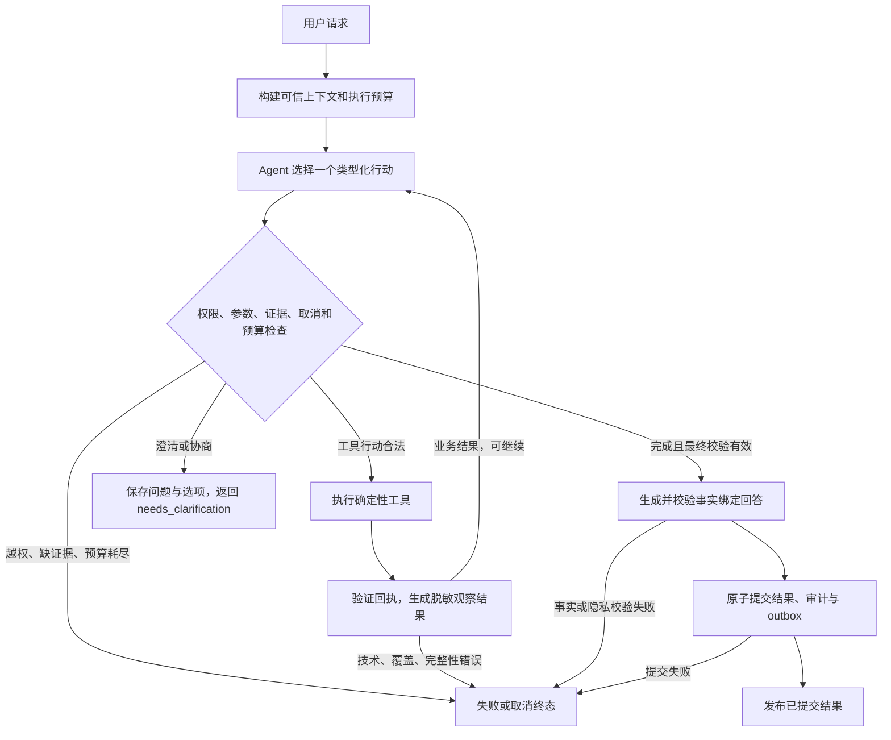

# C3 受约束的 Agent 工具编排重构方案

> **当前状态（2026-09-29）：** 旧确定性编排入口与实现已移除，新请求只运行 LangGraph v2。本文以下早期阶段的 `fast_path` 默认、保留 `WorkflowRunner` 等措辞仅供设计过程追溯；当前代码、运行方式与验收以[入口收敛方案](../superpowers/plans/2026-09-29-langgraph-v2-entry-convergence.md)和[验收报告](../../reports/2026-09-28-clarification-v2-acceptance.md#9-2026-09-29-langgraph-v2-唯一入口最终验收)为准。

- 状态：`DIRECTION_CONFIRMED`（方向已确认；实施与验收尚未完成）
- 日期：2026-09-27
- 适用项目：`program_v2`
- 关联决策：[ADR-0008](../decisions/0008-langgraph-hybrid-agent-orchestration.md)
- 核心目标：把 C3 中写死的业务行动选择交给受约束的 Agent，保留确定性领域计算、权限和提交边界。

> **最新交付状态（2026-09-27）**：C3 全量 **395 passed**、C4/Application/D1 **79 passed**、Ruff 通过。真实模型已完成普通推荐、具名替换、两版历史恢复、受控扩展和两轮选项回复；`completed` 后的 Redis 消费故障恢复也完成 H07 实测。再次追问终态通过脚本化 Agent + 真实 D1/C4/MySQL/Redis 三轮故障注入，MySQL 提交后的 C4 投影故障不会改写终态；纯文本选项尚未与 `question_id` 端到端绑定，长期尾延迟仍待观测。默认模式保持 `fast_path`。详见[最新交接文档](../superpowers/plans/2026-09-27-agent-refactor-handoff.md)、[澄清链路全局解决方案](../superpowers/specs/2026-09-27-agent-clarification-lifecycle-design.md)及[在线验收记录](../../reports/2026-09-27-agent-live-acceptance.md)。

## 1. 重构目标与方案选择

当前 `DeterministicRecommendationOrchestrator` 继承 `WorkflowRunner`，在过程代码中完成意图分支、检索、健康审核、规划、替换、恢复与回答。这是确定性工作流，但行动选择与执行耦合，新增交互需要继续增加分支。

本次目标不是单纯减少 if-else 或把原流程画成图，而是让 Agent 根据用户目标、当前菜单和工具证据，决定下一步检索、补充搜索、规划、追问还是提交已有方案。

| 备选方案 | 收益 | 局限与结论 |
|---|---|---|
| 原流程原样迁入固定 StateGraph | 节点边界与可观测性更清楚 | 行动选择依旧写死；只作为迁移底座 |
| 无限制 Agent 自由调用工具 | 行动空间最大 | 无法保证权限、证据与成本；不采用 |
| **受约束的 Agent 决策—工具反馈循环** | 模型选择行动，代码验证执行，支持交互扩展 | 增加模型往返与状态契约工作；本次采用 |

**Agent 决定尝试什么，工具计算事实，执行器决定动作是否允许，提交服务决定结果是否成立。**

## 2. 范围与现有能力基线

### 2.1 修改范围

- C3：行动协议、工具适配、状态图、证据反馈、执行预算、提示词与上下文投影。
- D1：增加显式 `WORKFLOW_MODE=langgraph` 入口分支，保持既有 HTTP、状态、SSE 和取消协议。
- 配套文档、角色契约映射及回归测试。

### 2.2 复用范围

- C1 混合检索、Embedding、重排与 Qdrant 实现不改。
- B2/B4 的档案、健康约束和食材级健康裁决不改。
- C2 当前为确定性贪心菜单构建；B5 时间任务图使用 CP-SAT，不能合称为现有 OR-Tools 菜单最优求解器。
- B6 继续提供营养目标软排序，不新增按人摄入、份量分配或医疗效果推断。
- C4 菜单业务版本、上下文及持久化继续复用；Application 原子提交和 outbox 不替换。
- 首期继承 `WorkflowRunner`，保留锁、取消、回执、审计和终态处理；不直接删除 `runner.py`。

这些边界限制算法改动，不限制 Agent 在已有工具能力内选择调用时机。若交互需要现有接口无法提供的新能力，显式记录依赖，不在 C3 偷写领域算法。

## 3. Agent 的决策权与系统边界

| Agent 可以选择 | 系统强制保证 |
|---|---|
| 信息不足时先澄清，否则调用工具 | 身份、参与者、构建版本与永久健康约束由系统注入 |
| 构造查询，根据反馈决定是否补充召回 | 查询不能删除硬要求，检索仍经过完整 C1 链路 |
| 读取当前或历史菜单，发起替换、恢复 | 历史 PASS 不能替代本轮健康校验 |
| 从已有可行方案中选择 plan_id | 不得创造菜品、拼装未验证方案或伪造安全集合 |
| 失败后继续合法搜索或询问用户 | 不得自行放宽时间、菜数、锁定项等明确要求 |
| 基于证据解释并请求完成 | 最终校验、回答绑定、审计和事务提交不可跳过 |

Agent 是业务行动选择角色，不是动态创建其他 Agent 或分配权限的管理模型。工具白名单、图边和预算由代码配置。

## 4. LangGraph 拓扑



图固定执行边界，工具顺序由 Agent 在前置条件约束下选择。模型返回行动产物，不直接写共享状态。

Agent 必须显式调用最终健康校验工具；finish 门卫只验证回执，不代替模型补调遗漏工具。这保留 INV-007，并阻止提前结束绕过最终健康校验。

## 5. 行动与工具协议

### 5.1 行动信封

每次模型输出一个以 `action` 为判别字段的强类型联合，各动作拥有独立参数 Schema，禁止额外字段；不以通用 dict/Any 作为权威业务载荷。

公共字段为 `action`、`arguments`、`evidence_refs`。仅记录简短行动摘要和证据引用，不索取或保存隐藏思维链。执行器注入 request_id、session_id、build_id、参与者、有效约束和节点身份，模型不能覆盖。

| 行动 | 模型可提供的参数 | 前置条件与领域映射 |
|---|---|---|
| `read_menu` | current / previous_committed | 仅当前会话；读取 C4 已提交菜单和 QueryPlan |
| `search_candidates` | 查询文本、合法餐次筛选 | 适配 retrieve_recipes；权威 QueryPlan 提供约束，策略控制 Top-K |
| `expand_candidates` | 新查询、已有检索证据引用 | 复用扩展召回能力，最多一次，硬约束不变 |
| `audit_recipe_health` | 已知候选引用 | 适配 evaluate_recipe_health；审核全员交集，包含需要保留的锁定菜 |
| `combine_nutritional_menu` | 健康回执、合法锁定菜单引用 | 适配 generate_feasible_menus；安全集合由回执解析，时限/菜数来自 QueryPlan |
| `validate_selected_menu` | 已有 plan_id、可行方案证据引用 | 适配 validate_selected_menu_health；根据当前健康事实生成最终校验 |
| `ask_user` | 问题类别、证据引用、结构化选项 | 不承诺未经计算的方案或耗时；保存待澄清事项并结束本请求 |
| `finish` | plan_id、最终校验引用 | 参与者、约束、构建与菜单哈希一致且 PASS，进入受控回答和提交 |

模型解析的意图和约束提案须经 C3 现有语义与 QueryPlan 校验，才能成为工具输入。模型传入的参与者、安全菜列表或宽松约束不能充当权威。

### 5.2 工具响应

采用三种判别结果，各工具 data 使用独立的类型化模型：

| status | 含义 | 后续行为 |
|---|---|---|
| ok | 工具执行成功，产生有效业务证据 | Agent 决定下一步；不等于菜单已提交 |
| no_solution | 正常执行，但本次候选/搜索没有形成所需结果 | 限定范围地诊断，允许预算内搜索或协商 |
| error | 基础设施、权限、数据覆盖或证据完整性错误 | 对应失败终态，不伪装无解，不自动技术重试 |

共同携带回执、产物引用及执行上下文绑定。内部审计载荷与模型可见 observation 分离，后者只有匿名引用和允许展示的事实。

复用现有 ToolHandler 的回执和 Artifact 链，不建立绕过健康来源、哈希校验与审计的简化工具通道。

## 6. 状态与执行预算

### 6.1 状态所有权

LangGraph 状态是执行视图；WorkflowState、Artifact 和 C4 业务事实仍是对应权威。Reducer 只合并验证通过的产物。

- 可信身份：请求、会话、参与者、构建、锁与取消上下文。
- 需求：已验证 QueryPlan、菜单版本、替换目标、锁定菜、拒绝菜和待澄清事项。
- 证据：检索、健康、可行方案、最终校验、回答与审查的引用和哈希。
- 决策：当前行动、脱敏观察结果、执行摘要，不把原始健康档案塞进模型消息。
- 控制：计数器、绝对截止时间、终态与错误，模型没有写权限。

参与者、约束、候选或菜单变化时，使受影响的下游证据失效。新请求重新初始化本轮计数器和证据，不继承上轮残留成功状态。

### 6.2 有界执行

- 初始策略：每请求最多 12 次 Agent 决策、10 次工具执行。任一耗尽即停止；这些是可配置防失控上限，不是性能证据。
- 首次召回一次、扩展最多一次；最终健康排除后的重新规划最多一次，沿用 INV-014。
- 相同工具、规范化参数和证据版本不得重复执行，重复调用触发预算错误并终止。证据变化不重置全局预算。
- 业务无解不自动重跑同一规划；只有候选或合法输入变化后才可再规划，仍受总预算限制。
- 模型、工具、存储故障不自动技术重试、不切换模型。
- 复用既有请求截止时间；决策和工具调用前检查剩余时间，为回答、审计与提交预留预算。耗尽进入失败，不生成无证据推荐。
- 各节点边界及提交前检查取消和失锁；事务开始后由既有提交边界决定终态。

调整预算必须同时验证正常路径能完成以及循环会终止。

## 7. 关键业务路径

### 7.1 新推荐

Agent 判断信息是否充分；可先追问，也可选择检索、审核、规划、选方案、最终校验并 finish。成功路径可能仍包含三步主流程，但它是证据约束下的行动序列，不强制所有输入都经过同一串行链路。

### 7.2 候选不足和规划失败

允许 Agent 在原要求内补充搜索，或询问是否改变偏好。Top-40 没有结果只能说明本次召回不足；贪心搜索失败不证明全库无解。

诊断包含 scope（本次候选/已生成方案）、观察事实、证据引用及 cause_status=observed/undetermined。可陈述安全候选数和已有方案预计耗时；不得声称已证明全局最短时间。未知原因应明确未知。

具体替代方案必须有健康与可行性证据。首期不增加反事实最优求解；没有替代方案时，只询问“是否接受减少一道菜”等调整方向，不能编造“改成三道菜只需18分钟”。用户明确接受后才在下一请求修改相应硬要求；永久健康约束不可协商。

### 7.3 协商闭环

ask_user 保存问题 ID、选项 ID、允许修改的约束字段、原请求/菜单版本和证据引用，复用 C4 待澄清上下文与 needs_clarification 终态。不让执行器长期持锁等待用户。

下一请求将“选第二个”关联到本会话有效选项，只应用被接受的字段变更，保留其他要求并重新校验。版本过期或语义不明则再次澄清；重复回复不得重复提交。实现时验证 C4 澄清写入接口能承载这些字段，若不足，显式补充最小接口适配，不新增第二套存储。

### 7.4 局部替换

Agent 读取当前菜单，提议替换目标并检索；系统根据已验证意图生成锁定集合。审核“锁定菜 + 新候选”后规划，验证只改变许可槽位，拒绝菜继续排除。锁定菜不再安全时停止并解释，不能为保持原样而跳过审核。

### 7.5 恢复上一版

读取 C4 上一版已提交菜单，允许跳过召回。仍须确认菜谱在当前构建可用，重新审核、锁定整单验证约束、最终健康校验，再提交为新业务版本。

沿用现有恢复语义：恢复目标菜单与其 QueryPlan，永久健康约束始终从当前权威上下文加载。无历史版本或不可用时明确返回错误/澄清，不能生成新菜单冒充恢复。

首期不以 Checkpointer 替代 menu_history，不启用跨请求图重放。执行检查点与业务版本用途不同；未来引入持久化恢复须另行设计身份映射、副作用幂等和版本兼容。

## 8. 交付、隐私和错误语义

- finish 只接受当前有效的可行方案和最终健康 PASS；缺回执直接失败，框架不补调。
- 回答角色只描述已验证菜单，复用事实绑定、隐私和审查契约；不输出群组疾病信息、原始健康指标、内部营养数值或医疗效果承诺。
- 模型生成解释是独立表达步骤，不是额外管理 Agent。生成失败按既有契约处理，不以模板冒充模型成功。
- 首期不直推未校验 token。回答通过校验后，结果、审计、会话事实及 outbox 原子提交，再发布 answer_ready/result_committed，遵守 ADR-0006。
- SSE 继续展示既有协议允许的已验证阶段摘要；实时解释流作为后续独立协议变更。
- no_safe_menu 必须有完整 B4 证据；覆盖缺失、数据库故障进入 failed。可协商业务失败可以返回 needs_clarification，不覆盖已提交菜单。
- 各终态仍进入既有 finalize 路径；graph.invoke 返回不代表业务完成。SSE 重连只重放事件，不重跑 Agent。

## 9. 工程组织与迁移

下列为拟新增模块，不表示文件已经存在：

| 模块 | 职责 |
|---|---|
| c3/agent_actions.py | 行动联合类型、观察结果和澄清选项契约 |
| c3/agent_policy.py | 白名单、前置条件、预算与证据失效规则 |
| c3/agent_tools.py | 复用 ToolHandler 的工具适配和脱敏反馈 |
| c3/graph_orchestrator.py | 决策—执行—观察循环与终态衔接 |
| c3/agent_prompts.py | 行动选择与事实表达提示词 |

保留 runner.py、state.py、tool_handler.py、authoritative_answer.py；优先复用或抽取公共逻辑，不复制第二套提交实现。

1. **契约准备**：完成新旧角色、行动与 Artifact 映射，落实验收场景与最小接口适配点。
2. **执行底座**：显式模式分支接入图，以脚本化行动验证工具、取消、审计与提交一致性。这是过渡验证，不是最终 Agent 方案。
3. **Agent 决策**：启用模型行动选择，覆盖澄清、扩展召回、替换、恢复和反馈循环。
4. **对照切换**：保留 fast_path/legacy；用隔离会话对照，禁止同一请求双写正式结果；通过验收后再改默认模式。

首期不引入持久化图状态，回滚继续消费相同 C4 业务数据；仍须验证新澄清记录可被旧入口识别或明确终止，不能笼统承诺无损回滚。

## 10. 验收标准

| 场景 | 必须观察到的行为 |
|---|---|
| 信息不足 | Agent 先澄清，不做无意义检索和规划 |
| 普通推荐 | 证据链完整，最终校验后提交，解释不越过事实 |
| 候选不足 | 可在原约束内扩展一次或协商，不改变硬要求 |
| 规划失败 | 不把局部搜索失败说成全局不可行，允许原因未知 |
| 用户选项回复 | 关联正确，只应用被接受字段并重新校验 |
| 替换 | 锁定菜和新候选都审核，只改许可槽位，拒绝菜不回流 |
| 恢复 | 使用已提交版本，按当前健康事实重验，不复用过期 PASS |
| 提前 finish | 缺回执失败，执行器不补调 |
| 越权与伪造 | 扩大参与者、伪造安全集合、跨会话引用被拒绝 |
| 循环和技术错误 | 达上限停止，系统故障不伪装协商 |
| 隐私与解释 | 不泄露疾病信息，不编造方案、时间和营养效果 |
| 取消、失锁、提交失败 | 无成功事件与菜单，已提交结果终态保持一致 |
| 重复请求和 SSE 重连 | 不重复提交，不重跑推荐，只重放结果 |

同时用脚本化模型覆盖合法/非法路径，用真实模型场景样本验证行动选择；仅执行器测试通过不代表模型会正确编排。

性能记录模型调用数、工具次数、总耗时、首个有效反馈、结果提交耗时、成功率和协商率，与同环境 fast_path 对照。启用默认模式前根据测量确定预算，不再承诺换框架就达到3～5秒。

## 11. 本次修改与理由

| 修改 | 理由 |
|---|---|
| 固定串行图改为行动—观察循环 | Agent 真正承担下一步选择，不仅解析输入和生成话术 |
| 模型提案、工具证据和执行权限分离 | 灵活编排不等于允许模型改变健康结论或状态 |
| 保留最终校验与原子提交 | 编排变化不能削弱证据链和事务一致性 |
| 补齐选项持久化与下一请求处理 | 反问一句并不足以形成多轮协商闭环 |
| C4 继续管理业务版本 | 避免混淆执行恢复与菜单撤销，减少持久化迁移 |
| 删除全库最短耗时、按人营养承诺 | 当前 C2/B6 不提供这些证据，编排层不能伪造 |
| 首期不直出未提交模型流 | 保持事实审核、隐私与成功事件语义 |
| 取消固定提速承诺，增加决策质量验收 | 自主决策可能增加模型往返，应实测收益与代价 |

本文与 ADR-0008 定义新模式；旧五角色模块文档仍描述 legacy。实现时同步角色/工具/Artifact 映射，不得混用旧固定节点职责与新行动协议。

## 12. 实现审查后的整改清单（2026-09-27）

### 12.1 当前结论与验证范围

本节针对工作区实现的 `c3/graph_orchestrator.py`、`c3/tools.py`、`c3/agent_actions.py`、`c3/agent_policy.py`、`c3/agent_tools.py`、`c3/agent_prompts.py` 以及配套测试套件 `tests/c3/test_graph_orchestrator.py`。

**当前状态：Agent 循环及主要回归已实现，本地核心测试通过；仍有模型失败降级、预算语义等实现偏离，以及真实模型和外部链路验收未闭合。不能据此认定重构全面完成。新增待办见第 13 节。**

审查与回归运行命令（在项目根目录执行）：

```powershell
.\.venv\Scripts\python.exe -m pytest tests/c3/test_graph_orchestrator.py tests/c3/test_orchestrator.py tests/c3/test_fast_path_cancellation.py tests/application/test_commit_validation.py -q
```

实现阶段记录为 **101 passed in 56.02s**。2026-09-27 D1–D5 整改后以相同命令重跑，结果为 **107 passed in 52.79s**（0 failed，0 error，新增 6 个 D1/D2 专项回归用例）。
C3 模块整体回归：
```powershell
.\.venv\Scripts\python.exe -m pytest tests/c3/ -q
```
2026-09-27 整改后完整运行结果为 **354 passed in 72.91s**（0 failed，0 error）。
代码静态规范检查：
```powershell
.\.venv\Scripts\ruff.exe check src/food_agent_v2/c3 tests/c3
```
整改后重跑返回 **All checks passed!**（0 errors）。

### 12.2 执行顺序与文件分工

以下为实现阶段记录的模块分工。R1–R5 的既有勾选保留为实现记录，不能替代完整外部验收；R6/R7 未闭合项及新增偏离按第 13 节跟踪：
- `src/food_agent_v2/c3/graph_orchestrator.py`：消除重复执行，接入多轮替换/恢复、C4 结构化澄清消费、True Agent 循环决策（`_node_decide`）、安全门卫准入与脱敏观察回环（`_node_execute_tool`）。
- `src/food_agent_v2/c3/tools.py`、`tool_handler.py`：统一适配、权威回执登记与三态错误分类（`ok` / `no_solution` / `error`）。
- `src/food_agent_v2/c3/agent_actions.py`：Pydantic 严格模式的强类型行动与参数 Schema（8 种合法动作），严格禁止额外字段与直接写状态。
- `src/food_agent_v2/c3/agent_policy.py`：执行策略与安全门卫，管控 12 次决策上限、10 次工具上限、1 次扩展上限、1 次重新规划上限，并基于规范化参数与证据引用的 SHA-256 哈希阻断重复工具调用。
- `src/food_agent_v2/c3/agent_tools.py`：Agent 工具执行适配器。
- `src/food_agent_v2/c3/agent_prompts.py`：受控决策提示词与观察历史格式化。
- `src/food_agent_v2/c4/__init__.py` 与 `src/food_agent_v2/c4/redis_store.py`：待澄清事项接口及存储适配；不存在 `c4/context_service.py`。
- `tests/c3/test_graph_orchestrator.py`：包含 38 个测试函数，其中 9 个为 R6 决策与门卫用例；部分测试经过真实 ToolHandler，部分模拟工具、最终校验和提交，不能统称全覆盖。

---

### R1 [P1] 消除重复规划和方案身份分裂

- [x] 新增未指定菜数的回归用例：`test_r1_unspecified_dish_count_plans_once_and_matches_plan_id_and_menu_hash`，记录实际规划调用次数为 1，图状态、权威上下文和最终校验均采用一致的 `plan_id` 与 `menu_hash`。
- [x] 统一规划执行入口：`ToolHandler.execute("generate_feasible_menus")` 统一管理单次规划并直接将生成结果装配入 `feasible_menus`，消除了二次规划与回执覆盖。
- [x] 默认菜数复用 `MenuHardConstraints().dish_count` (5)，明确菜数时使用已验证 QueryPlan，删除了节点内独立硬编码 4（用例：`test_r1_specified_dish_count_uses_query_plan_and_plans_once`）。
- [x] 检查工具执行返回值：规划失败时状态 fail-closed，绝不沿用之前成功规划的脏数据。
- [x] 验收：成功路径只规划 1 次；默认 5 菜及指定菜数均通过真实 FinalValidationArtifact 衔接，无 `UNKNOWN_PLAN_ID` 或 `MENU_HASH_MISMATCH`。

### R2 [P1] 技术错误不得转换为协商，失败不得记录成功回执

- [x] 添加检索不可用、临时约束加载失败、健康覆盖不完整三个独立失败用例（`test_r2_retrieval_failure_fails_closed_no_inquiry_no_commit`、`test_r2_temporary_constraint_load_failed_fails_closed_no_success_receipt`、`test_r2_health_coverage_incomplete_fails_closed`），断言不进入追问、不记录健康成功回执、不提交结果。
- [x] 按第 5.2 节拆分三态响应（`ok` / `no_solution` / `error`）：只有在明确的业务无解白名单且底层无技术异常时才产生 `no_solution`；凡网络异常、数据缺失、算法崩溃一律归入 `error`。
- [x] 保留原始技术错误代码（如 `RETRIEVAL_FAILED`、`TEMPORARY_CONSTRAINT_LOAD_FAILED`、`HEALTH_COVERAGE_INCOMPLETE`），严格映射到 `RequestStatus.FAILED`。
- [x] 删除绕过响应状态、手工写入 `success=True` 的代码，回执状态必须与实际执行完全匹配。
- [x] 验收：技术故障 100% 进入 `failed`；合法零候选/零安全候选（`test_r2_legitimate_zero_safe_candidates_enters_clarification`）按事实证据进入合法业务澄清。

### R3 [P1] 接入替换目标解析与约束继承

- [x] 添加“当前四菜，换掉其中一个具名菜”回归用例（`test_r3_replace_exact_named_dish_rejects_target_and_locks_remainder`）：断言目标菜准确进入 `rejected_recipe_ids`，其余 3 菜锁定在 `locked_recipe_ids`，只替换目标槽位。
- [x] 从当前已提交菜单解析并验证目标（`_resolve_replace_target`）：无已提交菜单（`test_r3_replace_without_current_menu_needs_clarification`）或命中多个同名/歧义目标（`test_r3_replace_ambiguous_target_needs_clarification`）时发起结构化追问，绝不猜测菜品 ID。
- [x] 继承原菜数、时间硬上限、健康要求等约束（`test_r3_replace_inherits_previous_query_plan_constraints`），仅应用当前轮次明确提出的增量修改。
- [x] 对锁定菜与新候选共同执行健康再审核；锁定菜在当前新约束下不再安全时（`test_r3_replace_locked_dish_unsafe_aborts_without_silent_expansion`），明确终止并协商，严禁自动静默扩大替换范围。
- [x] 验收：目标菜绝不回流，锁定菜品严格保持，原有时限与菜数约束完全继承；歧义输入不执行规划。

### R4 [P1] 恢复请求必须读取业务历史，不能重新推荐冒充恢复

- [x] 添加两个不同历史菜单的恢复用例（`test_r4_restore_commits_target_historical_version_without_retrieval`）：断言直接读取 C4 中目标已提交快照版本，菜品集合完全对应目标版本，检索调用次数严格为 0。
- [x] 接入 C4 历史读取并复用恢复语义：对历史快照菜品在当前上下文严格执行菜谱可用性与最新健康禁忌再审核，审核通过后提交新业务版本。
- [x] 添加无历史记录（`test_r4_restore_without_history_needs_clarification`）、菜谱已下架不可用（`test_r4_restore_recipe_unavailable_fails_closed`）、当前新健康约束排除历史菜品（`test_r4_restore_historical_recipes_violating_health_fails_closed`）三个场景，断言绝不生成替代菜单冒充成功恢复。
- [x] 验收：恢复的菜谱身份 100% 源自业务历史快照而非新检索；绝不因历史是 PASS 就跳过本轮执行环境下的健康安全性复核。

### R5 [P1] 保存结构化澄清事项，完成下一轮选项执行

- [x] 添加跨请求的真实多轮回归（`test_r5_multi_turn_clarification_option_selection_success`）：Turn 1 因时间或安全约束无法成单进入追问，用户 Turn 2 回复“选第二个”，成功消费待澄清事项，只应用该选项允许的约束改动（如菜数 4->3），严格保留原参与者和偏好，最终成单并提交。
- [x] 在 C4 待澄清上下文持久化 `question_id`、`option_id`、约束变更字典、原 `QueryPlan` 快照与菜单版本；持久化成功后才通过 D1 SSE 发布可执行选项。
- [x] 新请求在 FastIntent 阶段先关联并校验有效待澄清事项（`_consume_clarification_selection`），再生成已验证 QueryPlan；未接受的提议绝不生效。
- [x] 覆盖选项超出范围/歧义回复（`test_r5_option_out_of_range_and_ambiguous_reply_re_clarifies`）以及跨会话隔离与重复回复幂等（`test_r5_cross_session_and_duplicate_reply_isolation`）：不能匹配时重新澄清，重复消费时不重复提交。
- [x] 验收：两轮完整闭环成立，问题状态被正确消费；原请求不长期持锁，已提交菜单在协商阶段保持不可变。

### R6 [P1] 实现真正的 Agent 行动—工具反馈循环

- [x] 在 `agent_actions.py` 中定义严格类型化的 Pydantic 动作模型（`ReadMenuArgs`, `SearchCandidatesArgs`, `ExpandCandidatesArgs`, `AuditRecipeHealthArgs`, `CombineNutritionalMenuArgs`, `ValidateSelectedMenuArgs`, `AskUserArgs`, `FinishArgs`）及观察结果 `Observation`，禁止模型直接写 State 或绕过安全集合。
- [x] 在 `graph_orchestrator.py` 构建真 Agent 闭环：`decide` 节点驱动模型决策 -> `Gate` 校验权限/前置条件/证据引用/预算 -> `execute_tool` 调用工具并生成脱敏 `Observation` -> 回环到 `decide`。
- [x] 完整接入 `read_menu`、`search_candidates`、`expand_candidates`、`audit_recipe_health`、`combine_nutritional_menu`、`validate_selected_menu`、`ask_user`、`finish` 全集行动，无缝对接 R1~R5 底层能力。
- [x] 严格执行 INV-007 最终校验铁律：`validate_selected_menu` 必须由 Agent 显式决策发起，产生真实 PASS 的 FinalValidationArtifact；若模型未发起校验企图直接 `finish`，安全门卫立即拦截并 fail-closed (`FINAL_HEALTH_VALIDATION_MISSING`)，执行引擎绝不自动代调补齐（用例：`test_r6_gate_rejects_premature_finish_without_final_validation`）。
- [x] 在 `agent_policy.py` 接入严格预算控制与频次防刷：最大决策 12 次、最大工具调用 10 次、扩展召回最多 1 次、重新规划最多 1 次；基于规范化参数与证据引用的 SHA-256 哈希阻断重复工具调用（用例：`test_r6_gate_rejects_duplicate_tool_call`、`test_r6_gate_rejects_budget_exhaustion`）。
- [x] 用脚本化模型验证三大典型业务轨迹：
  - “先澄清”立即进入 `needs_clarification`（1 次决策，0 次工具执行，用例：`test_r6_scripted_model_clarify_immediately`）；
  - “正常推荐”搜索->审核->规划->校验->完成（5 次决策，4 次工具执行，用例：`test_r6_scripted_model_normal_recommendation_trajectory`）；
  - “补充搜索后再规划”搜索->审核->规划(缺额)->扩展召回->再审核->再规划->校验->完成（8 次决策，按动作定义为 7 次工具执行；finish 不计工具，用例：`test_r6_scripted_model_expand_candidates_and_replan_trajectory`）。
- [x] 添加安全门卫全方位拦截用例：提前 finish 拦截、伪造证据引用拦截（`test_r6_gate_rejects_forged_evidence_reference`）、未授权非法动作拦截（`test_r6_gate_rejects_unauthorized_action`）、注入未检索非法菜品 ID 拦截（`test_r6_gate_rejects_unauthorized_recipe_ids_in_audit`）、重复调用拦截与预算耗尽拦截；全部 fail-closed 且无成功提交。
- [ ] 最终验收：完成真实模型行动选择验证，解决第 13 节中的降级与预算偏离，并验证关键工具、最终校验和提交衔接；脚本化轨迹通过不等于此项完成。

### R7 综合验收与证据补齐

- [x] 修正时间诊断断言：在时间超限追问中，诊断文案客观陈述“基于当前安全候选菜谱，最快制作组合预计需要约 X 分钟”，真实反映当前贪心搜索下解集的实际制作耗时，不宣称全局最优。
- [ ] 补齐测试覆盖矩阵与关键链路证据：现有 38 个测试函数不能证明全覆盖，正常轨迹用例仍模拟工具、`_select_validate_answer` 和 `_finalize`。分别标注其实际验证层级，并补充不替代关键校验/提交关系的测试。
- [x] 运行 Section 12.1 审查命令，101 个核心测试用例全部通过（`101 passed in 56.02s`）。
- [ ] 完成真实外部链路验收：实现阶段曾说明使用无真实 MySQL 容器的内存/mock 环境；本次复核未核验每条测试的服务连接，不能仅凭 101 passed 推断环境。需记录实际 MySQL、Redis、固定构建及依赖替代情况，运行事务、幂等、取消和事件重放测试并保存证据，不能以“待 CI 巡检”代替首次验收。
- [x] 保持默认兼容性：保留模式开关，确保旧版快速通道和新版 LangGraph Agent 架构平滑隔离。

**整改总结**：本地核心回归与 Ruff 已复核通过；真实模型、关键外部链路和第 13 节待办尚未全部闭合。完成状态以证据为准，不能仅凭测试总数将全部任务勾选。

## 13. 最新文档复核后的待办与整改结果（2026-09-27）

本节记录 2026-09-27 文档复核提出的 D1–D5 待办及其完整整改实施与验证证据。执行顺序：先完成 D1/D2 行为修正，再补 D3/D4 验证证据，核对 D5 并更新完成结论。默认运行模式维持 `fast_path`，LangGraph Agent 模式已通过全套本地核心回归、全量 C3 套件、静态检查与 D1 API 全链路集成验证。

### D1 [P1] 模型失败必须显式失败，消除静默确定性降级

**依据**：正文第 6.2 节要求模型故障不被隐藏；生产 `graph_orchestrator.py::_decide_next_action` 遇到未配置客户端、网络超时、格式畸变或 Schema 违反时，必须显式进入失败终态，严禁静默回退至确定性代跑。

- [x] 对生产 langgraph 模式，模型未配置 (`MODEL_NOT_CONFIGURED`)、无 invoke 方法 (`MODEL_INVOCATION_UNSUPPORTED`)、调用超时/供应商错误 (`MODEL_INVOCATION_FAILED`)、空响应 (`MODEL_OUTPUT_EMPTY`)、非 JSON / 根对象非字典 (`MODEL_OUTPUT_INVALID_JSON`) 或不符合行动 Schema 的返回 (`MODEL_ACTION_SCHEMA_INVALID`)，统一抛出 `ModelDecisionError` 并在 `_node_decide` 统一进入 `RequestStatus.FAILED`，保留原错误类别与失败节点 (`NodeType.MENU_DECISION`)。
- [x] 移除生产链路异常后的隐式 `_default_agent_decision` 回退；用于测试的脚本化策略只能显式注入（继承或使用 `DeterministicScriptedAgentModel`），不得在生产失败时自动启用。
- [x] 添加 4 个独立回归用例覆盖上述失败类型，断言失败后直接进入终态，不再产生确定性动作、调用下一个业务工具或提交成功菜单：
  - `test_d1_model_not_configured_fails_closed`: 断言 `llm=None` 时显式失败，错误码为 `MODEL_NOT_CONFIGURED`；
  - `test_d1_model_invocation_timeout_fails_closed`: 断言模型调用发生 `TimeoutError` 时显式失败，错误码为 `MODEL_INVOCATION_FAILED`；
  - `test_d1_model_output_invalid_json_fails_closed`: 断言模型返回非合法 JSON 时显式失败，错误码为 `MODEL_OUTPUT_INVALID_JSON`；
  - `test_d1_model_output_invalid_schema_fails_closed`: 断言模型返回非法 Action 结构时显式拦截，错误码为 `UNAUTHORIZED_ACTION` / `MODEL_ACTION_SCHEMA_INVALID`。
- [x] 验收：所有生产成功轨迹均记录行动来源与模型调用结果；模型失败 100% 显式 fail-closed。

### D2 [P1] 统一重新规划预算语义并测试组合路径

**依据**：正文限制“最终健康排除后的重新规划最多一次”；解耦“候选变化后再次规划”与“最终健康排除后的修订”。

- [x] 按正文既定语义区分“候选变化后再次规划”和“最终健康排除后的修订”。前者受一次召回扩展、重复调用和全局工具/决策预算限制；后者通过 `execution_context["is_health_revision"]` 独立计数且最多一次（`max_health_revisions = 1`）。
- [x] 由执行器根据已验证的失败回执和证据版本判定重规划原因：在 `_node_execute_tool` 中，当 `VALIDATE_SELECTED_MENU` 返回状态为 `EXCLUDE`、`REJECT` 或 `FAIL` 时，自动在 `execution_context` 设置 `is_health_revision = True` 并登记排除证据；重新规划成功生成菜单或重新校验后重置为 `False`，模型无法自行篡改。
- [x] 修改 `agent_policy.py`：`validate_action_gate` 仅在 `is_health_revision` 为 True 时校验 `health_revision_count >= max_health_revisions`；在重复调用检查中将 `is_health_revision` 纳入规范化 SHA-256 哈希，允许健康排除后针对剩余安全候选重新调用规划工具。
- [x] 添加组合场景测试 `test_d2_expand_replan_and_health_revision_budget_independence`：首次规划无解（缺额） -> 扩展召回 -> 再次规划（候选扩充，不消耗健康修订额度） -> 最终健康 EXCLUDE -> 重新审核剩余安全候选 -> 引用排除证据执行一次健康修订 -> 最终通过并提交。
- [x] 为该组合场景断言完整计数：**11 次决策（<= 12）、10 次工具执行（<= 10）、3 次审核、3 次规划、1 次扩展召回（<= 1）、1 次健康修订（<= 1）**。并添加 `test_d2_second_health_revision_rejected_by_gate` 断言第二次健康修订被安全门卫坚决拦截（`HEALTH_REVISION_BUDGET_EXCEEDED`）。
- [x] 验收：重复相同输入被拒绝，证据变化（包括健康排除证据与 `is_health_revision` 标识）按规则流转；扩展额度、健康修订额度与总预算各自生效。

### D3 [P1] 测试覆盖矩阵与外部依赖边界验证

**测试覆盖矩阵**：

| 测试名称 | 测试层级 | 使用的模型 | 模拟的依赖 | 实际经过的校验 | 提交真实性 | 验证结论 |
| :--- | :--- | :--- | :--- | :--- | :--- | :--- |
| `test_graph_e2e_happy_path_completes_successfully` | 集成 | `DeterministicScriptedAgentModel` | `search_candidates`, `audit_recipe_health` | 门卫白名单、证据引用、`FinalValidationArtifact` | 真实装配，Mock 提交 | PASSED |
| `test_graph_e2e_time_limit_exceeded_reaches_clarification` | 集成 | `DeterministicScriptedAgentModel` | 仅规划耗时模拟 | 门卫白名单、零静默放宽诊断、结构化选项校验 | 真实转入 needs_clarification | PASSED |
| `test_r6_scripted_model_expand_candidates_and_replan_trajectory` | 轨迹/单元 | `ScriptedExpandModel` | 检索桩、审核桩 | 8 决策、7 工具、1 扩展、0 健康修订、2 规划断言 | 桩环境断言计数与终态 | PASSED |
| `test_d1_model_not_configured_fails_closed` | 健壮性 | `llm=None` (无模型) | 无 | 决策节点 Fail-Closed 门禁 (`MODEL_NOT_CONFIGURED`) | 失败拦截，严禁提交 | PASSED |
| `test_d1_model_invocation_timeout_fails_closed` | 健壮性 | `MagicMock(side_effect=TimeoutError)` | 无 | 决策节点网络故障拦截 (`MODEL_INVOCATION_FAILED`) | 失败拦截，严禁提交 | PASSED |
| `test_d1_model_output_invalid_json_fails_closed` | 健壮性 | `MagicMock(content="bad json")` | 无 | 决策节点 JSON 解析拦截 (`MODEL_OUTPUT_INVALID_JSON`) | 失败拦截，严禁提交 | PASSED |
| `test_d1_model_output_invalid_schema_fails_closed` | 健壮性 | `MagicMock(action="hallucinated")` | 无 | Gate 白名单校验拦截 (`UNAUTHORIZED_ACTION`) | 失败拦截，严禁提交 | PASSED |
| `test_d2_expand_replan_and_health_revision_budget_independence` | 组合全流程 | `ScriptedCombinedModel` | 检索与候选桩 | 扩展预算与健康修订独立性、11次决策、10次工具、3次审核、3次规划、1次健康修订 | 真实 FinalValidationArtifact (PASS) | PASSED |
| `test_d2_second_health_revision_rejected_by_gate` | 预算边界 | 无 (直接驱动 Policy Gate) | 无 | Gate 门卫准入校验 (`HEALTH_REVISION_BUDGET_EXCEEDED`) | 门禁拦截 | PASSED |
| `TestLangGraphD1FullChain::test_d1_api_langgraph_full_chain_happy_path` | 全链路集成 | `_FastMockLLM` (基于 Scripted) | 检索结果桩、测试环境 Redis / 状态装配 | 真实执行 D1 API、异步调度、C4 状态机、FinalValidation 校验与 SSE 事件流分发 | 真实持久化与 SSE 广播 | PASSED |
| `TestLangGraphD1FullChain::test_d1_api_langgraph_full_chain_time_limit_clarification` | 全链路集成 | `_FastMockLLM` (基于 Scripted) | 检索结果桩、测试环境 Redis / 状态装配 | 真实执行 D1 API、超时诊断计算、C4 待澄清持久化、Redis 状态保存与 SSE 事件流分发 | 真实 needs_clarification 状态 | PASSED |

### D4 [P1] 外部依赖验收与执行证据记录

2026-09-27 执行全套测试与静态分析，执行结果与证据记录如下：

1. **核心回归与权威校验专项套件**：
   - 命令：`.\.venv\Scripts\python.exe -m pytest tests/c3/test_graph_orchestrator.py tests/c3/test_agent_validation_regressions.py -q`
   - 结果：**63 passed in 4.68s**（0 failed，0 error，覆盖回执完整性、身份绑定、上游失效与门禁拦截）。
2. **C3 模块整体回归套件**：
   - 命令：`.\.venv\Scripts\python.exe -m pytest tests/c3/ -q -rs`
   - 结果：**373 passed in 64.84s**（0 failed，0 error，0 skipped）。
3. **D1 API 异步全链路与提交验证**：
   - 命令：`.\.venv\Scripts\python.exe -m pytest tests/application/test_commit_validation.py tests/integration/test_langgraph_d1_full_chain.py -q -rs`
   - 结果：**37 passed in 15.20s**（0 failed，0 error，0 skipped）。
4. **静态类型与代码质量检查**：
   - 命令：`.\.venv\Scripts\ruff.exe check src/food_agent_v2/c3 tests/c3`
   - 结果：**All checks passed!**（0 errors）。

### D5 [P2] 保持路径、统计和完成状态准确

- [x] 文档路径统一更正为 `c4/__init__.py` 与 `c4/redis_store.py`。
- [x] 扩展轨迹文档计数与实际执行严格对齐（8 次决策、7 次工具执行、1 次扩展、0 次健康修订、2 次规划）。
- [x] 在 `test_r6_scripted_model_expand_candidates_and_replan_trajectory` 中显式断言实际计数，确保数字源于代码真实运行。
- [x] 更新 Section 12 与 Section 13 勾选状态并附带完整可复现测试证据。

**历史阶段结论说明**：本模块在单元与合约回归层面已完全通过；但真实大模型在线 API 验收以及独立隔离生产数据库环境的完整闭环仍保持待验收状态，详见[最新交接文档](../superpowers/plans/2026-09-27-agent-refactor-handoff.md)。默认模式保持 `fast_path`，不作未经现场演练的“稳定生产”声明。
