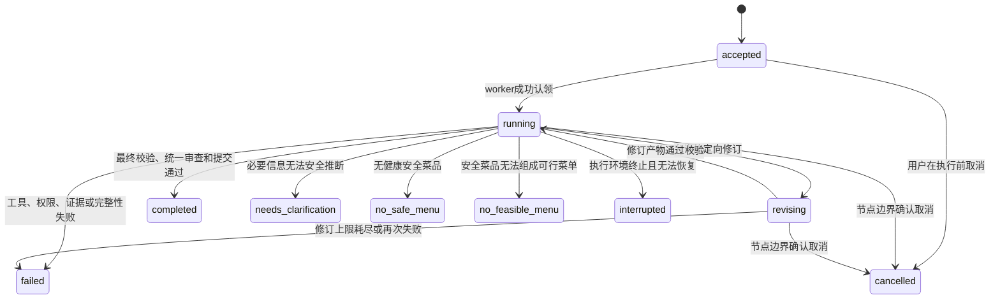
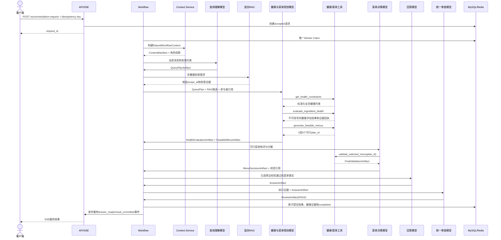
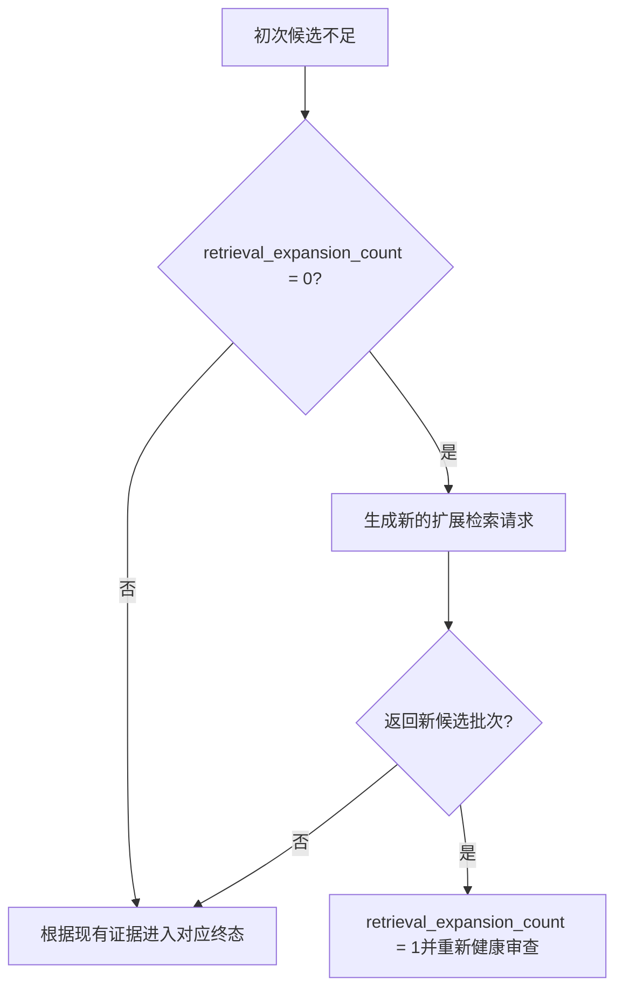

# V2推荐请求生命周期

- 状态：`APPROVED`
- 日期：2026-08-04
- 适用范围：WorkflowState、模型节点、工具、API/SSE和最终提交

## 1. 文档目的

本文从跨模块场景描述一次推荐请求如何创建、流转、修订、失败、取消和提交。它不定义完整字段Schema，而是固定各角色的先后关系、进入下一节点的条件和所有业务循环的上限。

生命周期必须遵守[系统总体设计](../00-system-overview.md)、[全局不变量](../contracts/global-invariants.md)和[模块边界](../contracts/module-boundaries.md)。

## 2. 请求状态



`accepted`、`running`和`revising`是非终态。其余状态均为终态，终态结果不可被同一`request_id`重新执行或覆盖。

## 3. 正常推荐链路



正常链路的强制条件是：

1. QueryPlanArtifact通过Schema和约束合并校验；
2. RAG完成词法、向量、融合和重排序，且不包含健康结论；
3. 健康规划模型形成全部必需工具的有效回执；
4. FeasibleMenuArtifact只包含全员健康交集中的菜品；
5. 菜单决策模型选择已有`plan_id`并完成最终健康校验；
6. AnswerArtifact完全基于所选菜单和证据；
7. ReviewArtifact为`PASS`；
8. 最终结果和强制健康审计在同一事务提交。

阶段性`analysis_ready`事件可以在对应Artifact校验后发布。最终回答正文在`FinalValidationArtifact=PASS`和`ReviewArtifact=PASS`之前不得发布。

## 4. 健康冲突与菜单不可用

### 4.1 部分菜品健康冲突

```text
RAG候选菜品
→ 标准食材展开
→ 与所有参与者有效健康约束逐一匹配
→ 命中审核硬关系的菜品整道排除
→ 剩余安全菜品进入菜单规划
```

排除证据保存在HealthEvaluationArtifact中，包含`recipe_id`、`ingredient_id`、参与者匿名引用、约束代码、规则引用和规则版本。被排除菜品不能通过偏好、营养、检索分数或模型判断重新进入当前候选菜单。

### 4.2 无健康安全菜品

如果全部召回候选均命中健康硬约束，并且允许的一次扩展召回已经使用或无法产生新候选批次：

```text
safe_recipe_ids = []
→ health_evidence完整
→ 终态no_safe_menu
```

`no_safe_menu`表示没有可用于规划的安全菜品，不等于工具失败、数据库失败或模型漏调工具。

### 4.3 有安全菜品但无法组成菜单

如果存在安全菜品，但无法满足明确菜数、菜单结构、锁定菜品、严格时间、仅现有食材或其他硬条件：

```text
safe_recipe_ids非空
且 feasible_plan_ids = []
→ 终态no_feasible_menu
```

健康安全与菜单可行性必须分别记录，不能把两种终态合并为“没有推荐结果”。

## 5. 一次扩展召回

初次召回只有在安全候选或菜单规划输入不足时，健康与菜单规划模型才可以调用一次`expand_retrieval`：

扩展召回最多一次；是否允许调用由WorkflowState中的`retrieval_expansion_count`决定。



扩展请求不能重复相同工具和相同参数，也不能放宽健康约束。扩展回来的新菜品必须经历完整食材健康审查。

## 6. 最终健康校验失败后的重新规划

菜单决策模型选择`plan_id`后必须调用最终校验。若最终校验发现菜单哈希、参与者约束或食材证据不一致：

最终健康失败后的重新规划最多一次，由`health_replan_count`强制限制。

```text
final_validation = FAIL
且 health_replan_count = 0
→ health_replan_count = 1
→ 返回健康与菜单规划节点
→ 使用失败证据重新生成可行菜单
→ 再次进入菜单决策和最终校验
```

第二次最终校验仍失败，或第一次失败无法形成合法的新规划输入时，进入`failed`并返回`FINAL_HEALTH_VALIDATION_FAILED`。不能输出上一次选择的菜单，也不能由回答模型修改冲突菜品。

## 7. 统一审查的定向修订

统一审查模型只读执行轨迹、必需工具回执、Artifact链、最终健康校验和回答依据。它输出：

```text
PASS
或 REVISION_REQUIRED(target_node, issue_codes, evidence_refs)
```

当`review_revision_count = 0`时，工作流允许一次定向修订：

- 回答依据或表达问题返回回答模型；
- 菜单选择与已有方案不一致时返回菜单决策模型，并重新执行最终健康校验；
- 上游健康证据缺失、必需工具漏调或权限越界不进入修订，直接失败。

修订后生成新Artifact版本，旧的用户可见阶段摘要通过`analysis_superseded`标记失效。工作流随后只允许一次复审。复审仍不通过时进入`failed`，错误码为`WORKFLOW_RETRY_LIMIT_EXCEEDED`或审查给出的更具体错误。

统一审查模型不能直接修改菜单、回答、State或工具回执，也不能通过自己的工具补齐其他角色漏掉的调用。

## 8. 工具和权限失败

### 8.1 必需工具漏调

```text
模型提交Artifact
→ required_tool_receipts不完整
→ REQUIRED_TOOL_NOT_CALLED
→ failed
```

工作流不代替模型调用工具，不把缺失结果设置为默认值，也不进入回答节点。

### 8.2 越权工具调用

角色调用不在白名单中的工具，或试图扩大参与者、会话和请求范围时：

```text
TOOL_PERMISSION_DENIED
→ 丢弃该调用结果
→ failed
```

越权失败不允许通过切换模型或删除调用记录继续。

### 8.3 相同工具重复调用

同一节点出现相同工具和相同参数哈希时，只允许第一条有效调用进入回执集合；再次调用违反节点预算并进入`WORKFLOW_RETRY_LIMIT_EXCEEDED`。这不影响用户创建新`request_id`进行显式重试。

### 8.4 永久健康约束覆盖请求

用户或模型尝试删除、放宽或忽略固定档案中的疾病、过敏、异常指标或其他永久健康硬约束时：

```text
PERMANENT_CONSTRAINT_OVERRIDE_DENIED
→ 不修改有效约束集
→ failed
```

用户可以撤销当前会话中自己新增的临时约束，但不能把临时撤销扩展到永久档案事实。

## 9. 上下文完整性失败

ContextManifest缺少当前消息、有效健康约束、当前菜单或待澄清事项，或者核心块哈希不一致时：

```text
CONTEXT_INTEGRITY_FAILED
→ failed
```

如果核心块完整但总Token仍超过预算，返回`CONTEXT_BUDGET_EXCEEDED`。两种情况都不能通过删除健康约束继续。

## 10. 幂等、并发和用户显式重试

### 10.1 创建请求

- 相同幂等键、相同规范化载荷：返回已有`request_id`和当前终态或运行状态；
- 相同幂等键、不同载荷：返回`IDEMPOTENCY_KEY_REUSED`；
- 唯一Worker Claim保证同一个请求只有一个执行者；
- 会话锁防止同一会话中的并发修改覆盖当前菜单版本。

### 10.2 用户显式重试

用户明确要求重试时创建新的`request_id`，记录`retry_of=<old_request_id>`。新请求重新构建上下文，不修改旧请求的终态，也不复用旧请求未提交的模型输出。

## 11. SSE断开、重连和取消

### 11.1 SSE断开

SSE连接只是事件消费者。连接断开：

- 不取消工作流；
- 不重新调用模型或工具；
- 不创建新请求；
- 不改变WorkflowState。

客户端使用`Last-Event-ID`恢复事件；服务端从持久事件游标继续发送。心跳只维持连接，不包含业务结论。

### 11.2 用户取消

取消请求只设置受控取消标记。当前模型或工具调用完成后，工作流在节点边界检查标记：

```text
cancel_requested = true
→ 不启动下一节点
→ 写cancelled终态
→ 保留已经产生的执行证据
```

取消不能把已经完成原子提交的请求改回`cancelled`。如果提交事务已经开始，必须由提交服务完成或回滚后再确定终态。

## 12. 执行环境中断

当Worker终止、Redis运行状态不可恢复或必要外部状态丢失时，请求进入`interrupted`，而不是自动重跑。恢复机制只能从MySQL已提交的节点边界和完整Artifact引用继续；无法证明上下文完整时保持终态并等待用户显式新建请求。

## 13. 最终提交失败

最终提交按以下顺序在同一MySQL事务中完成：

```text
验证Artifact链
→ 写最终菜单与AnswerArtifact引用
→ 写参与者约束和食材健康证据引用
→ 写FinalValidationArtifact和ReviewArtifact结果
→ 写completed终态
→ commit
```

任一步失败均回滚并返回`AUDIT_COMMIT_FAILED`或具体数据库错误。运行日志或可观测平台不能补偿这次失败，工作流也不能自动重新提交。

## 14. 生命周期验收场景

实现阶段至少验证：

- 正常单人请求进入`completed`；
- 多人任一参与者食材冲突导致整道菜排除；
- 全部菜品不安全进入`no_safe_menu`；
- 有安全菜但严格时间不可满足进入`no_feasible_menu`；
- 扩展召回只发生一次且产生新候选；
- 最终健康校验失败只重新规划一次；
- 统一审查只定向修订和复审一次；
- `REQUIRED_TOOL_NOT_CALLED`直接失败；
- `TOOL_PERMISSION_DENIED`直接失败；
- `PERMANENT_CONSTRAINT_OVERRIDE_DENIED`不修改永久健康约束；
- `CONTEXT_INTEGRITY_FAILED`不删除健康约束继续；
- 未通过离线质量门禁的数据产物不能进入在线链路；
- SSE断开不取消、不重跑；
- 重连按事件ID续传；
- 相同幂等键不同载荷返回`IDEMPOTENCY_KEY_REUSED`；
- 显式重试创建关联的新请求；
- 用户取消在节点边界生效；
- 强制审计提交失败回滚成功结果。
