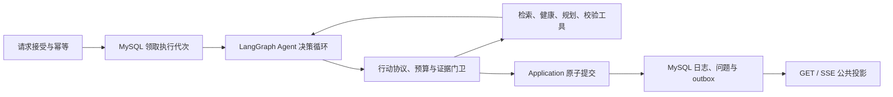

# LangGraph Agent 唯一目标链路：收口与交付文档

- 日期：2026-09-29
- 状态：执行中；尚未达到上线门禁
- 依据：[Agent 编排设计](../../modules/09-langgraph-agent-orchestration-redesign.md)、[澄清协议设计](../specs/2026-09-27-agent-clarification-lifecycle-design.md)、[v2 验收记录](../../../reports/2026-09-28-clarification-v2-acceptance.md)

## 1. 决策与交付边界

用户已明确：默认的确定性旧流程不再作为目标，也不再为它投入兼容性修复。交付对象是 **LangGraph Agent 编排 + 澄清协议 v2**。Agent 选择行动；确定性领域工具负责检索、健康审查、菜单计算与最终校验；Application/C4 负责权威提交和恢复。图的作用是约束、观察和执行 Agent 的行动，不是把旧固定流程原样迁入图。

本轮只处理 LangGraph v2 的可用性与一致性。旧 `fast_path` 的测试结果可记录，但不能替代 v2 验收，也不作为本轮放行门禁。不要为了旧流程错误码或 mock 兼容扩大改动。现有领域工具、健康硬约束、菜单计算及已提交业务数据仍是必须保护的核心链路。

代码中暂存的旧入口不等于产品目标。待 v2 门禁通过后，将新会话默认路由切到 LangGraph v2，再移除无用的旧入口、配置和测试；切换前不以旧入口的存在声称 v2 已可用。已创建会话按其持久化协议解释，不能在中途因环境变量变化改走另一套语义。

## 2. 目标请求链路



每个 v2 请求只有一个持久化接受身份和一个当前执行代次。模型输出不能直接改变健康约束、问题状态或提交事实。澄清问题通过 `question_id`、`option_id`、revision 与生产请求绑定；前端的结构化选择作为新请求提交。GET 以 MySQL 已提交事实为准，Redis 只保存运行时进度和可重建投影。

## 3. 当前证据与尚未完成的事

| 范围 | 已确认 | 仍需关闭 |
|---|---|---|
| Agent 行动编排 | LangGraph v2 的行动、工具、证据与预算已有实现；C3 全套回归本轮达到 416 passed | 真实模型结构化澄清 Q1→选择→终态还没有成功证据 |
| 澄清提交 | 已定位并修复 C3 正常路径漏传 revision/v2 标志、提交错误被旧业务错误遮蔽的问题 | 用真实模型和真实存储复验修复后结果 |
| 执行恢复 | MySQL 已有 owner + generation 领取、续租、结束及提交校验；真实 MySQL 定向 62 passed | D1/C3 失租、旧会话锁、读写投影及绝对运行时限的集成验收 |
| 请求投影 | Redis 已增加原子 compare-generation 写入；D1 正在增加按 MySQL 当前代次过滤 GET/SSE | 旧代次迟到写、跨进程读取与 outbox 恢复的确定性测试 |
| 前端 | 结构化选项、刷新恢复及 38 项 Vitest 曾通过 | 真实 Q1→选择后的界面与服务端终态一致性 |
| 在线模型 | 先前两条普通成单成功；后续澄清尝试受模型网络连接失败阻断 | 用可达链路重跑，记录 request/session/question ID、MySQL、outbox、SSE 证据 |

以上数字是阶段性结果，不代表整体验收通过。最新测试和在线样本须写回[验收记录](../../../reports/2026-09-28-clarification-v2-acceptance.md)。

## 4. 剩余执行任务

### A. 关闭执行代次竞态

1. D1 领取成功后，把 owner/generation 贯穿 C3、Application 提交与临时投影；旧代次失去租约后不能写状态、SSE、Redis 或终态日志。
2. DB 租约心跳失效或达到 v2 绝对截止时间时，停止续 Redis 会话锁。旧线程即使模型调用迟到返回，也必须在节点入口和提交前被拒绝。
3. 新代次撞上旧会话锁时保留 `recovery_required` 可重试状态，不生成失败终态或失败 SSE；客户端用同幂等键、同载荷重发原 POST 领取。
4. v2 的 completed、needs_clarification、failed/cancelled/interrupted 均通过带代次校验的权威提交。成功提交、接受记录终态、问题变化和 outbox 在同一事务边界内成立。
5. GET/SSE 对未提交请求比较 MySQL 当前 generation 与 Redis/内存 generation；旧快照不可作为当前事实。已提交请求仍从日志、问题和已投递 outbox 恢复。

### B. 验证 Agent 澄清闭环

1. 在固定 v2 会话中，真实模型面对不可同时满足的要求应输出 `ask_user`，产生 `needs_clarification` 和公开 Q1；MySQL 有且只有一个有效问题，outbox/SSE 使用相同稳定事件 ID。
2. 用 Q1 的真实 `question_id` 和 `option_id` 创建第二请求。验证 Q1 消费、第二请求完成或产生 Q2，旧请求 GET 不能显示 Q2。
3. 覆盖模型无响应、结构化行动非法、健康校验拒绝、提交失败和 Redis 丢失；每种情况都要说明权威终态、可重试性和是否对用户公开错误。

### C. 切换为唯一目标链路

1. A/B 门禁通过前保持测试环境内显式 v2 会话，不能把默认路由切换当作验收手段。
2. A/B 和回归通过后，服务端为新会话持久化 `langgraph + v2`，并删除依赖运行时环境变量猜测旧会话协议的分支。详细落地见[唯一执行入口实施方案](2026-09-29-langgraph-v2-entry-convergence.md)。
3. 再清理确定性旧入口及其专用配置/测试。清理是后续单独变更，不得与尚未验证的代次修复混成一次风险扩散；共享的领域工具、审计和提交服务继续保留。

## 5. 放行门禁与证据格式

以下项目全部满足，才可把 LangGraph v2 作为新会话默认路径：

- **代次隔离**：旧提交、旧状态、旧 SSE、旧 Redis 写入全部被拒；旧锁停止续租后同一 POST 能恢复。提交先于重领、重领先于提交两种顺序都只产生一个终态日志和对应 outbox。
- **澄清闭环**：真实模型 Q1→结构化选择→完成或 Q2 成功；GET、SSE、MySQL 问题行、日志、outbox 一致，且公开载荷不含私有修改或健康资料。
- **回归**：LangGraph/C3、D1、C4、Application、迁移与相关集成测试通过；Ruff、前端结构化选择测试和构建通过。旧确定性流程的兼容性测试不计入该门禁。
- **故障恢复**：MySQL 不可用时不依据 Redis 宣称权威完成；Redis 丢失后可从 MySQL/outbox 恢复已提交事实；未提交且不可确认的状态明确返回可恢复错误。
- **可观察记录**：每条真实样本保存请求/会话/问题 ID、终态、模型调用与耗时、日志/outbox/SSE 对照；脚本化故障与真实模型结果分开写，不能互相替代。

任一门禁未满足，就继续标记“未放行”，并在验收报告中记录失败事实和下一次复验命令。在线模型网络不可达只说明在线证据缺失，不能把离线通过写成真实模型成功。

## 6. 验收命令与交付文件

```powershell
.\.venv\Scripts\python.exe -m pytest tests/contracts tests/application tests/c3 tests/c4 tests/d1 tests/integration -q
.\.venv\Scripts\ruff.exe check src tests scripts/verify_v2_live_structured.py
git diff --check
```

真实模型样本由 `scripts/verify_v2_live_structured.py` 执行；它只在模型连接失败时重试，结果需结合 MySQL/outbox 与 SSE 人工核对。前端在 `frontend` 目录运行 `npm test -- --run` 和 `npm run build`。交付时更新[验收记录](../../../reports/2026-09-28-clarification-v2-acceptance.md)与本文件的状态，明确是否达到默认切换门禁。
