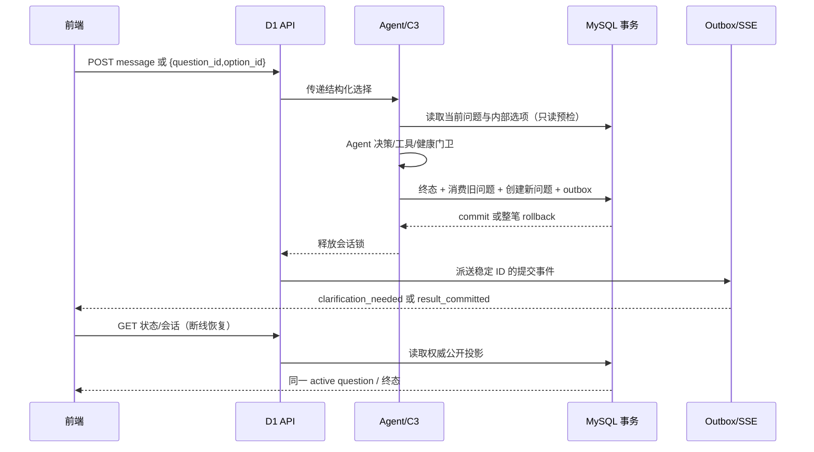

# Agent 澄清链路全局解决方案

- 日期：2026-09-27
- 性质：设计与实施交付方案；本文不代表已实施或已验收
- 适用范围：`WORKFLOW_MODE=langgraph` 的 D1 → C3 → Application → MySQL/C4 Redis → SSE/前端链路
- 现状证据：[重构交接](../plans/2026-09-27-agent-refactor-handoff.md)、[在线验收](../../../reports/2026-09-27-agent-live-acceptance.md)

## 1. 结论与边界

总体判断：受约束的 Agent 行动—工具反馈循环、健康门卫和五类主要在线场景已有实现与单次验收，不需要再把 LangGraph 退回固定流程。阻止默认切换的主因转到了**会话协议与运行可靠性**：澄清问题的权威状态、跨存储提交顺序、前端回复身份和长期模型尾延迟。现有代码已能在已提交菜单或再次追问后，利用 MySQL 审计中的 `accepted_clarification_question_id` 阻断部分 Redis 残留重放；这是必要的故障缓解，尚不是完整的澄清协议。问题有三个层次：

1. **回复身份未绑定**：D1 请求只有 `message`，C3 把“选第一个”解释为最新 Redis pending。旧、新问题都含选项 1 时，无法知道用户指向哪个问题。
2. **问题产生与终态分离**：`_node_inquire_user` 先写 Redis、发布 SSE，`_finalize` 随后才提交 MySQL；提交失败可能留下已展示却未获权威确认的新问题。普通首次追问没有 MySQL 终态事实。新需求还会在执行前消费旧 pending，若本轮失败也无法自然恢复。
3. **提交事实与公开投影分离**：MySQL、Redis、D1 内存/Redis 状态、SSE 各自维护状态；已提交后的 Redis 异常已有局部保护，但状态恢复、事件重放与前端刷新没有统一的权威读取路径。`GET /v1/sessions/{id}` 当前直接返回 C4 的 `pending_clarifications`，其中可能含私有 `query_plan_snapshot` 与约束修改，不应继续作为公开协议。

目标是保证**每个 `question_id` 最多产生一次已提交的业务效果**，且客户端明确指向该问题；不承诺模型只调用一次，也不声称 MySQL 与 Redis 存在分布式原子事务。Agent 仍自主选择追问、检索、规划或提交；协议层只裁决问题身份、状态转移、证据和可见性。健康门卫、工具事实、最终校验不放宽。默认 `fast_path` 保持不变。

## 2. 备选方案

| 方案 | 能解决什么 | 缺口与判断 |
|---|---|---|
| A. 仅给现有 Redis pending 和请求增加 `question_id` | 消除多数文本编号歧义，改动小 | Redis 问题先展示、MySQL 后提交的窗口仍存在；崩溃恢复依赖逐项补偿。不满足完整交付。 |
| **B. MySQL 澄清账本 + 终态同事务转移 + outbox（推荐）** | 问题生成、旧问题消费、菜单或再次追问的终态在一个数据库事务内成立；Redis 与 SSE 可重放 | 需要增量数据库迁移、API/前端契约与部署门禁；边界清晰，可沿用现有 Application 事务和 outbox。 |
| C. 全流程事件溯源/持久化 LangGraph 检查点 | 历史重建能力最强 | 改动远超澄清问题，仍须解决对外选项身份与提交事务；本阶段不采用。 |

## 3. 权威状态与不变量

MySQL 是澄清生命周期的唯一权威源。Redis 仅承载会话执行快照、缓存、锁和可重建投影；D1 状态和 SSE 是公开投影。`sessions.active_clarification_question_id` 指向当前唯一有效问题，`clarification_questions` 保存问题及其状态。每次转移在已锁定的 `sessions` 行内完成。

| 不变量 | 具体要求 |
|---|---|
| I1 唯一活跃问题 | 同一会话最多一个由 MySQL 指针确认的 active question；Redis 数组顺序不参与业务裁决。 |
| I2 明确选择 | 选择必须携带 `question_id` + `option_id`；模型/前端都不能提交 `modifications`，服务端从权威问题记录读取。纯文本“选第一个”不可被后台猜成选择。 |
| I3 同事务提交 | 消费旧问题、创建下一问题、写 `recommendation_logs`、菜单版本和相应 outbox 在同一 MySQL 事务完成或全部回滚。 |
| I4 幂等与冲突 | 同 `request_id`、同提交信封原样返回；不同信封冲突。不同请求竞争同一 `question_id` 时，最多一个业务提交成功；其余返回明确的已消费/过期/已被替代结果。接收预检尽量避免无效模型调用，但提交时仍必须独立复核，不能承诺竞态下模型从未运行。 |
| I5 可见性 | 新问题在事务提交前不能出现在正式 SSE、GET 状态或前端可选列表中。崩溃后可从 MySQL 重建公开结果并重放稳定 ID 的事件。 |
| I6 隐私 | 公共响应只含问题 ID、文本、选项 ID/文本、到期时间；内部约束修改、QueryPlan 快照、健康证据不出现在 SSE、会话 GET 或浏览器存储中。 |
| I7 失锁阻断 | 问题状态转移和菜单提交都校验有效 fencing token 与会话版本；过期 worker 不得因非 `completed` 终态绕过 MySQL 门禁。 |

“恰好一次”仅指 MySQL 中可观察的**业务提交效果**。网络请求、模型调用与 outbox 派送允许重试；每个重试必须幂等或被拒绝。

## 4. 数据模型与事务接口

增量迁移新增 `clarification_questions`，并给 `sessions` 加 `active_clarification_question_id`、`clarification_revision`（初值 0）。建议字段：`question_id` 主键，`session_id`、`producer_request_id`（唯一）、`status`（`pending|consumed|superseded|expired`）、`public_payload` JSON、`private_snapshot` JSON、`expires_at` UTC、`accepted_request_id`（唯一且可空）、`accepted_option_id`、`created_at/updated_at`。索引覆盖 `(session_id,status,expires_at)`；`session_id` 外键指向 sessions。`question_id` 必须由 `request_id` 和固定轮次索引确定性派生，或在请求创建时持久化，保证崩溃重试得到相同提交信封。私有快照只存恢复规划必需的约束引用/QueryPlan 字段，不复制原始健康档案；公开与内部字段在契约层分开验证，不能把整行 JSON 透传 D1。

新增 `ClarificationTransition` 契约：`expected_question_id`、`selected_option_id`、`next_question`、`supersede_current` 四部分均可空，但只能组成合法状态转移。`commit_request_result(..., clarification_transition=...)` 在现有 `SELECT sessions ... FOR UPDATE` 之后执行：

1. 把澄清转移（含问题 ID、选项 ID、下一问题的稳定 ID）纳入 `commit_hash`，按 `request_id` 做现有信封幂等检查；同信封重试直接返回权威结果，不同转移得到 `IDEMPOTENCY_CONFLICT`。
2. 校验正整数 fencing token、会话版本、当前问题 ID、状态、数据库时间的到期点与 `option_id`。对涉及澄清的 `needs_clarification` 与 `completed` 都执行；更新会话的 fencing token。若 Redis 全局计数器可能重置，发布前须加入与 MySQL 上次 token 的对齐/启动检查，不能悄悄放宽比较。
3. 选项回复：旧问题 `pending→consumed`，记录接受它的 `request_id/option_id`。自由文本新需求：旧问题仅在**本轮成功提交**时 `pending→superseded`；失败时旧问题仍有效。到期问题在事务中判定并拒绝选择。
4. 本轮再次追问：插入新问题并更新 active 指针；本轮完成菜单：清空 active 指针；两者与请求日志、菜单版本以及 outbox 同时提交。首次追问也必须写 MySQL `needs_clarification` 结果和新问题。
5. 写入稳定事件 ID 的 `clarification_needed` outbox；沿用现有 `completed` 事件机制。提交失败时没有新问题和可执行 SSE。

保留 `recommendation_logs.health_evidence.accepted_clarification_question_id` 作为审计字段，但不再使用 JSON 查询作为生命周期主索引。`C4.get_pending_clarifications` 可以继续为内部上下文提供缓存视图，必须从 MySQL active 指针校验/重建，不能决定下一次选择。

| 本轮输入与终态 | 同事务澄清转移 | 对外结果 |
|---|---|---|
| 无活跃问题，Agent 首次追问 | 插入新 `pending`，active 指向它 | `needs_clarification` + 新问题事件 |
| 选择当前问题，完成菜单 | 旧问题 `consumed`，active 置空 | `completed` + 已提交菜单事件 |
| 选择当前问题，Agent 再次追问 | 旧问题 `consumed`；插入新 `pending` 并切换 active | `needs_clarification` + 新问题事件 |
| 完整新需求取代当前问题并成功 | 旧问题 `superseded`；按结果置空 active 或创建新问题 | `completed` 或 `needs_clarification` |
| 任一路径在提交前失败、取消或中断 | 不产生新问题，不消费/替代旧问题 | 明确终态；旧选项仍可按协议重试 |

若需求本身要求结束会话/放弃问题，应定义单独的显式 `dismiss_clarification` 转移；不得把任意自由文本或技术失败当作已消费。过期问题的 GET 公开视图不可继续展示可点击选项，状态清理可懒执行，但选择必须按数据库时间拒绝。

## 5. 请求、事件与前端协议

`POST /v1/recommendation-requests` 保留普通 `message`。选择时新增顶层结构化字段 `clarification_response: {question_id: string, option_id: number}`；`message` 可继续作为用户可读文本，但选择语义只来自该对象。字段格式错误立即 422；问题不存在、已消费、已替代或过期在接收预检时返回 409，并在事务提交时重新校验竞态。若请求已被接收后才输掉并发竞争，请求以明确冲突码终止，绝不执行菜单提交。不得接收客户端提交的 `modifications` 或私有快照。旧客户端只发“选第一个”时返回明确的 `CLARIFICATION_REFERENCE_REQUIRED`，提示刷新问题或提出新的完整需求；不得把它暗中绑定到最新问题。一个真正的新需求仍可发送自由文本，并按第 4 节在成功提交后取代旧问题。

`clarification_needed` SSE、`GET /v1/recommendation-requests/{id}` 的终态投影和 `GET /v1/sessions/{id}` 的 active question 投影使用相同的公开 `ClarificationView`：`question_id`、问题文本、`options[{option_id,text}]`、`expires_at`。D1 必须过滤现有 C4 会话响应中的 `pending_clarifications` 原始内容，只输出公共视图。SSE 断线、刷新或轮询后，前端从 GET 恢复同一 ID；回复按钮发送结构化 `question_id/option_id`，发送中的按钮禁用。若服务器返回 `CLARIFICATION_ALREADY_APPLIED`、`CLARIFICATION_STALE` 或 `CLARIFICATION_EXPIRED`，前端拉取最新 active question，不自动重试旧选项。

客户端也不应把用户自由输入的“选第一个”自动绑定到最新问题：这句话可能是旧问题的延迟回复。选择只能通过携带所展示问题 ID 的按钮或明确选择控件发送；普通输入框用于完整的新需求。模糊编号文本返回引用缺失提示，不进入 Agent。浏览器只持有公开视图，不持有内部修改字典。

## 6. 故障语义与恢复

| 断点 | 权威结果 | 恢复行为 |
|---|---|---|
| 生成问句后、MySQL 提交前模型/工具/数据库失败 | 无新问题；旧问题不变 | 不发布可执行 SSE；本请求 `failed`，用户可重试旧选择或新需求。 |
| MySQL 已提交、Redis pending/会话投影失败 | MySQL 新问题/消费事实已成立 | 不把终态改为 failed；后续从 MySQL 重建 Redis。 |
| MySQL 已提交、D1 状态/SSE 写失败 | 事务日志与 outbox 已成立 | GET 从 MySQL 恢复终态；outbox 重投同一事件 ID。 |
| 同一问题被两个请求同时选择 | 最多一个事务推进 active 指针 | 第二个在预检或提交时得明确冲突；不可调用模型后静默转成新问题。 |
| 选择已过期/已被替代/不存在的问题 | 不修改菜单或其他问题 | 返回相应 409/422 与当前公开问题，不回退到文本解析。 |
| 同一幂等键重复发送 | 不重复运行 Agent 或产生新问题 | D1 返回原 `request_id`/终态；MySQL 信封再做第二道幂等校验。 |
| SSE 到达时会话锁尚未释放 | 已提交结果仍有效，但后续请求可能抢锁失败 | outbox 在释放锁后投递；对同会话紧接请求加入短暂有界等锁，避免 `SESSION_LOCK_UNAVAILABLE` 竞态。 |
| Redis 全局 fencing 计数器丢失/回退 | MySQL 上次 token 仍权威 | 启动门禁阻止澄清/菜单提交，恢复计数器或完成经验证的 epoch 迁移后放行。 |

不通过“两库双写成功”判断是否完成。恢复任务只对比 MySQL 版本和 Redis 投影，幂等重建；失败可重试并计量积压。D1 的异常兜底不得将 MySQL 已提交终态覆盖为 `WORKFLOW_ERROR`。D1 在 Redis 丢失且 MySQL 存在终态时从请求日志与 outbox 构造公开状态；若两者都没有可确认事实，返回明确的恢复中/存储不可用错误，不把未知状态伪装为 404 或 `completed`。

## 7. 实施顺序与文件边界

| 阶段 | 交付物与主要文件 | 独立验收 |
|---|---|---|
| P0. 契约与增量迁移 | `db/schema_mysql.sql`、新增 `db/migrations/...sql`；新增 `contracts/clarification.py`；明确公共/内部 payload 与状态转移 | 空库与 H07 副本迁移可重复，旧菜单与请求日志不变；约束和索引生效。 |
| P1. Application 权威事务 | `application/commit_service.py`、新增澄清 repository、`application/outbox.py`；一次事务处理旧问题、新问题、菜单/追问和事件 | 首次追问、选项完成、选项再次追问、新需求替代、事务回滚、并发竞争与幂等测试。 |
| P2. C3/C4 接入 | `c3/graph_orchestrator.py`、`c3/runner.py`、`c4/mysql_repository.py`、`c4/__init__.py`；C3 暂存新问题到状态而非预先写 Redis/SSE，C4 从 MySQL 读 active question | 失败不出现幽灵问题；旧问题消费与新问题生成在同一终态；锁丢失 fail-closed。 |
| P3. D1 与前端 | `d1/schemas.py`、`d1/__init__.py`、`api_app.py`、`frontend/src/types.ts`、`api/client.ts`、`stores/recommendation.ts`、`features/chat/ChatPanel.vue` | SSE、轮询、刷新视图一致；按钮携带 ID；过期/旧 ID 可恢复；私有数据不外泄。 |
| P4. 恢复与验证 | D1 GET 权威回填、outbox 重放、Redis 投影修复；C3/C4/Application/D1/前端单测和 H07 故障注入 | 第 6 节故障矩阵全过；真实模型端到端场景和脚本化注入分别记录，不混淆。 |

按 P0→P4 顺序交付；每阶段先写能暴露当前缺口的测试，再做最小实现。现有 `tests/c3/test_agent_validation_regressions.py`、`tests/integration/test_langgraph_d1_full_chain.py`、`tests/application/test_commit_validation.py` 扩展新协议用例；前端扩展 `recommendation.test.ts` 和 `ChatPanel.test.ts`。旧 Redis pending 测试要迁移为“缓存可丢、MySQL 可恢复”，不能只断言数组长度。

## 8. 迁移、上线与回滚

先部署兼容旧代码的加法 schema，再部署支持新旧协议的代码，最后仅对**新 LangGraph 会话**开启 `CLARIFICATION_PROTOCOL=v2`。会话所用 `workflow_mode/protocol_version` 应持久化，不能在同一会话中因环境变量切换而换协议。当前 Redis-only 问题缺少可靠的生产请求关联，不建议猜测回填；旧会话应完成原流程或明确收到“请重新提出需求”，不能把旧问题当新协议问题直接接受。

按隔离测试 → 少量新会话 canary → 扩大比例 → 决定是否调整默认模式推进。回滚时只停止**新会话**进入 v2；已有 v2 问题继续由兼容代码处理，或明确终止并要求新建会话。绝不让旧 `fast_path` 静默解释 v2 选项。对 H07 已发布数据使用迁移脚本，不重建固定菜谱/健康数据；部署前备份并在副本验证，迁移失败停止开关。

## 9. 放行证据与剩余运行指标

功能放行必须同时满足：第 3 节不变量的自动化测试；第 6 节每一断点的受控故障注入；真实 MySQL/Redis 下重复选择只形成一次业务提交；SSE 断线与页面刷新后展示同一问题；公开响应通过禁用字段扫描；原有五类 Agent 在线场景及“再次追问”有新协议真实模型样本；C3/C4/Application/D1 与前端回归全过。提交前保留 `WORKFLOW_MODE=fast_path` 默认值。

性能单独设放行门：按场景记录决策次数、单次模型耗时、总耗时、空响应率、澄清率、提交失败率、outbox 积压与 Redis 投影修复时间，报告 p50/p95/p99 及样本量。现有 30 次模型调用不能估算稳定 p99；先采集跨时段、有代表性的在线样本，再由产品明确可接受的延迟/失败阈值。未达阈值时保持 LangGraph opt-in，不能用 deterministic fallback 假装模型成功。

明确不在本方案中做：重写健康审查/B4、替换检索/规划算法、引入全流程事件溯源、让前端决定约束修改、承诺 Redis/MySQL 分布式 exactly-once。
