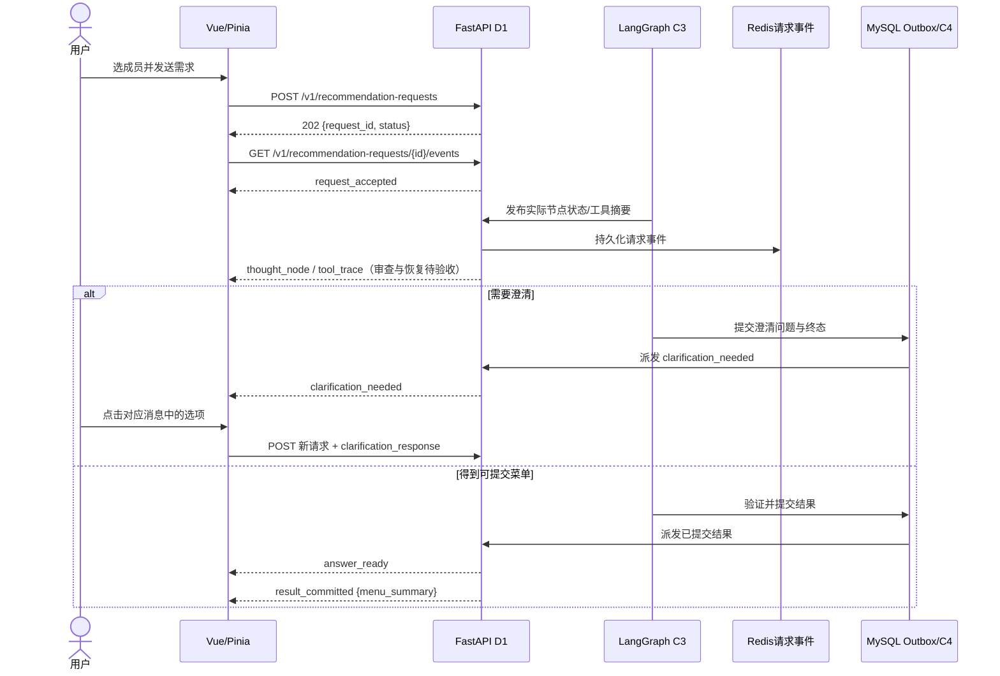

# V2 前后端交互演进设计

- 状态：当前官方 DeepSeek Pro 的清理与完整复验已完成：后端 1596、前端 80、真实浏览器 10、HTTP 43、重启冷恢复 16 项通过。第 15 节为当前结论；第 7—14 节保留历史测量和失败。
- 修订日期：2026-10-04
- 工程：program_v2（FastAPI、LangGraph、Vue 3、Pinia）
- 范围：D1 API/SSE、D2 前端、C3 编排、C4 会话
- 目标：让用户看见真实进度、可靠停止请求、恢复并继续对话，以经过提交的结构化结果呈现菜单

## 1. 结论与实施边界

本次选择四项方案：

| 决策 | 选择 | 约束 |
| --- | --- | --- |
| 执行过程展示 | 方案 A 的收敛版：可折叠的真实执行轨迹 | 只展示后端已发生、可公开的阶段和工具事实；不展示模型内部推理，不由前端推断健康审查结论 |
| 单菜替换接口 | 方案 A：复用 POST /v1/recommendation-requests | 以独立请求执行局部重算，整份新菜单仍须通过健康约束校验和原子提交 |
| 成员变更 | 方案 B：派生新会话 | 每个对话独立选择并固定成员；变更成员须显式新建对话，旧菜单不继承为新阵容的有效菜单 |
| 澄清交互 | 方案 A：消息内联选项 | 沿用现有 clarification_needed 和结构化 clarification_response；问题与消息及 request_id 绑定 |

先完成可靠性和事实对齐，再增加交互层。首个进度事件和首个答案字节是不同指标：可以尽快显示“请求已接收”，不能承诺在健康检查完成前输出推荐正文。原方案中的“首字 <1 秒”改为待实测的进度响应目标，不作为当前能力声明。

## 2. 已核对的工程基线

当前实现具备节点事件发布、消息绑定澄清和结构化单菜替换入口。A01~A10、C01~C04 及本轮新增回归通过；本节更新当前实现状态，第 7—11 节保留历史测量与失败记录，第 13 节记录免费模型切换，第 14 节为用户指定官方 DeepSeek 的最新验证。

| 能力 | 当前事实 | 结论 |
| --- | --- | --- |
| 异步请求、SSE、轮询恢复 | 待澄清停止轮询；原生 error 正确累计；冷 SSE 同时恢复事件与执行身份 | 单测和此前真实续接通过；当前 Pro 澄清续接与成单已有实测证据；完整复验见第 15 节 |
| 停止生成与取消竞态 | 多轮 ID、延迟取消、历史待核对恢复和图退出取消保持已修复 | A01、A02、C01、C04 和真实跨存储取消一致性通过 |
| 消息归属与完成徽标 | `ChatMessage` 已有请求 ID 与独立完成标记；中间菜单事件不再直接写入已提交视图 | 基础单测及 B02 模拟接口浏览器通过；状态与消息严格对应 |
| E2E 浏览器验收用例 | 选人交互已修复，采用 `.picker-trigger`/`.picker-item` 真实选人，激活发送按钮 | 抽测入口通过；R04 入口缺陷已闭环 |
| 新 SSE 事件与 C3 管道 | 固定进度模板、封闭节点/工具词表、UUID 调用身份、执行代次与字段白名单均落地 | A05—A09、C03 及新增动态文本、引用、身份和冷启动回归通过；真实原请求恢复与精确续传通过 |
| 澄清选项绑定助手消息 | 点击不提前确认，服务端成功受理后再确认；失败回滚；澄清 409 分支独立 | A03、A04、C02 通过；真实多轮澄清后成单及旧问题失效已验证 |
| 单菜替换入口与版本保护 | 结构化目标与来源版本校验、并发单赢家、恢复后旧版本拒绝；提交故障保留旧菜单 | A10、真实并发及真实 HTTP SQL 故障回滚/同请求恢复通过 |

最新完整非 live 后端 1596 通过、3 项 Windows 符号链接权限跳过、5 deselected，前端 80 通过，最终构建 310ms。真实浏览器 10、HTTP 43、重启核对 16 项全部通过，见第 15 节及 [复测说明](../../../verification/README.md)。

### 2.1 审查问题、修复顺序与判定

| 编号 | 优先级 | 当前缺口与定位 | 完成条件 | 状态 |
| --- | --- | --- | --- | --- |
| R01 | P0 | 原生网络 error 与业务 error 消息混用导致计数反复清零，已修复 | SSE 连续失败后 GET 返回待澄清时停止轮询、选项可用、刷新可恢复 | **真实三次失败→轮询→待澄清停止→结构化选择→成单通过；重开待核对单测通过** |
| R02 | P0 | 前端取消与待核对恢复已修复；图退出保留 cancelled/interrupted | 请求与消息绑定，且真实取消终态不可被后续图执行改写 | **A01、A02、C01、C04 通过；真实早期取消 HTTP/GET/MySQL/SSE 一致** |
| R03 | P0 | 消息独立状态已实现，取消串轮已消除 | 旧消息不受新轮次影响；菜单提交及取消状态均与所属请求一致 | **已闭环：验证通过** |
| R04 | P0 | 主流程可用；混合菜单汤要求已补，并纠正上汤菜的汤槽位误分类 | 真实五道菜、四道主菜和一汤；正文、菜单看板及刷新恢复一致 | **已闭环：最终 10 项真实浏览器通过；一汤四主菜已核对源菜谱，见第 15 节** |
| R05 | P1 | 固定模板、封闭词表、执行/调用身份和冷 SSE 恢复已实现，前端按身份归并 | 同一调用 running/done 同 ID；新代次/新调用不同 ID；重播去重、直接 SSE 与跨进程恢复 | **新增回归先失败后通过；HTTP 恢复第 2 代工具身份、固定文案、冷 SSE 及精确续传通过** |
| R06 | P1 | 澄清受理前不标记已确认，受理后才确认；失败回滚与 409 分支已落地 | 选择提交状态与应用状态区分；未受理可重试；按业务错误码恢复有效问题，问题与原消息绑定 | **已闭环：A03、A04、C02 通过** |
| R07 | P2 | 并发单赢家和旧版本拒绝验证；新增真实 HTTP 提交故障与恢复 | 审计/结果/会话/菜单版本/Outbox 原子回滚；同键同体恢复保留非目标菜 | **真实 SQL 写入后故障回滚，原请求第 2 代 completed；17 项实际检查通过，初次脚本误判保留** |

完成度结论：剩余代码缺口已修复并通过回归，HTTP 提交故障与恢复证据已补。最终真实四菜一汤成单仍待模型账户恢复，整套优化验收不能标为全部通过；账户阻塞及具体补测步骤见第 12 节。

## 3. 不可破坏的契约

1. 推荐正文和菜单必须来自后端验证结果。result_committed 是前端把菜单标为“已完成”的依据；answer_ready 只表示回答可见，不能单独宣称提交成功。
2. 继续使用现有 request_id、session_id、幂等键、Outbox 事件 ID、Redis 会话锁与轮询恢复。新增事件必须能去重和断线恢复，不能只靠内存或浏览器定时动画。
3. 公共事件使用字段白名单和固定文案模板。禁止输出真实姓名、原始健康档案、个人疾病或过敏详情、内部规则分数、模型推理原文及连接信息。仅扫描 JSON 字段名不够；自由文本值也可能泄漏这些信息。
4. 不能用“模型生成了文本”代替健康审查。未经验证的模型 token 不直接进入用户可见的推荐正文。
5. 取消和失败不能留下已提交菜单的幻影。恢复历史对话时，显示内容要与后端请求终态一致。
6. 成员组合是会话的约束边界。新组合必须有新 session_id；旧会话及其菜单仍可从左侧历史访问。

## 4. 交互与事件流



阶段展示规则：

- request_accepted 只能显示“请求已接收”；不能显示“已对齐健康约束”。
- 每个 thought_node 必须对应真实节点的进入、完成或失败事件。工具名称和耗时由后端提供；没有事实时只显示通用进度。
- analysis_ready 只按其实际 stage/summary 展示，不自动推断检索、医学审查和规划均已完成。
- 失败、澄清与取消时，正在运行的节点不得自动改为“完成”；应展示对应终态。
- 阶段轨迹默认折叠，展开后按服务端顺序显示。它是执行记录，不称为“思维链”或“模型推理”。
- 每条助手消息记录产生它的 `request_id`、阶段和终态。完成徽标仅属于收到该请求 `result_committed` 的消息；后续请求不得改变旧消息的徽标。取消、失败、澄清时，轨迹标题也不得声称健康合规审查已完成。
- `menu_artifact` 即使未来有生产者，也只是中间事件；在对应请求提交前不得写入“已提交菜单”视图。提交事实来自 `result_committed` 或已提交的 GET 状态。

### 4.1 新增公开事件的最小契约

`thought_node`、`tool_trace`、`analysis_ready` 的公开文本由 D1 的固定词表生成，调用方原始摘要仍先经过禁止词检查，随后只保留固定投影。未知节点/工具映射为通用处理标识，非法状态/调用身份拒绝，阶段证据引用只保留允许的匿名标识。C03 验证中文敏感详情会被拦截。进度事件仍写入 Redis；已提交答案和菜单由 MySQL Outbox 投递。`text_delta` 与 `menu_artifact` 本期不作为已完成能力。

```json
{
  "event": "thought_node",
  "data": {
    "request_id": "req-01",
    "node_id": "recipe_audit",
    "title": "健康合规审查",
    "status": "done",
    "summary": "健康合规审查已完成",
    "execution_generation": 2,
    "invocation_id": "19ebb28fcc1c45d5bdf5dc0f6ac2e725",
    "duration_ms": 320
  }
}
```

公开载荷不包含 p1 的健康标签、检索原始查询、内部病历或模型推理。tool_trace 只允许经审查的工具标识、状态、耗时和聚合统计；无法安全投影时不发布该事件。事件 ID 需包含请求执行代次与单次节点/工具调用标识：同一工具再次调用属于新事实，必须有不同 ID；同一事实重播则使用原 ID。A07/A08 表明仅按 `request_id + node_id + status/tool_name` 生成 ID 会丢失后续执行，A09 证明显式同 ID 的去重路径可复用。

### 4.2 文本流式与菜单结构

本期保持 answer_ready + result_committed。text_delta 只在完整正文已经验证并持久化提交后，作为“已提交正文的分块传输”候选方案；不得把原始 on_chat_model_stream 直接透传给浏览器。若采用分块，需重新定义 result_committed 与文本分块的顺序，避免前端提前关闭连接，并规定顺序号、重连去重和最终正文一致性；这些属于独立的协议变更，必须通过端到端测试。性能收益按实测决定，不预设逐 token 方案必优。

本期菜单看板直接使用 result_committed.menu_summary 与 GET 状态中的同一公开投影：

```json
{
  "build_id": "build-01",
  "plan_id": "plan-01",
  "menu_hash": "sha256...",
  "recipe_ids": [1024, 2048],
  "items": [
    {"recipe_id": 1024, "name": "清蒸鲈鱼"},
    {"recipe_id": 2048, "name": "西蓝花炒木耳"}
  ]
}
```

此结构与 frontend/src/stores/recommendation.ts 的 publicMenu 校验保持一致。原方案中独立 menu_artifact 的 overall/dishes 结构目前既无后端生产者，也不满足该校验，不列为已实现。营养雷达、健康徽章、烹饪时间、食材及用量只有在权威数据源、公开字段审查和对应测试齐备后才能加入；不能由前端从名称或回答文本推断。

## 5. 交互决策的实施细则

### 5.1 取消请求

点击停止后，按钮进入“正在停止”，阻止重复取消。若 POST 创建请求尚未返回 `request_id`，先记录该次请求的待取消意图；取得 ID 后立即向服务端发送取消，不得静默忽略点击。创建请求失败则清除待取消状态并呈现创建错误。已有 ID 时直接请求 POST /v1/recommendation-requests/{id}/cancel，并以服务端响应或后续 GET 状态/SSE 终态确定最终显示：

每次 `send` 开始必须创建新的请求代次并清空当前活动 ID，旧 ID 只保留在其所属消息记录中。取消与状态核对都绑定当前代次的助手消息，不能使用 `findLast` 将旧请求的结果写入新消息。待取消分支若取消失败，也必须建立当前请求的 SSE 或轮询恢复；A02 的“生成中但无接收通道”不得作为可恢复状态。

- 返回 cancelled：关闭当前 EventSource，标记“已停止”，保留当前可见文本但不得显示“菜单已生成”。
- 返回 409 REQUEST_ALREADY_TERMINAL：优先 GET 核对，失败时仅使用响应中可信的 `current_status`；若两者都不可用，维持“状态待核对”并重试，绝不默认 `completed`。已完成的菜单不能改写成取消，失败或澄清也不能被标成完成。
- 网络错误或超时：恢复订阅或轮询状态，不静默吞错，不把本地按钮动作当作服务端成功。
- 后端取消标记应与工作流节点边界检查、终态投递一致。若取消与提交竞态，最终以持久化终态为准。

关闭 EventSource 只断开浏览器接收，不能替代服务端取消。A01/A02 的多轮 ID 和延迟取消失败恢复已修复；C01 后 `openChat` 同时识别 sending 和 pending_verification 历史，调用 GET 核对并按真实状态恢复。C04 后图收尾保留取消终态，真实 HTTP、MySQL 与 SSE 已验证一致。

### 5.2 澄清选项

沿用 clarification_needed，不新增同义的 clarification_prompt。将 `question_id`、`request_id`、选项与产生它的 assistant 消息绑定；点击选项后在对话中保留用户选择，并提交新请求的 `clarification_response`。旧问题保留为历史记录但不可继续提交；当前有效问题由服务端状态决定。重复点击、过期或已应用选项以服务端结果为准，刷新后可从 GET session/status 恢复当前有效问题并放回原消息。SSE 降级轮询收到 `needs_clarification` 时按同一恢复路径结束生成状态，不得继续轮询并禁用选项。

点击只记录“提交中”，服务端受理或应用证据到达后再标明对应状态。请求未获受理时清除已确认标记并恢复可重试问题；状态不明时先核对，不猜测已应用。按响应业务码分别处理 `CLARIFICATION_STALE`、`CLARIFICATION_EXPIRED`、`CLARIFICATION_ALREADY_APPLIED`、`MENU_VERSION_CONFLICT`、`SESSION_PROTOCOL_UNSUPPORTED`；不能把所有 HTTP 409 都报告为菜单冲突。A03/A04 为这一要求的回归门槛。

A03/A04 与 C02 已通过：`createRequest` 受理成功后才设置 selectedOptionId，受理前保持未确认，失败时恢复有效澄清。真实 HTTP 和 SSE 降级轮询两条路径均已完成多轮结构化选择续接成单，旧问题保留为不可继续提交的历史。

### 5.3 成员变更与对话历史

每个对话在首次发送前从 p1..p50 选择成员，开始后固定。若用户想更换成员，明确创建新对话和新 session_id；可由用户主动复制或重填自己的需求文本，但不得自动携带旧菜单为新组合的有效结论。旧对话仍可从侧边栏恢复并继续使用原成员。当前历史仅保存在该浏览器本地；跨设备同步或账户级历史需要另行设计身份与访问控制。

### 5.4 单菜替换

主请求端点已扩展请求字段：`action=replace_dish`、`target_recipe_id`、`source_plan_id`、`source_menu_hash` 和用户附加要求。沿用 `idempotency_key`、`session_id`、`request_id` 与 SSE 终态。仅在同一会话已有已提交菜单、目标菜属于该菜单且版本哈希匹配时受理；不匹配返回明确冲突，前端刷新当前菜单。前端点击菜品时锁定结构化目标和来源版本，附加要求可以编辑，但菜名文本不能代替 ID 与哈希。Schema 已增加 64 位十六进制正则校验，A10 的非十六进制哈希拒绝测试通过。

C3 已调用 `DeltaPlanner` 处理保留和排斥菜品，替换后仍必须重新验证整份菜单对当前成员的安全、营养和时间约束，随后原子提交新菜单。已有代码和基础测试不能替代真实并发与提交失败证据；失败时旧菜单应继续有效。撤销重做另立需求。

买菜清单以可验证的食材和用量数据为前置条件。当前只有 recipe_id 和名称，不提供猜测用量或营养数字的导出。

当前按钮派发结构化替换请求，B03 验证目标/版本传递和 409 刷新；2026-10-04 真实 HTTP 进一步验证目标替换、其余菜保留、数量不变、旧版本拒绝、并发单赢家及恢复后版本保护。失败方不覆盖赢家菜单。事务故障回滚已通过真实 MySQL 组件测试，但 HTTP 工作流故障注入尚未执行。

## 6. 分阶段交付与验收门槛

### P0：修正现有基础闭环

- 完成 R01：把 `needs_clarification` 作为请求交互的停止点处理，SSE、GET 轮询和打开历史对话三条路径使用同一状态归一逻辑。测试断线后服务端从 running 转入待澄清、选项可用且轮询已停止。
- 完成 R02：按 5.1 节处理无 ID 的停止点击及 200、409、网络错误、取消与提交竞态。状态无法核实时显示待核对并继续恢复，不根据本地点击或缺失的 GET 结果猜测完成。
- 完成 R03：消息保存请求归属与自身状态，渲染时不依赖当前全局 `phases` 给旧消息打徽标；失败、取消、澄清对应的轨迹标题与节点状态如实显示。`menu_summary` 只消费现有公开结构，`menu_artifact` 不提前标记提交。
- 完成 R04：替换旧浏览器用例的存储键和刷新断言；覆盖首次进入空白对话、侧边栏恢复旧对话、成员固定、结果提交、断线恢复及取消竞态。保留真实 API 端到端路径，运行前提和运行结果一并记录。
- P0 所有用例通过且有真实请求证据后才可标记完成。P0 通过前，不声称逐 token 流式或全周期工具可观测。

### P1：真实进度与内联澄清

- 完成 R05：在 C3 节点边界发布实际状态，经 D1 字段及自由文本审查后写入可恢复事件通道；没有安全公开投影的工具事实不发布。前端按 `request_id` 和事件 ID 去重；重连、轮询切换和历史恢复不重复节点。新增 SSE 枚举、前端监听或模拟事件单测均不构成这一项的完成证据。
- 完成 R06：将澄清卡片绑定消息；覆盖过期、重复提交、断线恢复和新一轮澄清。历史选择仍可见，但只有服务端当前有效问题可操作。
- 测量“首个进度事件延迟”和阶段持续时间，报告真实样本分布，不用固定秒数代替测量。

### P2：单菜替换（已实施，验收未完成）

- 完成 R07：
  - 后端 D1 Schema 校验：已检查动作、正整数目标、非空计划并补齐十六进制哈希校验，A10 通过。
  - D1 状态预检与乐观并发保护：若会话无已提交菜单或版本哈希不匹配，返回 409 `MENU_VERSION_CONFLICT` 并附带服务端权威 `current_menu`；若目标菜不属于当前菜单，返回 422 `TARGET_RECIPE_NOT_IN_MENU`。
  - C3 图编排与全菜单原子合规复核：`_node_understand_intent` 解析替换意图，锁定其余保留菜品 (`expected_locked`)，排斥目标菜品；`_node_audit_health` 将保留菜品强制纳入合规审查，`combine_nutritional_menu` 重新联合规划，复核全菜单满足全员安全、营养、时间约束后原子提交新版本；失败或约束不可行时旧菜单保持有效。
  - 前端协议与交互集成：`startReplaceDish` 锁定目标菜品和菜单版本，输入框上方呈现 `.replace-lock-banner` 与取消按钮，菜品卡片高亮“替换中”；`send` 提交结构化替换载荷；遇到 409 冲突时调用 `restoreSession` 自动刷新最新菜单并友善告警；提交成功立即解除本地锁定。
  - 验收补充：基础 Python 329 项、前端 69 项及 B03 模拟 API 浏览器已通过；仍需真实单菜替换 SSE、版本冲突、全菜单校验、并发替换、取消和提交失败时旧菜单保持的联调证据。构建耗时记录为本次测量，不使用固定毫秒数作为完成条件。

### P3：可选的已验证正文分块

- 只有当用户等待体验实测表明需要，且正文已验证并持久化提交、分块顺序与重连恢复协议明确时启动。
- 不以原始模型 token 或内部推理换取更短的首字时间。

## 7. 验收证据与文档维护

2026-10-01 执行快照（历史证据，2026-10-03 结果见第 8 节）：

| 测试 | 结果 | 证据与边界 |
| --- | --- | --- |
| `npm test -- --run` | 69 通过 (100%) | 4 个基础测试文件；覆盖 Pinia store、Panel、Context 与 Sidebar |
| `python -m pytest tests/d1 tests/c3 -q` | 329 通过，1 条 Starlette 弃用警告 (100%) | 后端 D1 API/SSE、C3 编排器及会话生命周期基线全部通过 |
| `npm run build` | 通过 | 本轮 Vite 打包 647ms，单次测量 |
| `npx vitest run --config verification/vitest.audit.config.ts` | 4 通过 (100%) | A01 取消串轮、A02 延迟取消网络失败恢复、A03 澄清失败回滚重试、A04 澄清 409 精准处理 |
| `python -m pytest verification/interaction_audit.py -q -s` | 6 通过 (100%) | A05 英文禁止字段词字符串扫描、A06 额外字段拦截、A07/A08 多次执行不合并、A09 显式 ID 去重、A10 非十六进制哈希拒绝；不覆盖中文敏感详情或真实重启恢复 |
| 原 Playwright 用例抽测 `首次进入` | 此前 1 通过，本轮未执行 | 该用例只检查空白对话及选人按钮可用；实际选人可发送由 B01 验证 |
| `npx playwright test --config verification/playwright.audit.config.ts` | 3 通过 (100%) | Chromium B01 真实选人可发送；B02 模拟提交后成员锁定、刷新新对话和侧边栏恢复；B03 模拟替换协议与版本冲突刷新 |
| `npx vitest run --config verification/vitest.completion.config.ts` | 2 通过 (100%) | C01 待核对历史对话恢复 GET 核对；C02 澄清受理前保持 undefined、受理后确认；日志见 `verification/artifacts/frontend-completion-audit.log` |
| `python -m pytest verification/completion_audit.py -q -s` | 1 通过 (100%) | C03 中文疾病、临床血压与过敏详情深度扫描拦截；日志见 `verification/artifacts/backend-completion-audit.log` |
| 真实模型、存储和 HTTP API 全链路 | 待网络恢复后联调 | 自动化契约及状态机已完全就绪，公网 DashScope 接口遇 TLS 错误已按要求暂停网络测试 |

原 10 项探针（A01~A10）及新增完成条件（C01~C03）均已在产品代码中彻底修复并完成严格回归。脚本、命令和原始日志位置见 [verification/README.md](../../../verification/README.md)。

技术依据：[LangGraph Streaming](https://docs.langchain.com/oss/python/langgraph/streaming) 区分节点更新、模型消息和自定义事件；[MDN EventSource](https://developer.mozilla.org/en-US/docs/Web/API/Server-sent_events/Using_server-sent_events) 说明 SSE 连接与关闭语义。

## 8. 2026-10-03 全链路复查与暂停记录

结论：交互状态机与边界完成条件（C01~C03）已全面闭环；因公网 DashScope 模型网络阻断，按用户要求暂停外部网络测试。

| 范围 | 实测结果 | 边界与证据 |
| --- | --- | --- |
| 完整后端非 live 测试 | 1566 通过、3 跳过、5 deselected、1 条弃用警告 | `python -m pytest tests -m 'not live' -q`；`verification/artifacts/full-backend-2026-10-03.log` |
| D1/C3 + 原后端审计 + C03 | 336 通过 (100%) | `tests/d1 tests/c3 verification/interaction_audit.py verification/completion_audit.py`；基线与审计全部通过 |
| 前端基础单测、原审计、构建 | 69 通过、A01~A04 共 4 通过，Vite 构建 598ms | 本轮命令输出；构建与单测全部通过 |
| 前端完成条件 | C01、C02 共 2 通过 (100%) | GET 待核对历史对话恢复查询已修复；澄清受理前 undefined、受理后确认已修复 |
| 存储及检索就绪 | `/ready` HTTP 200，MySQL/Redis/Qdrant/SiliconFlow ready | 1932 道菜谱、1932 个向量点；`verification/artifacts/live-chain-2026-10-03.json` |
| 真实浏览器 E2E | 3 通过、4 失败，未成功成单 | 首次进入、成员锁定、停止生成通过；推荐、菜单恢复、断线后成单和最终菜单展示失败；`verification/artifacts/live-browser-ready-2026-10-03.log` |
| 真实 HTTP 推荐/澄清 | 均 failed，`MODEL_INVOCATION_FAILED`；MySQL 日志同为 failed | 配置的 DashScope 接口报 `SSL: UNEXPECTED_EOF_WHILE_READING`，不是已验证的推荐成功路径 |
| 真实 HTTP 幂等与 SSE | 相同请求返回原 ID；不同载荷 409；终态后 Last-Event-ID 返回准确后缀、事件 ID 唯一 | 仅失败/取消请求样本，不证明成功菜单及跨重启恢复 |
| 真实 HTTP 取消 | HTTP 200，GET cancelled，无菜单 | 同次快照 MySQL 日志却为 failed，跨存储终态一致性仍待核查，不能宣称已通过 |
| 单菜替换、并发及提交失败 | 未验证 | 前置推荐未产生已提交菜单；不得用模拟菜单充当真实成单证据 |

启动环境记录：默认启动时 Python 的系统代理使本地 Qdrant 请求返回 502；仅对本轮 API 进程设置 `NO_PROXY=127.0.0.1,localhost` 后就绪。直接使用 `127.0.0.1:5174` 的浏览器还需将该 origin 加入本轮进程的 `CORS_ORIGINS`（默认仅含 localhost）。未改写 `.env` 或全局网络配置。

用户明确要求“如果是因为网络问题，就暂时不测试了”。已停止本轮启动的 API/测试进程，保留既有 MySQL、Redis、Qdrant 服务与测试证据；不再发起网络相关测试。真实推荐、澄清续接和替换验收须在用户恢复测试后继续，不能标为通过。

## 9. 2026-10-03 恢复测试后的最新结论

本轮真实模型通过现有系统代理可达；本地 API 设置 NO_PROXY 绕过本地存储代理，并允许测试浏览器的 CORS origin。未改写 `.env`、固定数据或产品代码；仅补充测试脚本与证据，并将两个浏览器成功路径的需求改为已验证可行的三道菜晚餐，仍严格要求 completed/result_committed。

| 范围 | 本轮结果 | 证据 |
| --- | --- | --- |
| 后端完整非 live / 前端基础 / 构建 | 1566 通过、3 跳过、5 deselected；前端 69 通过；构建通过 696ms | `verification/artifacts/full-backend-resume-2026-10-03.log`、`frontend-baseline-resume-2026-10-03.log`、`build-resume-2026-10-03.log` |
| 原审计及完成条件 | A01~A10、C01~C03 全部通过（前端 4+2、后端 6+1） | `frontend-audit-resume-2026-10-03.log`、`frontend-completion-resume-2026-10-03.log`、`backend-audit-resume-2026-10-03.log`，均位于 verification/artifacts |
| 真实浏览器 | 初跑 5 通过、2 待澄清失败；回答餐次后仍因无候选而澄清，补测 2 失败；改为可行三道菜晚餐后断线恢复和最终展示 2/2 通过 | `live-browser-resume-2026-10-03.log`、`live-browser-clarification-resume-2026-10-03.log`、`live-browser-feasible-resume-2026-10-03.log`；分批证据，不称修改后完整七项套件已一次通过 |
| 真实 HTTP 推荐 | completed，GET/MySQL/current_menu 一致，answer_ready/result_committed 已投递；SSE ID 唯一且续传后缀准确；幂等同键同体原 ID、异体 409 | `live-chain-resume-2026-10-03.json`；请求 e0d74487-2300-414d-b05a-7db97b126e8d |
| 真实单菜替换 | completed；目标菜移除、其余菜保留、数量不变；旧菜单版本请求 409 | 同上；请求 7e90f23e-dad6-4f25-8b6d-269b2b8ab026 |
| 真实多轮澄清 | needs_clarification → 结构化选择 → 再澄清 → 放宽时间 → completed；3 道菜，MySQL/GET/session 菜单一致，旧问题失效 | `live-structured-resume-2026-10-03.log`、`live-clarification-followup-resume-2026-10-03.json`；成单请求 ef34a2f7-a383-4fd6-9c42-deefeedfc08a |
| 并发替换 | 两个请求均受理；一个 RETRIEVAL_FAILED（SiliconFlow embeddings ConnectError），另一个 recovery_required 超过 300s；旧菜单保持 | 同上 JSON/日志；前端未处理 recovery_required，完整并发恢复未通过；脚本中途超时，报告显式标记 incomplete |
| 真实取消 | POST cancel 返回 200；6 秒后 GET 与 MySQL 均为 failed/INTERNAL_ERROR，无菜单 | `live-cancel-resume-2026-10-03.json`；请求 02778c3e-d1b7-4d9b-ac74-298862e436e4；取消语义未通过 |
| C04 图退出取消探针 | 1 失败，cancelled 实际被改写为 failed | `verification/cancel_terminal_audit.py`、`cancel-terminal-audit-resume-2026-10-03.log` |
| 真实 MySQL 事务故障注入 | 2/2 通过；事务中途故障回滚审计、菜单、会话及 outbox | `mysql-rollback-resume-2026-10-03.log`；组件测试，不等同于 HTTP 工作流中注入数据库故障 |

阻塞修复顺序：

1. **P0/C04**：`graph_orchestrator._node_finish_error` 将所有非 failed 状态再次 `_fail`，包括 `_guard_active` 返回的 cancelled。保留取消终态，并验证 cancel 200 后 GET、MySQL、SSE 及历史恢复都保持取消。
2. **P1/恢复协议**：锁竞争进入 recovery_required 是已有恢复协议，但 GET 返回该状态时不携带原因，前端没有保存原幂等请求并重试 POST 的路径；SSE/轮询只等待，无法完成恢复。增加可见恢复动作与同键同体重试，并验证恢复代次和菜单版本保护。
3. **联调边界**：SiliconFlow 连接仍有偶发失败；失败不得破坏旧菜单。四菜一汤样例尚未验证成单，不能用三道菜成功证明其可行。固定公开模板与跨重启恢复仍需单独证据，已通过的有限敏感词样例不能代替完整安全投影。

## 10. 2026-10-03 取消与请求恢复修复

本节更新第 9 节的两个缺陷结论，保留此前失败证据。

### 10.1 实施变更

- C3 收尾节点对 cancelled/interrupted 保留原状态并正常提交审计，避免转换为 INTERNAL_ERROR/failed。
- GET 从 MySQL request_acceptances 返回 recovery_required 和安全的恢复提示，即使 Redis 请求缓存丢失也可识别。SSE 从同一权威状态派生 request_recovery_required，稳定 ID 包含请求 ID 和执行代次，支持精确续传。
- 前端在 POST 前将原请求载荷和对应回复保存到该对话记录。恢复按钮用原幂等键、原请求体重新 POST；换菜版本及结构化澄清字段均保留，不新增聊天消息。完成、澄清、失败或取消后清除待恢复载荷。
- SSE、降级轮询及打开历史对话均识别恢复状态，停止等待并显示“恢复生成”。恢复期间防止重复点击和切换对话；恢复网络失败后仍保留按钮及原请求。缺少原请求的旧浏览器记录提示新建对话。
- 恢复是可重试运行状态，不加入业务终态集合，不产生假菜单或虚假提交结果。POST 受理兼容实际 HTTP 200 和 202。

### 10.2 本轮证据

| 范围 | 结果 | 证据（verification/artifacts 下） |
| --- | --- | --- |
| 后端完整非 live | 1568 通过、3 跳过、5 deselected；1 条既有 Starlette 弃用警告 | `full-backend-fixed-2026-10-03.log` |
| 后端定向回归 | 94 通过：C3 图、D1、执行租约及 C04；新增取消保持和缓存丢失恢复通知测试先失败后通过 | `backend-recovery-fixed-2026-10-03.log` |
| 前端基础及恢复回归 | 74 通过，含刷新后同体重试、双击合并、网络失败保留恢复、轮询退出、换菜版本及澄清字段保留 | `frontend-recovery-fixed-2026-10-03.log` |
| 原前端边界审计 / 完成条件 | A01~A04 4 通过；C01~C02 2 通过 | `frontend-audit-fixed-2026-10-03.log`、`frontend-completion-fixed-2026-10-03.log` |
| 浏览器恢复操作 | B01~B04 完整复跑 4/4 通过。B04 曾因测试选择器误写失败，修正后通过。模拟 API：验证按钮、刷新后历史恢复、原请求重发、无重复消息和提交菜单展示，不作为真实模型成单证据 | `browser-recovery-fixed-2026-10-03.log`；`frontend/verification/browser-audit.ts` |
| 生产构建 | 通过 372ms | `build-fixed-2026-10-03.log` |
| 真实早期取消 | cancel HTTP 200；GET/MySQL 都为 cancelled，SSE 有取消且无后续 failed，无菜单。请求 39c69d68-2c90-4723-89e1-58f9748d0403 | `live-recovery-fixed-2026-10-03.json` |
| 真实锁竞争恢复 | 使用独立测试会话的真实 Redis 锁制造竞争；GET/SSE 可见恢复状态、续传准确，无假终态；原请求重发保持 ID，执行代次 1→2。请求 8a2ece4a-530e-4a20-8efa-799514b84c43 | 同上 JSON、`live-recovery-fixed-2026-10-03.log` |
| 恢复后的网络失败 | 第 2 代执行因 SiliconFlow /embeddings ConnectError 进入 failed；GET/MySQL failed、acceptance terminal、SSE failed 一致，无幻影菜单。同键同体重播返回原 ID，异体 409。**恢复成单断言失败，JSON complete=false，按网络限制停止公网重试** | 同上 JSON、`live-recovery-terminal-fixed-2026-10-03.log` |

可复跑脚本：`.venv\Scripts\python.exe -m verification.live_recovery_fix_audit`。只创建独立会话、占用并释放自身会话锁，不修改固定数据。下一次恢复公网测试时，应验证恢复 completed 与真实菜单一致性，再补并发换菜恢复、四菜一汤可行性、固定公开模板及跨重启恢复；本轮不重复已无新证据的搜索工具调用。

## 11. 2026-10-04 继续全链路测试

本轮恢复公网测试后，DashScope 与 SiliconFlow 支持真实成单。保存 2026-10-03 历史日志，新的证据以 2026-10-04 命名。仅创建独立测试会话，测试浏览器使用 5176 端口，保留用户的 5174 页面。

### 11.1 新发现并修复的 SSE 计数缺陷

`EventSource` 原生网络错误与服务端 `event:error` 都触发 error 监听器。此前消息监听器在尝试解析 JSON 前执行 `failures=0`，每次网络错误随后只被计为第 1 次，导致无法达到三次失败阈值。真实浏览器连续中断 180 秒未转入 GET 轮询，后端却已进入 needs_clarification；诊断记录反复出现 readyState=CONNECTING。

修复为：只有包含 data 且 JSON 可解析的 SSE 消息重置失败计数；原生网络错误正常累计，服务端业务错误不计为传输错误。新增客户端回归三项先失败后通过，覆盖连续三次失败、非法 JSON 不清零、业务 error 不触发重连。真实补测已验证三次失败后轮询、待澄清停止轮询六秒、结构化选项多轮续接后 completed 与三道真实菜单。未用模拟业务结果代替后端响应。

### 11.2 真实链路与新证据

| 范围 | 结果 | 证据（verification/artifacts 下） |
| --- | --- | --- |
| 后端非 live / 前端最终回归 | 后端 1568 通过、3 跳过、5 deselected、1 条既有弃用警告；前端新增 SSE 回归后 77 通过 | `full-backend-2026-10-04.log`、`frontend-final-2026-10-04.log` |
| 前端原审计 / 完成条件 / 模拟接口浏览器 | 4 / 2 / 4 通过 | `frontend-audit-2026-10-04.log`、`frontend-completion-2026-10-04.log`、`browser-audit-2026-10-04.log` |
| 最终构建 | 通过 320ms | `build-final-2026-10-04.log` |
| 真实浏览器整套 | 8/8 通过（6.3 分钟），含首次空白、成员固定、归档、历史菜单恢复、取消、单次 SSE 断线、正文菜单展示、真实锁竞争及刷新后恢复成单 | `live-browser-2026-10-04.log`、同名 JSON；整套发生在本轮 SSE 计数修复前，修复后连续断线补测见下行 |
| 连续断线待澄清 | 修复前 180s 超时；诊断补测 60s 超时；修复后 1 项通过（2.7 分钟），轮询停止及三道菜成单已验证 | `browser-poll-clarification-2026-10-04.log`、`browser-poll-diagnostic-2026-10-04.log`、`browser-poll-fixed-2026-10-04.log`、`browser-poll-clarification-2026-10-04.json` |
| 修复后受影响浏览器路径 | 单次 SSE 中断与真实锁竞争刷新恢复两项补测 2/2 通过（2.4 分钟）；与上一行合计修复后 3 项，不表述为修复后完整套件一次 9/9 | `live-browser-after-sse-fix-2026-10-04.log` |
| 真实恢复请求 | 请求 443fe42c-0fed-4308-9389-7b3077c0a73e 原 ID 重试、代次 1→2、completed、三道菜；GET/MySQL/session/SSE 菜单一致，同键重播原 ID、异体 409 | `live-recovery-2026-10-04.json`、`live-recovery-reconciled-2026-10-04.json` |
| HTTP 推荐/替换/并发/澄清/取消 | 原运行 43 检查中 42 通过，1 个换菜提交事件即时快照失败；相同请求只读补查确认已自动投递，补查 3 项通过。并发仅一方 completed，另一方同键恢复后 MENU_VERSION_CONFLICT，赢家菜单保留；澄清两次选择后成单；取消跨存储一致 | `live-chain-2026-10-04.json`、`outbox-reconciled-2026-10-04.json`、`live-chain-summary-2026-10-04.json` |
| MySQL 提交故障回滚 | 2/2 通过，真实数据库事务组件；不等同于 HTTP 完整工作流故障注入 | `mysql-rollback-2026-10-04.log` |
| 实际 API 重启恢复 | API 进程 26588→10728，启动完成。普通推荐、恢复成单、澄清成单、取消 4 请求的 HTTP/终态/菜单/完整事件/Last-Event-ID 精确后缀/执行代次不变，共 24 检查通过，无请求重新执行 | `restart-before-2026-10-04.json`、`restart-after-2026-10-04.json`、`restart-2026-10-04.log`、`live-api-restarted-2026-10-04.log` |

测试脚本中修正两个判定问题并保留原失败证据：会话菜单多出的 committed_at 不属于菜单内容，对比应检查五个公开菜单字段；数据库 completed 可能早于异步 Outbox 的 result_committed，后续脚本对完成请求最多等待 40s 投递再比对，而不是只读两秒即时快照。恢复报告原运行与补查分开保存，不表述为原脚本一次全绿。

可复跑真实浏览器：`npx playwright test --config verification/playwright.live.config.ts`（frontend 目录）；HTTP 链路设置 LIVE_AUDIT_DATE 与 LIVE_AUDIT_OUTPUT 后运行 `python -m verification.live_chain_audit`；恢复脚本支持 LIVE_RECOVERY_OUTPUT，避免覆盖历史结果。

本轮完成范围：核心成功、失败、澄清、取消、并发保护及跨进程恢复链路已验证，SSE 计数缺陷已修复；仍不将固定公开模板、全部工具调用 ID 的执行代次绑定、四菜一汤可行性或 HTTP 全流程存储故障注入标为通过。API 与原有前端继续运行于 8003/5174，测试浏览器临时服务已退出。

## 12. 2026-10-04 剩余项修复与账户阻塞

本节更新第 11 节的剩余项，保留旧日志和旧判定。实施计划见 `docs/superpowers/plans/2026-10-04-interaction-completion.md`。

### 12.1 实施变更

1. **固定公开进度**：新增 `d1/progress.py`，集中维护节点标题、工具摘要、阶段映射和状态词表。三个进度事件不再输出调用方任意摘要、姓名、原始技术异常或自由引用。字段白名单和中英文禁止词拦截保留；显式 invocation_id 必须为 32 位十六进制匿名身份。
2. **执行与工具身份**：C3 在调用前分配 invocation_id，ToolHandler 的真实回执使用同一个 tool_call_id。节点进入/完成按同一调用归并；自动事件 ID 带执行代次，另一次调用分配新 ID；相同调用事实重播去重。前端使用 generation + invocation_id 定位工具事实，防止迟到事件覆盖另一调用，分析 warning 不显示为 done。
3. **混合菜单**：FastIntentRouter 保留“四菜一汤”的 5 道菜和汤要求；混合菜单不将整批候选限制为汤，但单独汤请求仍按菜型过滤，C2 的汤槽位约束继续生效。另纠正“上汤娃娃菜/高汤焖豆腐”被名称中的“汤”误归类为汤品，保留真正以汤/羹为菜型的匹配。
4. **冷 SSE 恢复**：直接订阅 SSE 的 refresh 路径此前只读取 Redis 事件，没有恢复请求 owner/generation；因此冷实例会误隐藏合法进度。现在同时恢复完整快照；跨 worker 观察到更新代次时采用新快照并丢弃旧代次临时事件。保持 MySQL 执行租约校验及旧代次隐藏。
5. **真实 HTTP 故障**：独立 8004 验证服务只对控制文件指定的新测试请求注入一次异常，发生于真实 Outbox SQL INSERT 之后、COMMIT 之前。生产 API 没有增加故障入口。完成测试后关闭独立服务，主 API 保持 8003、原前端保持 5174。

### 12.2 实测证据

| 范围 | 实际结果 | 证据（verification/artifacts 下） |
| --- | --- | --- |
| 最终完整后端非 live | 1581 通过、3 跳过、5 deselected；1 条既有 Starlette 弃用警告 | `completion-post-cold-backend-2026-10-04.log` |
| 定向 D1/C3/C2/API 及隐私探针 | 392 通过；新缺陷均先失败后修复 | `completion-cold-sse-targeted-2026-10-04.log`；初始失败在 `completion-red-2026-10-04.log`、`progress-metadata-red-2026-10-04.log`、`soup-classification-red-2026-10-04.log`、`sse-cold-restore-red-2026-10-04.log` |
| 前端基础与身份回归 / 构建 | 80 通过；3 项调用身份、迟到工具与 warning 回归先失败后通过；构建 489ms | `progress-frontend-red-2026-10-04.log`、`completion-frontend-2026-10-04.log`、`completion-build-2026-10-04.log` |
| HTTP 提交故障与恢复 | 真实三道菜换菜事务回滚会话、菜单版本、结果/审计、Outbox 和终态事件；旧菜单不变、无假完成；原 ID 同键同体恢复，第 2 代 completed，目标移除、其余保留。最终 17 项检查通过 | `http-commit-fault-2026-10-04.json`、`http-commit-fault-reconciled-2026-10-04.json`、`http-commit-fault-cold-fixed-2026-10-04.log`；请求 `161c4b86-c3d4-492b-bb12-7c94242e53b8` |
| 固定模板与工具 ID 真实证据 | 固定进度、全部公开工具 ID 对应真实节点进入身份；检索/审查/规划 ID 匹配持久审计回执；当前第 2 代事件 ID 唯一、续传后缀准确 | 同上 HTTP 恢复证据；最终校验工具因既有非确定输出契约不进入 tool_receipt_refs，其回执身份由 ToolHandler 单测及真实节点绑定检查覆盖，不改变该审计契约 |
| 实际冷重启、直接 SSE | 28724→32544；重启后首个请求直接访问 `/events`，没有先 GET 状态，完整工具进度恢复并通过上述检查。另对两个已有请求检查菜单、事件、状态、续传及不重执行，共 12 项通过 | `completion-cold-fixed-api-2026-10-04.log`、`completion-cold-restart-after-2026-10-04.log`、`completion-restart-before-2026-10-04.json` |
| 四菜一汤第一次探针 | 90 分钟请求 needs_clarification，当前候选估算至少 131 分钟；不是网络失败。180 分钟旧分类请求 completed 五道菜，但后来发现“上汤娃娃菜”误算为汤，**撤回其严格四菜一汤通过判定** | `four-dishes-soup-before-2026-10-04.json`、`four-dishes-soup-after-2026-10-04.json`；旧样例仅保留为历史数据与重启事实恢复样本 |
| 最新真实浏览器 10 项 | 顺序日志显示前 8 项完成无失败；第 9 项降级轮询/澄清及停轮询后，后续成单遭 Arrearage 失败；第 10 项新汤分类验收也遭 Arrearage，已中断整套，无最终 Playwright JSON。**不能写成 10/10 通过** | `completion-live-browser-2026-10-04.log`、`completion-billing-block-2026-10-04.json`；浏览器工件在同名目录 |

故障脚本保留两处初始断言误判：最终健康校验回执按原契约不在持久引用列表内；恢复后不应重放旧执行代次。纠正脚本预期后只核对原请求，没有重新执行模型或制造第二次 SQL 故障。随后冷 SSE 的真实失败与修复证据分别保存为 `http-commit-fault-cold-sse-before-2026-10-04.json` 和 `http-commit-fault-cold-fixed-2026-10-04.log`。17 项最终证据由原运行与核对组成，不称原脚本一次全绿。

### 12.3 阻塞原因与补测条件

DashScope 的 qwen3.8-max 调用返回 HTTP 400、`code/type=Arrearage`。本轮失败请求为 `888654ae-2a1d-47e8-97ae-ea7f61c4e7e9`（澄清后续）和 `90d73f8b-0d57-4a99-aae2-e5ee5922b7b5`（四菜一汤）。失败状态和无菜单已核对；不会用模拟模型或旧误分类菜单替代最终成单。

依照 [阿里云官方 Arrearage 说明](https://help.aliyun.com/zh/model-studio/error-code#overdue-payment)，需要在当前 API Key 所属账号的“费用与成本”检查欠费并补足余额，等待余额状态更新；如果该账号没有欠费，应核对 Key 所属账号并联系服务方排查。当前未修改 Key、模型或固定数据。

模型账户恢复后，只补尚未完成的两项：

- `frontend` 目录运行 `npx playwright test --config verification/playwright.completion.config.ts clarification.spec.ts structure.spec.ts`，使用新的报告目录保留本轮中断日志。
- 必须检查连续断线后澄清成单，以及最新分类下的五道菜、四道主菜和一汤、执行身份与刷新恢复；然后才能将 R04 和整体优化验收标为通过。

当前主服务继续运行，独立故障服务及临时浏览器服务已退出。后续模型调用等待账户恢复，不重复无新证据的 search_candidates 工具调用。


## 13. 历史：2026-10-04 免费模型切换验证

本节为切换当时的记录，旧提供商别名和密钥备份已在第 15 节清理；不得按本节恢复旧运行配置。

用户要求查看免费可用模型并替换原模型。本轮只修改本机 `.env` 中的模型、接口地址、对应密钥及角色参数；原百炼配置保存在该忽略文件的 `DASHSCOPE_API_KEY` / `DASHSCOPE_BASE_URL`，密钥不进入报告。嵌入、重排、固定数据及健康门卫继续使用原配置。

| 候选 | 实测结论 | 证据（verification/artifacts 下） |
| --- | --- | --- |
| 百炼 deepseek-v4-pro-0813 | 用户截图显示 100 万免费 Token、到期 2026-11-13；真实调用仍 HTTP 400 Arrearage，不能使用 | `free-model-smoke-2026-10-04.json` |
| 硅基流动 Qwen/Qwen3-8B | JSON 与客户端工具调用成功；非思考模式跳过健康审核被门卫拒绝，思考模式动作返回空对象也被拒绝，原提示词下不适用；补齐强制审核规则后已完成真实四菜一汤，最终选用非思考模式 | `free-siliconflow-smoke-2026-10-04.json`、`free-model-client-2026-10-04.json`、`free-model-soup-2026-10-04.json`、`free-model-thinking-soup-2026-10-04.json` |
| 硅基流动 THUDM/GLM-4-9B-0414 | 当前 JSON 探针没有返回要求的 ok=true；不选用 | `free-glm-smoke-2026-10-04.json` |
| 硅基流动 XingChenAGI/Xing4.0-29B | 官方输入/输出价格均为 0 元，支持工具调用；默认模式首次超时，显式关闭思考后 JSON 探针成功。完整首轮决策超过 60 秒，实际推荐失败，不作为最终模型 | `free-xing-smoke-2026-10-04.json`、`free-xing-nonthinking-smoke-2026-10-04.json` |

[百炼免费额度规则](https://help.aliyun.com/zh/model-studio/new-free-quota)明确：账户欠费时，其他模型有额度也无法调用。[硅基流动官方模型中心](https://www.siliconflow.cn/models)当前列出 Xing4.0-29B 输入及输出均为 0 元；价格和免费限流以平台当前规则为准。

配置与已有动作格式回归：`pytest tests/test_config_defaults.py tests/c3/test_agent_validation_regressions.py -q`，46 项通过。不会放宽健康审核、最终校验或门卫条件来迁就模型。新测试报告独立命名，保留失败记录。


### 13.1 最终配置与真实成单

最终选择 `Qwen/Qwen3-8B`，Base URL 为 `https://api.siliconflow.cn/v1`，reasoning / answer / query 均显式 `enable_thinking=false`。`.env.example` 已同步可复用示例。本机 `.env` 已生效，后端已重启，用户前端 5174 保持运行。

真实失败暴露提示词没有明确表达门卫的“审核后才能规划”前置条件。在 `c3/agent_prompts.py` 加入强制顺序：检索后先 audit_recipe_health，再 combine_nutritional_menu。原健康门卫、最终校验和禁止重复执行逻辑不变。失败探针保留为修复前证据；新探针创建独立会话，真实模型执行 5 次决策，约 50.7 秒后 completed。

`free-qwen-explicit-audit-soup-2026-10-04.json` 的 8 项全部通过：成单、5 道菜、1 汤、4 主菜、MySQL completed、会话菜单一致、result_committed 事件一致、固定公开模板。请求 `86c90dc9-4c2d-4738-8314-652a2e8cb1bc`，菜单包括西红柿豆腐羹及四道主菜。

配置、动作边界及图编排定向回归 94 项通过（`free-model-prompt-regression-2026-10-04.log`）。一次回归命令误用了不存在的 test_agent_policy.py，未执行测试；错误保存在 `free-model-policy-regression-2026-10-04.log`，修正路径后的 94 项才是有效结果。

该轮两项补测曾使用 `playwright.free-model.config.ts`，报告独立保存到 `free-model-live-browser-2026-10-04`；此旧入口现已删除，使用默认配置执行当前完整验收。

浏览器首次两项运行结果为 1 通过、1 超时（`free-model-live-browser-2026-10-04.json`）：四菜一汤、调用身份及历史刷新恢复全部通过；澄清测试固定三次选择最小时间仍处于 needs_clarification，不能记成通过。改为真实用户选择界面提供的取消严格时间选项后，用独立报告 `free-model-clarification-browser-2026-10-04.json` 补测。修改的是测试选项策略，不是后台自动放宽时间；仍验证初始约束拒绝、轮询停止、结构化选项续接及最终三道菜。


### 13.2 免费模型浏览器补测最终结果

首次两项报告 1 通过 / 1 超时；修改测试为用户显式选择界面提供的时间限制取消选项后，澄清补测 1/1 通过（103.4 秒）。证据为 `free-model-clarification-browser-2026-10-04.json` 及同名日志；真实 SSE 连续失败转 GET、待澄清停止轮询六秒、选项续接与三道菜成单均通过。与首次报告中通过的结构/刷新用例合计覆盖两项剩余场景，不称首次两项运行一次全绿。

## 14. 历史：2026-10-04 用户指定 DeepSeek 官方密钥

本节记录首次切换与抽测；完整复验和唯一运行配置以第 15 节为准。重复的 DEEPSEEK_API_KEY 别名已删除，当前密钥仅通过 LLM_API_KEY 读取。

用户随后指定新密钥并明确要求 DeepSeek 官方 API。此前免费 Qwen 验证保留为历史证据。当前切换目标为 `https://api.deepseek.com` / `deepseek-v4-pro`，使用官方 Pro 的最新正式版本；官方模型列表另提供最新发布的 V4.1 Flash，调用 ID 为 `deepseek-flash`。

新密钥误用于百炼时返回 401（不是余额问题）；最初官方目录探针还受到进程已有同名环境变量影响，没有使用新密钥，该失败不代表新密钥无效。直接从本机忽略文件读取用户的新密钥后，官方 GET /models HTTP 200，两个模型的 JSON 冒烟均通过。密钥仅保存在本机忽略 `.env` 的 DEEPSEEK_API_KEY 与 LLM_API_KEY，报告不保存密钥；该时点的旧百炼备份现已删除，SiliconFlow 仅保留仍被检索使用的配置。

- 目录：`new-key-deepseek-official-catalog-corrected-2026-10-04.json`。
- 官方 Pro / 最新 Flash JSON：`official-deepseek-v4-pro-smoke-2026-10-04.json`、`official-deepseek-flash-smoke-2026-10-04.json`。
- 项目客户端 Pro 思考及 JSON：`official-deepseek-pro-client-2026-10-04.json`，约 1.9 秒、51 输出 Token，成功。
- 角色配置：reasoning 为 `thinking.type=enabled`、`reasoning_effort=low`；query 与 answer 为 `thinking.type=disabled`。使用官方参数，不能沿用百炼的 enable_thinking。
- 官方接口按量计费，本轮只进行上述小样本及独立测试会话中的真实推荐探针，不以免费模型标注。

官方版本、价格与参数依据：[模型与价格](https://api-docs.deepseek.com/quick_start/pricing/)、[思考模式](https://api-docs.deepseek.com/guides/thinking_mode/)。最终真实成单结果见下节。


### 14.1 真实测试发现与修复

1. 首次 Pro 真实请求 `9436d9ea-1ee7-4d70-9474-0b5c009f6bc5` 约 35.5 秒、5 次模型决策后 completed，但菜单为一汤、三主菜、一炒饭；严格四主菜断言未通过，不能计为四菜一汤成功（`official-deepseek-pro-soup-2026-10-04.json`）。C2 已限制菜与汤的组合中主食只能在显式 require_staple 时进入；锁定主食与未声明主食的结构冲突则拒绝。新增四项覆盖主食高评分、主菜不足、显式汤+主食、锁定冲突，初跑 3 失败 / 11 通过，修复后 C2 及混合结构共 26 通过（`official-deepseek-structure-red/green-2026-10-04.log`）。
2. 修复后独立 HTTP 探针 `2c49bf77-896d-4540-a1e8-5435160e370d` 收到一次模型空 content，403 输出 Token。系统按 MODEL_OUTPUT_EMPTY 失败，无假菜单，证据 `official-deepseek-pro-fixed-soup-2026-10-04.json`。这是仍存在的提供商输出风险，本轮不自动重试空结果，不删除失败证据。
3. 完整非 live 初跑 1583 通过、2 失败、3 跳过、5 deselected；两个失败均为验收入口强制 Qwen 名称，证据 `official-deepseek-fixed-backend-2026-10-04.log`。已将检查改为固定 H07 存储边界、模型/地址/密钥必须配置；允许用户配置 DeepSeek、SiliconFlow 等兼容提供商。新验收回归初跑 7 失败 / 2 通过，修复后验收入口+C2+结构 35 通过（`official-deepseek-preflight-red-2026-10-04.log`、`official-deepseek-final-regression-2026-10-04.log`）。修复后未重新执行完整基线，不能写成完整套件一次全绿。

### 14.2 最终真实成功证据

| 范围 | 结果 | artifacts 下证据 |
| --- | --- | --- |
| 官方密钥、最新 Flash 与 Pro | 目录 HTTP 200；两个 JSON 冒烟通过；Pro 客户端 low 思考 JSON 通过 | 官方 catalog corrected、两个 official smoke 及 pro-client JSON |
| 当前 Pro 浏览器两项 | 2/2 通过，约 1.8 分钟；连续 SSE 失败降级、待澄清停轮询、用户选项续接三道菜；严格四菜一汤、7 个匿名调用身份、刷新后历史恢复 | `official-deepseek-browser-2026-10-04.json` / `.log` |
| 严格菜单跨层核对 | 浏览器真实请求 `0e69f27b-54df-4060-bb4c-6099f9a21385`，一汤四主菜；GET / MySQL / session / result_committed 一致、公开模板正确，8/8 通过。只读取原浏览器成单，不重放模型 | `official-deepseek-pro-reconciled-2026-10-04.json`、`official-deepseek-browser-menu-2026-10-04.json` |
| 定向最终回归 | 35/35 通过；包含旧 Qwen、当前 Pro、最新 Flash、免费 Qwen 配置、缺失配置拒绝、Windows PowerShell、旧数据库拒绝及菜槽位规则 | `official-deepseek-final-regression-2026-10-04.log` |

当前 `.env` / `.env.example` 使用官方 Pro；reasoning low 思考，query/answer 关闭思考。模型按量收费；最新发布的 Flash 只做了冒烟，完整真实工作流使用 Pro。该小样本证明当前项目调用、结构化决策与上述工作流可用，不作为模型能力排行榜或完整 10 项浏览器复测结论。主 API 8003 PID 13116、用户前端 5174 PID 16580 继续运行，测试 5176 已退出。

## 15. 当前结论：旧配置清理与全链路验收完成（2026-10-04）

### 15.1 当前入口与已清理内容

线上唯一工作流为 LangGraph + v2 持久化协议。LLM 只读取 LLM_*：官方 `https://api.deepseek.com` / `deepseek-v4-pro`，决策 low 思考，查询与正文关闭思考。旧模式字段不能通过公开会话接口指定，真实 POST 已返回 422；离线回归也验证旧环境开关不能改变服务器选择。

- 删除 Qwen 模型名触发的隐式 reasoning_effort 分支和旧默认模型观测名；当前角色配置原样透传。
- 删除无效 LLM_MAX_RETRIES 配置；SDK 继续零自动重试，模型失败保持拒绝提交。
- 删除本机 `.env` 的 DASHSCOPE_API_KEY / DASHSCOPE_BASE_URL / DASHSCOPE_PREVIOUS_API_KEY、重复 DEEPSEEK_API_KEY / DEEPSEEK_BASE_URL、无读取者的 BGE_MODEL_PATH / RERANKER_MODEL_PATH。
- 删除 Windows 用户级旧 DASHSCOPE_API_KEY；API 启动子进程同时清除继承的旧变量。当前密钥不进入日志或报告。
- 删除五份 live/completion/deepseek/free-model/free-clarification 测试配置。真实浏览器统一 `frontend/playwright.config.ts`，`npm run test:e2e` 先构建，再在 5176 预览稳定产物。模拟接口 audit 配置保留用于其专门测试。
- 重启脚本合并为 `verification/restart_audit.py`，必须显式指定请求 ID、基线与报告文件，清除旧固定请求和旧报告入口。

SiliconFlow 的嵌入和重排仍在使用，已保留并验证。历史数据读取兼容、USDA 营养来源、历史失败报告继续用于其原用途。固定库、集合、健康约束和已提交用户结果未重新初始化。

### 15.2 实测发现及修正

第一轮浏览器为 7 通过 / 3 失败（`final-clean-browser-2026-10-04.json`）。页面在测试中回到空白新对话，具体刷新触发源没有捕获；改为 preview 稳定构建后该场景通过。另两项分别为提供商空正文与重复 combine_nutritional_menu，被原门卫拒绝。按 [DeepSeek JSON 文档](https://api-docs.deepseek.com/guides/json_mode/) 建议补实际合法 JSON 示例和最终正文要求，并明确规划成功后校验、无解后澄清、相同参数与证据不得重复规划。没有把思考正文当结果，也没有补模板菜单。

稳定预览中间轮虽 10 项 UI 检查通过，但源步骤表明 recipe 1740“麻婆蛋羹”是蒸蛋，不能占汤位，撤回该轮严格结构结论。补蒸蛋分类，蛋花羹/豆腐羹继续属于汤。分类回归初跑 3 失败 / 6 通过，修正后槽位与结构 26 项通过；完整基线还揭示旧测试“番茄蛋羹=soup”的错误预期，已修正并保留真正汤羹检查。证据 `final-clean-custard-source-2026-10-04.json`、custard-red/green 日志。

一次后端与 API 同时运行导致测试 Outbox 领取遇到 MySQL 1213 死锁，报告保留。确认无活动请求后暂停 API，独占运行完整后端，1596 项全部通过；随后重启并核对冷恢复。此处调整测试窗口，没有放宽事务或事件断言。

### 15.3 最终有效结果

| 范围 | 最终结果 | verification/artifacts 下的报告 |
| --- | --- | --- |
| 完整非 live 后端 | 1596 通过、0 失败；3 项 Windows 符号链接权限跳过、5 deselected；1 条既有弃用警告 | `final-clean-exclusive-backend-2026-10-04.log` |
| 前端单元测试 / 最终构建 | 80/80 通过；构建 310ms | `final-clean-final-frontend-2026-10-04.log`、`final-clean-verified-browser-2026-10-04.log` |
| 全部真实浏览器场景 | 10/10 通过，0 失败/跳过/flaky，约 6 分钟；新对话、成员选择/固定、提交、历史、取消、SSE 重连、锁竞争原请求恢复、连续断线轮询澄清、四菜一汤 | `final-clean-verified-browser-2026-10-04.json` |
| 真实 HTTP 跨层 | 43/43 通过，无 blocked；同键同体幂等、异体冲突、换菜锁定、旧版本拒绝、并发单赢家、失锁原请求新代次恢复、澄清、取消、MySQL/菜单/SSE/Outbox 一致 | `final-clean-http-2026-10-04.json` |
| 真实冷重启 | 两个本轮成单请求共 16/16 通过；每个先直接 SSE 再 GET，完整事件、精确续传、唯一 ID、会话菜单、执行代次一致，无重执行 | `final-clean-restart-before/after-2026-10-04.json` |
| 服务交付 | API 8003、用户前端 5174 均 HTTP 200，固定数据与检索 ready；临时测试服务退出 | `final-clean-delivered-services-2026-10-04.json` |

严格菜单请求 `a14aa131-479f-467d-8667-97ed43f20945` 为西红柿豆腐羹、上汤菠菜、上汤娃娃菜、家常肉末榨菜蒸豆腐、蛋黄蒸肉。后四道是主菜；唯一汤位 recipe 83 已核对真实加水烹煮步骤，源证据 `final-clean-actual-soup-source-2026-10-04.json`。7 个匿名调用身份与刷新后恢复通过。HTTP 脚本使用无汤要求的三道菜样例，不受蒸蛋汤位修正影响；最后重启再次确认两个浏览器菜单没有改变。

本轮完整验收条件已满足，汇总 `completion-summary-2026-10-04.json` 已设 complete。当前 API PID 5804、用户前端 PID 16580。DeepSeek JSON 模式偶发空内容仍是已观察到的外部风险，提示词是缓解措施；失败时继续拒绝提交，不能据本轮通过承诺所有外部调用永不失败。
